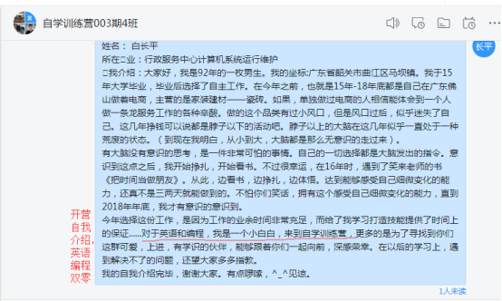
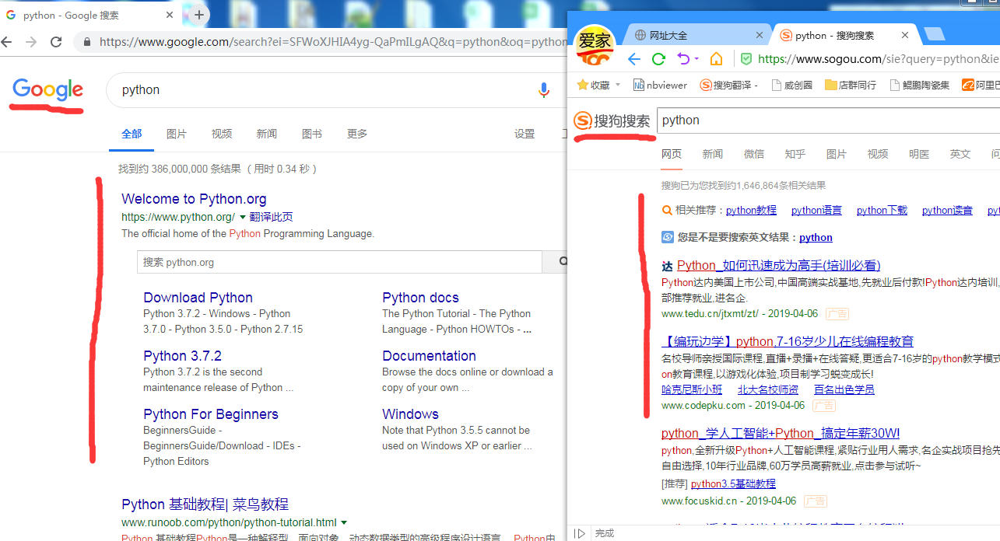
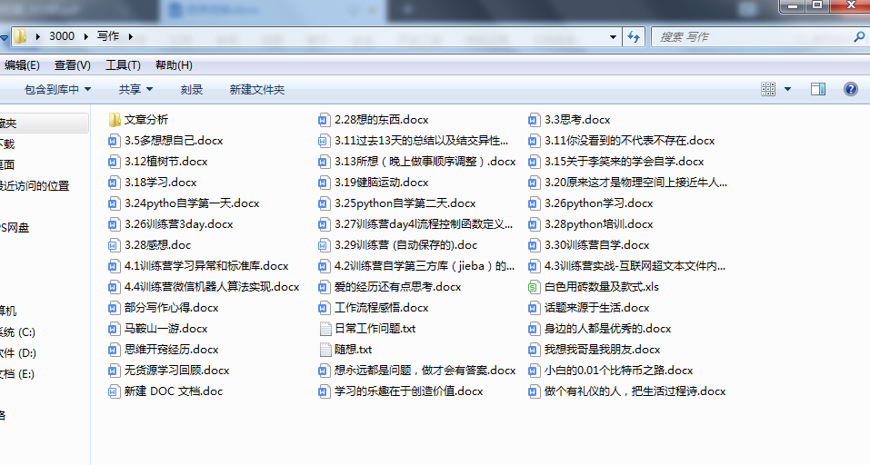

# 自学 —— 为自己而学

> 通过短短的 14 天自学 python，我能够清楚的感受到自己的变化是非常大的。这个大可以说大到颠覆了我的世界观，人生观，价值观。你可能会觉得不就才 14 天学习训练，这怎么可能？吹牛也要打草稿呀。也是，那就麻烦你耐心看我打打草稿。

在看之前，先让你看下，我参加训练营前后的对比。

**学习 python 语言编程前：**

开营自我介绍：

**学习 python 语言编程后：**

最后一次编程作业，是用微信机器人做一个词频统计应用：

## 参加自学 python 训练营，在这个过程中，我都有以下这些收获。

### 一、收获了 python 编程语言基础知识，编程这个世界的大门，我，打开了。

1、体悟到了，编程最重要的核心就是运算与流程控制。
>想要用程序实现任何想要实现的功能，都绝对离不开运算。而想要实现智能多样化的功能，也必然离不开流程的控制。所谓编程，只不过是把想要用计算机实现的功能，用机器语言按照一定的顺序运算的一个流程，这个流程也可以叫线程。线程这个概念相信你很熟悉。

2、学会先把问题进行拆分。
>最开始的时候，以为一上机就开始敲代码，然后到最后输出结果。这样往往没有结果。而后多次实操之后，开始学会了对问题先进行拆分，拆分之后，再用自然语言（中文）把整个流程梳理一遍，写出伪代码（伪代码这个概念学习编程后 google 我才知道）。而后，在用计算机语句把把整个流程敲进去，运行。对于新手的我来说，即使再简单的代码流程，也会不断出错，而后不断调试，我相信谁开始都是这样的，我也相信用着用着就自然而然的熟悉了。
**三思而后行，这个道理我觉得放在此处再适合不过了。**

3、造物的理念。
>为什么要编程？就是因为想更好的提高做事效率且现实中不存在这样的工具。想要实现什么功能，自己defined，配合已有的功能组件，针对性的创造算法（函数、方法）实现想要的功能。真的可以说是无中生有的，这难道不是在造物吗？学会了基本的造物理念，真的改变了我旧有的世界观。我以前觉得世间的一切，都是由特定的人在特定的时机创造的。而今，我也有能力去创造，就是这么自信。

4、明确编程知识在纵向结构上来说是有边界的，无非就是那么几块知识点。
>我不知道你有没有过这样的感受。在学习编程之前，因为道听途说太多敢于编程难得言论，总觉得编程很难，因为它最起码要有英语能力，而后，需要很多的专业知识。就会觉得编程知识难到没有边界。越想越不着边际，大多数时候想学去学，因为脑子里总有这样的感觉萦绕，于是学着学着就放弃了。最终，从来都没有掌握好编程这个技能。这次的完整的学习，让我明白了，如果这就是全部的学习内容，那编程的知识也就那么几块。而且，学习下来，我也非常相信，编程的知识就这么几块，无非就是数据结构、流程控制、函数、模块、异常处理、标准库、第三方应用库。因为有了这些知识，你就可以去创造了。当然，短短的十几天学习，很精通那是不可能的。但，我可以确切的告诉自己，我入门了。因为，我能够做出一些简单的应用。这就够了。从此，我再也不会觉得编程的知识难到没有边界，它是有边界的，任何知识都有边界的。对于技能的精通，肯定还需要不断的对每个知识块深入的学习。一切刚刚开始，一切终于开始了……

### 二、改变了对英语学习的看法，体会到了用英语的好处。

1、对于编程专业性的英语单词的认知。
>因为意思单一让人容易理解，记得牢，当再次看到学习过的单词能够一眼就明白它在文档中的意思，从而相对容易的理解整个英文句子所表达的意思，非常的有成就感。

2、改变了以往面对英语难的心理状态。
> 之前，一看到英语，就犯困，而且是头痛的那种困。即使那个东西再好，也不想在继续。而通过这段时间对于编程文档的学习，只要通篇翻译理解后，心里就会有这样的感受：其实，英语也就那么回事。不断用就行了。学会跟英语做朋友，真的能够体会到，它一定会把我带到一个我不曾想到过的世界。

3、对于英语的语句识别越来越有感觉。
>我坦诚的告诉你我英语零基础。这段时间，不断用英语学习，能够清楚的感受到英语的语法习惯，大部分时候一个句子首先是主谓宾，而后再做谓语补足语。在句子遇到 `of` 后，正常情况下是翻译 `of` 后面的内容之后，再加个 “的”，就变成 `of` 后面的内容是 `of` 前面的什么什么。这是自我感受和理解，当然肯定是存在不足的。但是，对于一个英语小白来说，我敢说这是一个非常大的跨越。其实反过来想，英语只不过是一门语言而已，相对中文来说，只是换了个表示符号和表达习惯上的略微差异而已。

4、明确了英语只有不断反复使用才能记得牢和用得好。
> 人嘛，在心智不成熟的情况下，总是想着做任何事情一步登天，而现实往往是不能如愿以偿。英语同样是这样的道理，别想着看一遍就能够记住（除非你是记忆力极强的天才）。要想记住英语单词，这次的学习，最大的感受就是不断的使用，而因为不断地用，陌生的单词反复出现在自己的眼前。一回生，二回熟，三回是朋友。别总说，你记不住单词，那是因为你用的少，看得少，抑或学习过单词就根本没有用过。

### 三、锻炼了自己的耐心与细心

> 学习是为自己而学，以作业为向导，反向寻找知识点来解决问题。对于英语 python 都是零基础的我来说，首先要解决英语这一个障碍，其次还要深入的思考理解解决问题需要用到的知识点。这些知识点，不曾出现过在自己的脑海中，而是需要自己一点点的去阅读获取。一时半会就是很难把需要用到的知识点找全，而且如果快速的浏览往往很多重要的知识点，它就好像跟你躲猫猫一样，你没有看到它，而它却看到了你。可是，这样的结果，就是对知识点，没办法做到理解，更别说运用了。为了解决问题，你需要逼迫自己再次阅读文档，细心耐心的反复看，只有在这样的时候，那些被你跳过的，遗漏的知识点，才会一个个的蹦跶出来。到最后面，这些一个个的知识点，通过耐心细心之后，已经能够在你的脑海中留下印象，而后因为知识点越来越多，他们自然而然的就串联起来，形成了解决问题的能力。

### 四、改变了自己对用浏览器的看法和搜索习惯

1、用 google 浏览器而不用国内的百度、搜狗和 360 等等浏览器。

> 在此之前，我经常用搜狗搜索引擎来寻找自己遇到的问题。很多时候，越搜越迷糊，因为大多数时候搜出来的都是一些广告，即使有有解决方案，也很多是解不答题。通过这次自学 python，我习惯了用 google，因为每次 google 几乎都能够解决我遇到的问题，我没有理由不喜欢甚至爱上 google。说再多，相信你很难感受得到，因为这个东西，只有你去搜你才能够真正体会到。我给你看下 google 对于同一个问题的搜索结果和搜狗搜出来的结果对比。如图：
>
 

>**可以看出来，google更像是一个问题解决库的通道，而搜狗更像是一个商场入口。**

2、这个过程中学会了遇到问题，先自己思考，思考不出结果时，把 “笼统” 的问题拿到 google 搜索。

> 不断查阅，不断发现重要的知识点和解决问题的方法。调试 bug 时，如果遇到不理解的报错，就把报错的类型直接复制而后 google，再次搜索。搜着搜着，你就能够很清楚的明白自己遇到的是什么问题。而后再用言语精确的描述遇到的问题，再搜索，这个时候，肯定能够找到想要的答案。遇到的问题，就怕问的精准，只要精准，google 就一定会给你精准的解决方案。

3、从此以后，可以说习惯了有事问 google。
> 只要用心提炼问题，耐心查找，你的问题 99.99% 已经有了答案。Google是一个非常大的图书馆，而不是商场。

### 五、锻炼自己的思考能力，也就是锻炼自己的大脑。

*学而不思则罔，思而不学则殆。*

> 学习新得东西，是为了自己能够掌握它，运用它。但前提是你必须把这个新的东西通过思考而后理解。理解它的来龙去脉，理解它的功能，一个个知识点不断思考不断突破，而后再把这些思考串联起来，运用。我们做作业的目的就是把自己的思考，通过完成作业的目的来给自己寻求反馈。在这个过程中，我对自己思考是否深入的最基本判断条件就是作业是否能够通过自己的思考理解完成。完成作业最重要的标志就是，能否把代码运行好，实现想要实现的功能。

### 六、体会到要学好做好一件事情，需要寻找好的工具做辅助。

1、工欲善其事必先利其器。

> 学好、做好一件事情，利用好的工具，可以做到事半功倍。这次学习编程，我们用的编程工具时 anaconda 中的vscode（visual studiocode 可视化代码工作室）。这个工具，自认为对新手来说是非常友好的。它可以让你在编程的时候，把代码敲好之后，直接就可以在同一个窗口运行。之前，自己也尝试过学习 python 编程，在敲代码前，需要建一个单独的 py 文件，而后运行的话，需要通过开始调用 idle 这个python GUI，显得非常的麻烦，效率一点都不高，很不友好。而 vscode 敲代码运行代码的效率完全可以碾压 python 自带的编程工具。

2、通过编程社交平台这个工具，可以极大提升学习效率。

> 我们运用 github 这个代码托管平台工具，来实现对遇到的编程问题进行提交 issue 来相互探讨与解决。・每个人遇到的问题，都有可能是自己遇到的问题或是自己将要遇到的问题。通过查看issue，能够精确的获取自己问题的解决方法。

3、也就是上面提到的浏览器问题，用 google 绝对可以让自己变得更聪明。

你看，我的收获不少吧，可能你还会觉得这些收获都是我编出来的。嗯，有这个可能。但是，如果我告诉你，我在收获这些东西的时候，都为此做了一些什么，你大概率就会相信了。

## 自学 python 这个过程具体做了哪些事情？

### 1、时间精力的投入，这是最基本的条件。

> 文章开头，你应该知道我的职业是什么。不过某种意义上来说，我能够入门还要感谢这份工作。这份工作，概括为 955 吧，每天早上八点半上班，下午五点半下班，中午十二点到两点半休息。上班的时间加起来一天有六个半小时。而我的工作是简单的计算机运行维稳，一般情况下，整个单位的计算机是非常乖巧的运行，不出问题。自然我的上班时间就只能乖乖的坐着了。这下可好了，我可以利用这上班的时间，自学 python。因为，编程零基础，所以为了理解编程的每个知识点，就必须投入大量的时间去思考理解。每天的作业都是通过上班和下班后的时间慢慢的持续的学习才理解而完成，每天如是。这样算下来，一天投入到编程的时间可以说超过十个小时。也因为有了这么多的时间投入，我才能够理解到那些重要的编程知识，才能够入门 python 编程语言。

### 2、每天不断总结，自我对话，每天 3000 字，总结整个作业用到的知识点。

> 这一点，我是看过笑来老师曾经的一篇文章，那篇文章，说的就是他从 20 多年前就开始尽量每天写 3000 字。他说他写的那 3000 字不要求写得有多好，即便是麻将桌上的段子都可以写进去。但是也不可能是为了凑够 3000 字而凑数字。因为要写出 3000 字，你的大脑就必须在不断地思考才行。起初，我第一眼看到 3000 这个数字，就心生畏惧。因为，自己一直以来都非常害怕写作，总觉得写出来的东西，“别人” 看了会说不够好。注意，这个 “别人” 就是我一直不敢动手写文章的罪魁祸首。看了笑来老师每天写 3000 字的这文章之后，被他的理由征服了。于是，从 2019。2。26 开始，我尽量每天写 3000 字。把自己想说的话，都写出来，想到什么写什么。第一天，第一篇，我花了足足三个半小时，才写完，从晚上 9 点开始写，一直写到凌晨 12 点 30。打字速度慢，语句表达困难等，都是非常浪费时间的操作。不过写完之后，有一种莫名的成就感和愉悦感。只不过，手有点僵而已。但是还是非常开心。

> 于是，不知不觉一个星期过去了。每天写 3000 字，好处真的如笑来老师所说。于我而言，我发现我多了一个朋友，那个朋友就是过去每一分每一秒的自己。知心，我们两个无话不谈，我把自己遇到的问题，敲打出来，自己跟自己对话，写着写着，问题解决的方案居然自动跳了出来，跳出来之后，我再敲打出来，而后，在生活工作中实践。实践最大的改变，就是对待老婆的态度以及跟她两人世界的缠绵，这里就不明说了，推荐你去看看笑来老师的那本 ‘书’《[挤挤都会有的-写给女生的性高潮指南](https://github.com/xiaolai/ji)》。而且，我发现我的打字的速度，明显提高了很多，到现在有时候 3000 字可能不到 2 个小时就写完了。因为 3000 字不是一时半会就能写完，每天写那么多，每次坐在凳子上写，一坐就是 2 个小时以上，不自觉的就锻炼了我的做事耐心。最重要的是我能够感受到自己思考能力在不断加强。到现在早已经习惯了 3000 字，对这个数字没有任何的畏惧感。我知道我的表达能力非常的欠缺，写出来的话，啰嗦。但是，这又何妨呢？我能够通过这些文字让自己更好的去理解这个世界的万事万物就够了，真的。其实，我说这些并不是在晒什么，而是，我想告诉你的是，既然你想写作，那就直接写吧，有什么话都写出来，持续写就可以了。你会发现写的好处的，不要去在意自己的言辞，也不用去在意别人的眼光。给你看看我走过的这一个多月：

>

> 请自动忽略标题……

所以到了 3 月24，开始自学 python，我每天就把自己在自学过程中，所理解到的知识点，再次通过自我对话，写出来，发现自己对知识点的理解似乎又有所增加。把自学过程中遇到的问题也记录下来，把问题刻入自己的脑海中，心心念念。我非常相信对问题心心念念，而后必有回饷的言论。真的，很多时候，在学习第二天的编程知识之后，前一天的问题，好像自动被解决了一样。解决了心里问题，心情自然舒畅。

### 3、不断调整自己的学习方法与思路。

> 自学第一天，刚好是碰上星期天，可以有一整天的时间来学习。于是，慢慢的看文档学习，每个英文单词都不断的查询，然后全部单词查完后，自己尝试理解，不理解的话，再把整个句子都放进翻译词典里翻译，再一个个的对照着理解。自然，这个过程是非常耗费时间的。于是，一遍不算太长的文档都花费 5 ~ 6个小时，才搞完。不过，能够通过不断翻译理解，最终看懂文档，心里的成就感是非常强烈的。但是随着学习内容的进一步增加，对于我这种英文零基础的人来说，可能一整天对着英文文档都不一定能够理解全，理解透，那么很自然就会导致作业没法及时完成。

> 于是，打开 word，开始自我对话，反思自己的学习路径和方法，反思参加这次训练营的最本质目的。也就是笑来老师常说的，做一件事情，什么最重要？这样的价值观。最终，自我对话做出了这样的思考：英语固然重要，但是参加这次 “自学 python 训练营” 最重要的是通过自学 python 编程习得自学能力，同时习得编程能力，再者是学会用英语（用英语的好处我在第一天已经体会到了）。有了这样的思考之后，从第二天开始，对于文档的学习，我选择用中文。更多的是用心认真的去理解作业涉及到的知识点，一点点的死磕。对作业的完成，不明的就 google，不断 search，search，research。因为有了这样的选择，我每天都能够按时完成作业，每个作业需要实现的功能，我都通过自己敲代码实现。一直坚持到 python 知识学完。自我觉得在训练营期间跟上训练营的节奏才是最重要的，因为只有跟上节奏，你才能够知道自己走到了哪一步，你才能够体会到编程知识结构的边界，你才能够因为跟上节奏而不断的向前前进。现在回头一看，我很庆幸自己能够做出这样的选择，因为很多同行者，在走着走着的时候，已经不见踪影了。不过，每个人都有每个人的选择，以上只是我个人的思考后的选择而已。

### 4、调整情绪，感受自己的变化，给自己鼓励。

> 转眼 14 天快过去了，感慨自己在英语和编程都是零基础的基础上，都能够拿到毕业证书。不断调整自己的学习方法，固然很重要。但是，在这个过程中，对于从来都没有过自学经验的我来说，有两次就差点放弃跟上训练营的节奏。我清楚的记得那是在数据容器和流程控制那两天。因为，阅读和作业量都相对前面的作业量要大很多，又因为自己理解知识点的速度慢，所以那两天都是到了晚上 10 点之后才开始做作业，敲打好代码之后，不断尝试，报错，再尝试，报错再尝试，这个时候，放弃的念头已经开始涌上心头。但，很快，我就用这么一句话说服了自己：过往，多少次自学，就是因为中途畏难放弃了，才导致今天还一事无成。卧槽，这对我来说，绝对是鸡血。于是，马上把放弃的情绪甩在一边，告诉自己一定可以。当然，最后面自己的确可以。淌过了那两天，慢慢发现自己学习编程越来越有感觉，什么循环、分支、定义函数、缩进、字母大小写等等等，都能够在脑海中重现它们。走到今天，我知道，我已经重生了，我不在是过去自己。因为，现在的我习得了自学能力编程能力。

### 5、总结自学过程。

> 通过训练营，我心里已经有了这么一个自学的方法论，因为是自己的方法，那就是一种能力。开始学习新东西 → 先 google 学习学习方法 → 找到好的学习辅助工具 → 用实战演练作为学习的驱动器 → 阅读官方文档 → 思考过后用 google → 解决问题 → 回顾总结知识点。提出问题，思考解决问题的方法，解决问题。按着这么一个流程走，就实现了需要获得的新技能。把学习流程化，遇到不理解的问题，不断循环反复，理解之后，进行下一步。不断践行，不断成长。成长为自己想要的那个自己。在自学这条路上，没有什么是学不会的。

到现在，不知道你对我开头说的那些话，是否还觉得我在吹牛，如果觉得是，那就是吧。不过，我还会一直的吹下去的。

## 当然这个过程，自己还存在很多不足的地方。

>1、因为过往的学习生活工作习惯，遇到问题，先苦思冥想，虽然惯性在不断地被改正，但还是存在这样的问题。

>2、对于社交学习这块做得不到位，更多的时候都是遇到一个问题死磕，从而浪费大量的时间，学习效率不高

>3、细心程度还不够，还需要不断的刻意训练。有些时候，因为一个缩进就导致程序无法运行，很多时候因为一个字母的大小写问题，而一直报错，很多时候因为遗漏了个参数，而一直不得正解。

## 寄语

专注做一件事情，最后一定会有所收获。14 天训练营时光，转瞬即逝，逝去的是时光，收获的是自学能力和编程能力。感谢这一路一起陪伴的同学和辅导员白雨童和教练。也非常感谢自己在不断挣扎的时候，在书里遇到了笑来老师。因为您，我才开启了我的思考人生。一切才刚刚开始，一切终于能够开始了。路很长，我要不断学习自学再学习，不断践行践行再践行。加油！
