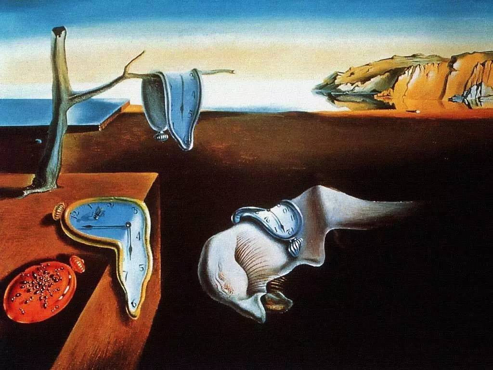

## 我是谁

我是 Lyric，之前曾做过产品经理，所以被称为歌词经理。

我最早是一位自由软件开发者，独立开发过多个流行 App；第一份工作在 WeChat 团队，负责产品工作；期间经历对后来的工作影响颇深。

我有很多身份，但最喜欢的是 “Maker”：探索互相独立的领域并将他们交融，以期发现新的可能性，并在 “创造” 这件事上推动到极致。
我有很多身份，但最喜欢的是 “Maker”：探索互相独立的领域并将他们交融，以期发现新的可能性，并在 “创造” 这件事上推动到极致。

本文应笑来老师邀而写，发表于 [lyric.im](https://lyric.im/my-self-teaching-stories)。

---

## 只字不差地阅读

在高一下半学期的时候，我弄到了一本 C++ 教材。

虽然当时我自认为已经 “掌握” 了 Visual Basic：不仅是在 Visual Basic 里拖动控件组成程序，我还能调用 DLL 里的导出的 Win32 API，甚至 Hook DLL，破解程序，欺骗系统去做我让他们做的事情；不仅是写几个书本上的例子，我还在网络上发布好几个自己做的程序：端口扫描器、字典生成器等等。他们都有真正的用户。
虽然当时我自认为已经 “掌握” 了 Visual Basic：不仅是在 Visual Basic 里拖动控件组成程序，我还能调用 DLL 里的导出的 Win32 API，甚至 Hook DLL，破解程序，欺骗系统去做我让他们做的事情；不仅是写几个书本上的例子，我还在网络上发布好几个自己做的程序：端口扫描器、字典生成器等等。他们都有真正的用户。

不过，我笃信 C++ 是世界上最好的语言，一定要学会它。现实很快表现了它的残酷：在 “继承” 的章节我还能跟得上，但是当教材讲到 “多态” 时我几乎不能理解了。
不过，我笃信 C++ 是世界上最好的语言，一定要学会它。现实很快表现了它的残酷：在 “继承” 的章节我还能跟得上，但是当教材讲到 “多态” 时我几乎不能理解了。

虽然是很简单的概念，但是在那个时候，一个刚接触计算机不到半年的青少年，没有导师，不具备系统性计算机知识，每天只有半小时上机编码的时间，所有的前置知识都来源于一本 Visual Basic 教程和一本姜超著的菜鸟黑客编程手册，学习一门新语言的难度可想而知。

当时我采取了**非常笨的办法**：对于书上看不懂的章节，每晚上都在床上读反复地读，一字一句地斟酌其中的含义；读完之后，白天在纸上写下伪代码，放学回家用半小时时间录入代码测试。这样的过程持续了一段时间，直到有一天，我突然理解了所有复杂的 C++ 概念。具体用了多长时间、怎么理解的、习题跑通的高兴心情，等等这些我不记得了，只记得一个结果：**我会了**。

后来，我才发现这并非是笨办法，而是**唯一正确的办法**。

反复、仔细的阅读不是浪费时间。每一次重新阅读，都会重启思考；每一次思考，都会加深抽象的层次；每一次抽象，都让我离作者更近。就像是小时候背诵古诗词，很难理解其中的美感；但长大后随着思考能力的增强，一旦吟出记忆中的诗句，字句中埋藏的美感就会一一呈现。

在大学有机会参与论文写作，导师让我们开始读领域前沿的外文论文，然后写综述。她告诉我们，刚开始肯定都是读不懂的。但你们要一字一字地读，一句一句地理解，最终就能读懂了。这也是科研论文的基本阅读方法。

只字不差地阅读是一个只有少数人能获得，并且是自我学习的基础技能，只有获得了这个技能，才算真正的 “**会读书**”。
只字不差地阅读是一个只有少数人能获得，并且是自我学习的基础技能，只有获得了这个技能，才算真正的 “**会读书**”。

## 重复我自己

我从小就表现出强烈的绘画兴趣和天赋。那时候家里还没给我请美术老师，但父亲对我做出一个要求：如果想画画，每天完成一幅线稿白描，从蒙纸拓画开始，到能够直接对着画稿临摹。

非常不开心。

我读过一些画家的故事，他们是一群从内至外都保持自由乃至癫狂的人。我也想要这样，有自由的身体和灵魂，所以我临了萨尔瓦多达利的 “记忆的永恒”（对，就是我们大家都看过的那幅）。
我读过一些画家的故事，他们是一群从内至外都保持自由乃至癫狂的人。我也想要这样，有自由的身体和灵魂，所以我临了萨尔瓦多达利的 “记忆的永恒”（对，就是我们大家都看过的那幅）。

父亲看完后说：“你不懂达利”。

确实不懂。达利是一个极具天赋的跨界艺术家。我只看到他梦境中 “软掉的钟”，或者其它怪诞的超现实主义作品；但不了解他如何拥有卓越的绘画和绘图技巧。正如我也不明白**反复临摹是一个学习过程**：不同颜色传达的情绪的差异、从温暖到凉爽的渐变、使用笔画表达力量还是使用晕来表现温柔，所有的临摹都是不断在脑子里塑造这些基本绘画技巧的过程。
确实不懂。达利是一个极具天赋的跨界艺术家。我只看到他梦境中 “软掉的钟”，或者其它怪诞的超现实主义作品；但不了解他如何拥有卓越的绘画和绘图技巧。正如我也不明白**反复临摹是一个学习过程**：不同颜色传达的情绪的差异、从温暖到凉爽的渐变、使用笔画表达力量还是使用晕来表现温柔，所有的临摹都是不断在脑子里塑造这些基本绘画技巧的过程。

高一学会 C++ 后，我把所有用 Visual Basic 写过的程序都用 C++（其实是 C）重写了一遍。在重写过程中，所有 VB 帮我处理的繁琐细节全部在 C 下暴露了出来：没有控件事件，我需要手工处理 Windows 消息循环；没有托管消息，我需要亲自管理 GUI 线程，以免整个程序卡住；诸如 “获取文本”、“设置文本” 这种最简单的操作也需要调用 Win32 API `GetWindowText`, `SetWindowText` 来进行等等。
高一学会 C++ 后，我把所有用 Visual Basic 写过的程序都用 C++（其实是 C）重写了一遍。在重写过程中，所有 VB 帮我处理的繁琐细节全部在 C 下暴露了出来：没有控件事件，我需要手工处理 Windows 消息循环；没有托管消息，我需要亲自管理 GUI 线程，以免整个程序卡住；诸如 “获取文本”、“设置文本” 这种最简单的操作也需要调用 Win32 API `GetWindowText`, `SetWindowText` 来进行等等。

在软件开发领域有一个说法叫 “**重新发明轮子（Reinventing the wheel）**”。指没有意义、浪费资源地重新创造已有事物。但在学习领域，重新发明轮子是重要的方法：不提供结论和关键方法，通过完整地体验其中的过程，让我们领悟其方法的核心精髓，进而掌握其中的思维方式。

我进行的这一类重复，不是没有意义的重做轮子。反复地有明确目的地临摹是对基本绘画技能的**重新塑造**，使用 C/C++ 重写程序是对图形化编程底层细节的**重新理解**。

后来开始工作了，我发现这二者的重复都造成了深远的影响。对空间、色彩、光线、情绪的理解加上对计算机运作原则的理解，让我不需要把需求转化为设计，也不需要把设计落实在纸面上。我可以敏锐地抓住游离的线索，直接从空气中开始编码，创造我想要的东西。

这种 “**从 App 的设计看到背后每一个 Byte 的流动**” 的能力提供了非常多便利，不过这是另一个故事了。
这种 “**从 App 的设计看到背后每一个 Byte 的流动**” 的能力提供了非常多便利，不过这是另一个故事了。

---

本文的 [PRESS.one 签名](https://press.one/file/v?s=60791ab3758ba4d2a78a1c0c9ae37a2b9158c78a7f924a0a41fad81c6b29ceea1c9bfcfc39d351574b3521d7fe8b7dc243756753f12f9ea165a44f133f4ba5ee0&h=6c4405e2fbd20ffa671b4cd98e121dbc3d323738fbd6a759e0391b879806e7ac&a=37bb01456229cf59e14aa19c6755a8ba2947be9b&f=P1&v=3)。
