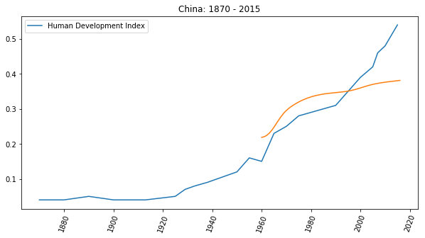
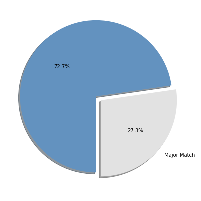

# 为什么一定要掌握自学能力？

一句话解释清楚：

> 没有自学能力的人没有**未来**。

有两个因素需要深入考虑：

> * 未来的日子还很长
> * 这世界进步得太快

我有个观察：

> 很多人都会不由自主地去复刻父母的人生时刻表。

比如，你也可能观察到了，父母晚婚的人自己晚婚的概率更高，父母晚育的人自己晚育的概率也更高…… 

再比如，绝大多数人的内心深处，会不由自主地因为自己的父母在五十五岁的时候退休了，所以就默认自己也会在五十五岁前后退休…… 于是，到了四十岁前后的时候就开始认真考虑退休，在不知不觉中就彻底丧失了斗志，早早就活得跟已经老了很多岁似的。

但是，这很危险，因为很多人完全没有意识到自己所面临的人生，与父母所面临的人生可能完全不一样 —— 各个方面都不一样。单举一个方面的例子，也是比较容易令人震惊的方面：

> 全球范围内都一样，在过去的五十年里，人们的平均寿命预期增长得非常惊人……

拿中国地区做例子，根据世界银行的数据统计，中国人在出生时的寿命预期，从 1960 年的 _43.73_ 岁，增长到了 2016 年的 _76.25_ 岁，56 年间的增幅竟然有 **74.39%** 之多！
```python
import matplotlib.pyplot as plt
import numpy as np

data = np.genfromtxt('life-expectancy-china-1960-2016.txt',
                     delimiter=',',
                     names=['x', 'y'])
da1960  = data[0][1]
da2016  = data[-1][1]
increase = (da2016 - da1960) / da1960
note = 'from {:.2f} in 1960 to {:.2f} in 2016, increased  {:.2%}'\
    .format(da1960, da2016, increase)

plt.figure(figsize=(10, 5))
plt.plot(data['x'], data['y'])
plt.ylabel('Life Expectancy from Birth')
plt.tick_params(axis='x', rotation=70)
plt.title('CHINA\n' + note)

# plt.savefig('life-expectancy-china-1960-2016.png', transparent=True)
plt.show()

# data from:
# https://databank.worldbank.org/data/reports.aspx?source=2&series=SP.DYN.LE00.IN
```


如此发展下去，虽然人类不大可能永生不死，但平均寿命依然在持续延长是个不争的事实。与上一代不同，现在的千禧一代，需要面对的是百岁人生 —— 毫无疑问，不容置疑。

这么长的人生，比默认的想象中可能要多出近一倍的人生，再叠加上另外一个因素 —— 这是个变化越来越快的世界 —— 会是什么样子？

我是 1972 年出生的。从交通工具来看，我经历过出门只能靠步行，大街上都是牛车马车，机动车顶多见过拖拉机，到有自行车，到见过摩托车，到坐小汽车，到自己开车，到开有自动辅助驾驶功能的电动车…… 从阅读来看，我经历过只有新华书店，到有网络上的文字，到可以在当当上在线买到纸质书，到有了国际信用卡后可以在 Amazon 上第一时间阅读新书的电子版、听它的有声版，到现在可以很方便地获取最新知识的互动版，并直接参与讨论…… 从技能上来看，我经历过认为不识字是文盲，到不懂英语是文盲，到不懂计算机是文盲，到现在，不懂数据分析的基本与文盲无异……

我也见识过很多当年很有用很赚钱很令人羡慕的技能 “突然” 变成几乎毫无价值的东西，最明显的例子是驾驶。也就是二十多年前，的哥还是很多人羡慕的职业呢！我本科的时候学的是会计专业，那时候我们还要专门练习打算盘呢！三十年之后的今天，就算有人打算盘打得再快，有什么具体用处嘛？我上中学的时候，有个人靠出版字帖赚了大钱 —— 那时候据说只要写字漂亮就能找到好工作；可今天，写字漂亮与否还是决定工作好坏的决定性因素吗？打印机很便宜啊！

这两个因素叠加在一起的结果就是，这世界对很多人来说，其实是越来越残忍的。

我见过太多的同龄人，早早就停止了进步，早早就被时代甩在身后，早早就因此茫然不知所措 —— 早早晚晚，你也会遇到越来越多这样的人。他们的共同特征只有一个：

> 没有自学能力

有一个统计指数，叫做人类发展指数（Human Development Index），它的曲线画出来，怎么看都有即将成为指数级上升的趋势。
```python
import matplotlib.pyplot as plt
import numpy as np
plt.figure(figsize=(10, 5))

lebdata = np.genfromtxt('life-expectancy-china-1960-2016.txt',
                        delimiter=',',
                        names=['x', 'y'])

hdidata = np.genfromtxt('hdi-china-1870-2015.txt',
                        delimiter=',',
                        names=['x', 'y'])


plt.plot(hdidata['x'], hdidata['y'], label='Human Development Index')
plt.tick_params(axis='x', rotation=70)
plt.title('China: 1870 - 2015')

plt.plot(lebdata['x'], lebdata['y'] * 0.005, label='Life Expectancy from Birth')
plt.plot(secondary_y=True)

plt.legend()

# plt.savefig('human-development-index-china-1870-2015.png', transparent=True)
plt.show()

# link:
# https://ourworldindata.org/human-development-index

# data from:
# blob:https://ourworldindata.org/44b6da71-f79e-42ab-ab37-871e4bd256e9
```



社会发展越来越快，你要面对的人生越来越长，在那一段与你的直觉猜想并不相同的漫漫人生路上，你居然没有磨练过自学能力，竟然只能眼睁睁地看着自己被甩下且无能为力，难道接下来要在那么长的时间里 “苦中作乐” 吗？

没有未来的日子，怎么过呢？

我本科学的是会计，研究生跑到国外读宏观经济学没读完，跑回国内做计算机硬件批发，再后来去新东方应聘讲授托福课程，离开新东方之后创业，再后来做投资，这期间不断地写书…… 可事实上，我的经历在这个时代并不特殊。有多少人在后来的职业生涯中所做的事情与当年大学里所学的专业相符呢？

纽约联邦储蓄银行在 2012 年做过一个调查，发现人们的职业与自己大学所学专业相符的比例连 _30%_ 都不到。而且，我猜，这个比例会持续下降的 —— 因为这世界变化快，因为大多数教育机构与世界发展脱钩的程度只能越来越严重……
```python
import matplotlib.pyplot as plt

labels = ['Major Match', '']
sizes = [273, 727]
colors = ['#E2E2E2', '#6392BF']
explode = (0, 0.08)
plt.figure(figsize=(7, 7))
plt.pie(sizes,
        labels=labels,
        explode=explode,
        autopct='%1.1f%%',
        colors=colors,
        startangle=270,
        shadow=True)
# plt.savefig('major-match-job.png', transparent=True)
plt.show()

# data from:
# https://libertystreeteconomics.newyorkfed.org/2013/05/do-big-cities-help-college-graduates-find-better-jobs.html
```



绝大多数人终生都饱受**时间幻觉**的拖累。

小时候觉得时间太长，那是幻觉；长大了觉得时间越来越快，那还是幻觉 —— 时间从来都是匀速的。最大的幻觉在于，总是以为 “时间不够了” —— 这个幻觉最坑人。许多年前，有一次我开导我老婆。她说，“啊？得学五年才行啊？！太长了！” 我说，

> “你回头看看呗，想想呗，五年前你在做什么？是不是回头一看的时候，五年前就好像是昨天？道理是一样的，五年之后的某一天你回头想今天，也是 ‘一转眼五年就过去’ 了…… 只不过，你今天觉得需要时间太多，所以不肯学 —— 但是，不管你学还是不学，五年还是会 ‘一转眼就过去’ 的…… 到时候再回头，想起这事儿的时候，没学的你，一定会后悔 —— 事实上，你已经有很多次后悔过 ‘之前要是学了就好了’，不是吗？”

现在回头看，开导是非常成功的。十多年后的今天，她已经真的可以被称为 “自学专家” —— 各种运动在她那儿都不是事儿。健身，可以拿个北京市亚军登上健与美杂志封面；羽毛球，可以参加专业比赛；潜水，潜遍全球所有潜水胜地，到最后拿到的各种教练证比她遇到的各地教练的都多、更高级；帆船，可以组队横跨大西洋；爬山，登上喜马拉雅……

都说，人要有一技之长。那这一技究竟应该是什么呢？

> 自学能力是唯一值得被不断磨练的长技。

磨练出自学能力的好处在于，无论这世界需要我们学什么的时候，我们都可以主动去学，并且还是马上开始 —— 不需要等别人教、等别人带。

哪怕有很强的自学能力的意思也并不是说，什么都能马上学会、什么都能马上学好，到最后无所不精无所不通…… 因为这里有个时间问题。无论学什么，都需要耗费时间和精力，与此同时更难的事情在于不断填补耐心以防它过早耗尽。另外，在极端的情况下，多少也面临天分问题。比如身高可能影响打篮球的表现，比如长相可能影响表演的效果，比如唱歌跑调貌似是很难修复的，比如有些人的粗心大意其实是基因决定的，等等。不过，以我的观察，无论是什么，哪怕只是学会一点点，都比不会强。哪怕只是中等水平，就足够应付生活、工作、养家糊口的需求。

我在大学里学的是会计专业，毕业后找不到对口工作，只好去做销售 —— 没人教啊！怎么办？自学。也有自学不怎么样的时候，比如当年研究生课程我就读不完。后来想去新东方教书 —— 因为听说那里赚钱多 —— 可英语不怎么样啊！怎么办？自学。离开新东方去创业，时代早就变了，怎么办？自学，学的不怎么样，怎么办？硬挺。虽然创业这事儿后来也没怎么大成，但竟然在投资领域开花结果 —— 可赚了钱就一切平安如意了吗？并不是，要面对之前从来没可能遇到的一些险恶与困境，怎么办？自学。除了困境之外，更痛苦的发现在于对投资这件事来说，并没有受过任何有意义的训练，怎么办？自学。觉得自己理解的差不多了，一出手就失败，怎么办？接着学。

我出身一般，父母是穷教师。出生在边疆小镇，儿时受到的教育也一般，也是太淘气 —— 后来也没考上什么好大学。说实话，我自认天资也一般，我就是那种被基因决定了经常马虎大意的人。岁数都这么大了，情商也都不是一般的差 —— 还是跟年轻的时候一样，经常莫名其妙就把什么人给得罪透了……

但，我过得一直不算差。

靠什么呢？人么，一个都靠不上。到最后，我觉得只有一样东西真正可靠 —— **自学能力**。于是，经年累月，我磨练出了一套属于我自己的本领：只要我觉得有必要，我什么都肯学，学什么都能学会到够用的程度…… 编程，我不是靠上课学会的；英语，不是哪个老师教我的；写作，也不是谁能教会我的；教书，更没有上过师范课程；投资，更没人能教我 —— 我猜，也没人愿意教我…… 自己用的东西自己琢磨，挺好。

关键在于，自学这事儿并不难，也不复杂，挺简单的，因为它所需要的一切都很朴素。

于是，从某个层面上来看，我每天都过的很开心。为什么？因为我有未来。凭什么那么确信？因为我知道我自己有自学能力。

**—— 我希望你也有。**

准确地讲，希望你有个更好的未来。

而现在我猜，此刻，你心中也是默默如此作想的罢。
