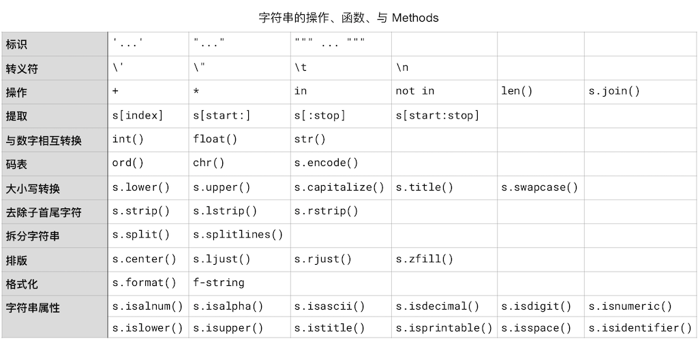

# 字符串

在任何一本编程书籍之中，关于字符串的内容总是很长 —— 就好像每本英语语法书中，关于动词的内容总是占全部内容的至少三分之二。这也没什么办法，因为处理字符串是计算机程序中最普遍的需求 —— 因为程序的主要功能就是完成人机交互，人们所用的就是字符串而不是二进制数字。

在计算机里，所有的东西最终都要被转换成数值。又由于计算机靠的是电路，所以，最终只能处理 `1` 和 `0`，于是，最基本的数值是二进制；于是，连整数、浮点数字，都要最终转换成二进制数值。这就是为什么在所有编程语言中 `1.1 + 2.2` 并不是你所想象的 `3.3` 的原因。
```python
1.1 + 2.2
```
    3.3000000000000003


因为最终所有的值都要转换成二进制 —— 这时候，小数的精度就有损耗，多次浮点数字转换成二进制相互运算之后再从二进制转换为十进制之后返回的结果，精度损耗就更大了。因此，在计算机上，浮点数字的精度总有极限。有兴趣进一步可以看看[关于 decimal 模块的文档](https://docs.python.org/3/library/decimal.html)。

字符串也一样。一个字符串由 0 个字符或者多个字符构成，它最终也要被转换成数值，再进一步被转换成二进制数值。空字符串的值是 `None`，即便是这个 `None` —— 也最终还是要被转换成二进制的 `0`。

## 字符码表的转换

很久以前，计算机的中央处理器最多只能够处理 8 位二进制数值，所以，那时候的计算机只能处理 256 个字符，即，2<sup>8</sup> 个字符。那个时候计算机所使用的码表叫 ASCII。现在计算机的中央处理器，大多是 64 位的，所以可以使用 2<sup>64</sup> 容量的码表，叫做 [Unicode](https://zh.wikipedia.org/wiki/Unicode)。随着多年的收集，2018 年 6 月 5 日公布的 `11.0.0` 版本已经包含了 13 万个字符 —— 突破 10 万字符是在 2005 年<a href='#fn1' name='fn1b'><sup>[1]</sup></a>。


把单个字符转换成码值的函数是 `ord()`，它只接收单个字符，否则会报错；它返回该字母的  unicode 编码。与 `ord()` 相对的函数是 `chr()`，它接收且只接收一个整数作为参数，而后返回相应的字符。`ord()` 接收多个字符的话会报错。
```python
from IPython.core.interactiveshell import InteractiveShell
InteractiveShell.ast_node_interactivity = "all"

ord('a')
chr(122)

ord('氅')  # 完了，汉字也有你不认识的吧？
chr(25354) # 这个字估计你也不认识……

# ord('Python') # 这一句会报错
```
    '挊'


## 字符串的标示

标示一个字符串，有 4 种方式，用单引号、用双引号，用三个单引号或者三个双引号：
```python
'Simple is better than complex.' # 用单引号
```
    'Simple is better than complex.'


```python
"Simple is better than complex." # 用双引号
```
    'Simple is better than complex.'


```python
# 用三个单引号。注意输出结果中的 \n
# 这个字符串，看起来是两行，保存在内存或者变量之中的时候，
# 是一整串，其中的换行是用 \n 表示的。
'''
Simple is better than complex.
Complex is better than complicated.
''' 
```
    '\nSimple is better than complex.\nComplex is better than complicated.\n'


```python
#用三个双引号。注意输出结果中的 \n
"""
Simple is better than complex.
Complex is better than complicated.
""" 
```
    '\nSimple is better than complex.\nComplex is better than complicated.\n'


```python
print(
"""
Simple is better than complex.
Complex is better than complicated.
"""
) #用 print() 输出的时候，\n 就是不可见字符，字符串本身如下：
# '\nSimple is better than complex.\nComplex is better than complicated.\n'
# 其中的 \n 被打印出来的时候显示成换行
```

    Simple is better than complex.
    Complex is better than complicated.


## 字符串与数值之间的转换

由数字构成的字符串，可以被转换成数值，转换整数用 `int()` ，转换浮点数字用 `float()`。

与之相对，用 `str()`，可以将数值转换成字符串类型。

注意，int() 在接收字符串为参数的时候，只能做整数转换。下面代码最后一行会报错：
```python
from IPython.core.interactiveshell import InteractiveShell
InteractiveShell.ast_node_interactivity = "all"

int('3')
float('3')
str(3.1415926)
# int('3.1415926') # 这一行会报错
```
    3
    3.0
    '3.1415926'


`input()` 这个内建函数的功能是接收用户的键盘输入，而后将其作为字符串返回。它可以接收一个字符串作为参数，在接收用户键盘输入之前，会把这个参数输出到屏幕，作为给用户的提示语。这个参数是可选参数，直接写 `input()`，即，没有提供参数，那么它在要求用户输入的时候，就没有提示语。

以下代码会报错，因为 `age < 18` 不是合法的逻辑表达式，因为 `age` 是由 `input()` 传递过来的字符串；于是，它不是数字，那么它不可以与数字比较……
```python
age = input('Please tell me your age: ')
if age < 18:
    print('I can not sell you drinks...')
else:
    print('Have a nice drink!')
```
    Please tell me your age:  19
    ---------------------------------------------------------------------------
    TypeError                                 Traceback (most recent call last)
    <ipython-input-9-0573fe379e83> in <module>
          1 age = input('Please tell me your age: ')
    ----> 2 if age < 18:
          3     print('I can not sell you drinks...')
          4 else:
          5     print('Have a nice drink!')
    TypeError: '<' not supported between instances of 'str' and 'int'

要改成这样才可能行：
为什么是可能行而不是一定行？如果用户 `input` 键盘输入的是 `eighteen` 或者 ` 十八 ` 等，依然会导致 `int()` 失败并得到 `ValueError` 的报错。用户输入的不可控，可能会导致千奇百怪的报错。但在这里，我们先简化处理，在引导语中加入一个正确的示例并默认用户会按引导语正确输入。

```python
age = int(input('Please tell me your age: 
 an int number , e.g: 22
'))
if age < 18:
    print('I can not sell you drinks...')
else:
    print('Have a nice drink!')
```
    Please tell me your age:  19
    Have a nice drink!


**注意**：如果你用来浏览当前 `.ipynb` 文件的是那个桌面 App [Nteract](https://nteract.io/)，它目前不支持 input() 这个函数的调用……

## 转义符

有一个重要的字符，叫做 “转义符”，`\`，也有的地方把它称为 “脱字符”，因为它的英文原文是 _Escaping Character_。它本身不被当作字符，你要想在字符串里含有这个字符，得这样写 `\\`：
```python
'\\'
```
    '\\'


```python
'\'
```
      File "<ipython-input-10-d44a383620ab>", line 1
        '\'
           ^
    SyntaxError: EOL while scanning string literal


上面这一行报错信息是 `SyntaxError: EOL while scanning string literal`。这是因为 `\'` 表示的是单引号字符 `'`（Literal） —— 是可被输出到屏幕的 `'`，而不是用来标示字符串的那个 `'` —— 别急，无论哪个初学者第一次读到前面的句子都觉得有点莫名其妙…… —— 于是，Python 编译器扫描这个 “字符串” 的时候，还没找到标示字符串末尾的另外一个 `'` 的时候就读到了 `EOL`（End Of Line）。

如果你想输出这么个字符串，`He said, it's fine.`，如果用双引号扩起来 `"` 倒没啥问题，但是如果用单引号扩起来就麻烦了，因为编译器会把 `it` 后面的那个单引号 `'` 当作字符串结尾。
```python
'He said, it's fine.'
```
      File "<ipython-input-11-2bcf2ca6dd95>", line 1
        'He said, it's fine.'
                     ^
    SyntaxError: invalid syntax


于是你就得用转义符 `\`：
```python
from IPython.core.interactiveshell import InteractiveShell
InteractiveShell.ast_node_interactivity = "all"

# 要么你这么写：
'He said, it\'s fine.'
# 要么你这么写：
"He said, it's fine."
# 要么，不管用单引号还是双引号标示字符串，都习惯于用 \' 和 \" 书写属于字符串内部的引号……
"He said, it\'s fine."
```
    "He said, it's fine."
    "He said, it's fine."
    "He said, it's fine."


转义符号 `\` 的另外两个常用形式是和 `t`、`n` 连起来用，`\t` 代表制表符（就是用 TAB `⇥` 键敲出来的东西），`\n` 代表换行符（就是用 Enter `⏎` 敲出来的东西）。

由于历史原因，Linux/Mac/Windows 操作系统中，换行符号的使用各不相同。Unix 类操作系统（包括现在的 MacOS），用的是 `\n`；Windows 用的是 `\r\n`，早期苹果公司的 Macintosh 用的是 `\r`（参见 [Wikipedia: Newline](https://en.wikipedia.org/wiki/Newline)）。

所以，一个字符串，有两种形式，**raw** 和 **presentation**，在后者中，`\t` 被转换成制表符，`\n` 被转换成换行。

在写程序的过程中，我们在代码中写的是 _raw_，而例如当我们调用 `print()` 将字符串输出到屏幕上时，是 _presentation_：
```python
s = "He said, it's fine." # raw
print(s)                   # presentation
```
    He said, it's fine.


以后有时间去看看这两个内建函数，能了解更多细节：
> * **ascii**(_object_) https://docs.python.org/3/library/functions.html#ascii
> * **repr**(_object_) https://docs.python.org/3/library/functions.html#repr

## 字符串的操作符

字符串可以用空格 `' '` 或者 `+` 拼接：
```python
'Hey!' + ' ' + 'You!' # 使用操作符 +
```
    'Hey! You!'


```python
'Hey!' 'You!' # 空格与 + 的作用是相同的。
```
    'Hey!You!'


字符串还可以与整数被操作符 `*` 操作，`'Ha' * 3` 的意思是说，把字符串 `'Ha'` 复制三遍：
```python
'Ha' * 3
```
    'HaHaHa'


```python
'3.14' * 3
```
    '3.143.143.14'


字符串还可以用 `in` 和 `not in` 操作符 —— 看看某个字符或者字符串是否被包含在某个字符串中，返回的是布尔值：
```python
'o' in 'Hey, You!'
```
    True


## 字符串的索引

字符串是由一系列的字符构成的。在 Python 当中，有一个容器（Container）的概念，这个概念前面提到过，后面还会深入讲解。现在需要知道的是，字符串是容器的一种；容器可分为两种，有序的和无序的 —— 字符串属于**有序容器**。

字符串里的每个字符，对应着一个从 `0` 开始的索引。比较有趣的是，索引可以是负数：


| 0    | 1    | 2    | 3    | 4    | 5    |
| ---- | ---- | ---- | ---- | ---- | ---- |
| P    | y    | t    | h    | o    | n    |
| -6   | -5   | -4   | -3   | -2   | -1   |
```python
s = 'Python'
for char in s:
    print(s.index(char), char)
```
    0 P
    1 y
    2 t
    3 h
    4 o
    5 n


对于有序容器中的元素 —— 字符串就是字符的有序容器 —— 由于它们是有索引的，所以我们可以根据索引提取容器中的值，你可以把 `[]` 当作是有序容器的操作符之一，我们姑且将其称为 “_索引操作符_”。注意以下代码第 3 行中， `s` 后面的 `[]`，以及里面的变量 `i`：
```python
s = 'Python'
for i in range(len(s)):
    print(s[i])

#上面的代码仅是为了演示索引操作符的使用，更简洁的写法是：
for i in s:
    print(i)
```
    P
    y
    t
    h
    o
    n


我们可以使用_索引操作符_根据_索引_**提取**字符串这个_有序容器_中的_一个或多个元素_，即，其中的字符或字符串。这个 “提取” 的动作有个专门的术语，叫做 “Slicing”（切片）。索引操作符 `[]` 中可以有一个、两个或者三个整数参数，如果有两个参数，需要用 `:` 隔开。它最终可以写成以下 4 种形式：

> * `s[index]` —— 返回索引值为 `index` 的那个字符
> * `s[start:]` —— 返回从索引值为 `start` 开始一直到字符串末尾的所有字符
> * `s[start:stop]` —— 返回从索引值为 `start` 开始一直到索引值为 `stop` 的那个字符_之前_的所有字符
> * `s[:stop]` —— 返回从字符串开头一直到索引值为 `stop` 的那个字符_之前_的所有字符
> * `s[start:stop:step]` —— 返回从索引值为 `start` 开始一直到索引值为 `stop` 的那个字符_之前_的，以 `step` 为步长提取的所有字符

提醒：无论是 `range(1,2)`，或者 `random.randrange(100, 1000)` 又或者 `s[start:stop]` 都有一个相似的规律，包含左侧的 `1`, `100`, `start`，不包含右侧的 `2`, `1000`, `stop`。

```python
from IPython.core.interactiveshell import InteractiveShell
InteractiveShell.ast_node_interactivity = "all"

s = 'Python'
s[1]
s[2:]
s[2:5]
s[:5]
s[1:5:2]
```
    'y'
    'thon'
    'tho'
    'Pytho'
    'yh'


## 处理字符串的内建函数

[Python 内建函数](https://docs.python.org/3/library/functions.html#slice)中，把字符串当做处理对象的有：`ord()`、`input()`、`int()`、`float()`、`len()`、`print()`。再次注意，`ord()` 只接收单个字符为参数。
```python
from IPython.core.interactiveshell import InteractiveShell
InteractiveShell.ast_node_interactivity = "all"

ord('\n')
ord('\t')
ord('\r')
chr(65) # 与 ord() 相对的函数
s = input('请照抄一遍这个数字 3.14: ')
int('3')
# int(s) 这一句会报错…… 所以暂时注释掉了
float(s) * 9
len(s)
print(s*3)
```
    10
    9
    13
    'A'
    请照抄一遍这个数字 3.14:  3.14
    3
    28.26
    4
    3.143.143.14


## 处理字符串的 Method

在 Python 中，字符串是一个**对象** —— 更准确地讲，是 str 类（`Class str`）的对象。

第一部分尚未读完的你，暂时不用了解对象究竟是什么；只需要知道的是，一个对象的内部有很多函数…… 这些写在对象内部的函数，有个专门的名称，类的**方法**（Method）。问题在于，在讲解编程的内容里，“方法” 这个词（比如，处理数值的_方法_是……）随处可见；所以，**为了避免歧义**，以后的文字里，提到 “类的方法” 的时候，直接用 **Method** 这个英文单词……

字符串有很多可以调用 Methods。以下介绍的 `str` Methods，在官方文档 "[Text Sequence Type](https://docs.python.org/3/library/stdtypes.html#text-sequence-type-str)" 中都可以找到。

调用 str 类的 Methods 是使用 `.` 这个符号，比如：
```python
'Python'.upper()
```
### 大小写转换

转换字符串大小写的是 `str.upper()`、 `str.lower()` 和 `str.swapcase()`，以及 `str.casefold()`；另外，还有专门针对行首字母大写的 `str.capitalize()` 和针对每个词的首字母大写的 `str.title()`：
```python
from IPython.core.interactiveshell import InteractiveShell
InteractiveShell.ast_node_interactivity = "all"

'Now is better than never.'.upper()

# 在 Python 命令行工具之中，单个下划线，是个特殊变量；
# 保存着最近的语句或者表达式的结果
# 上一个 Cell 执行过后，_ 中保存着 'NOW IS BETTER THAN NEVER.'

_.lower()
```
    'NOW IS BETTER THAN NEVER.'
    'now is better than never.'


```python
from IPython.core.interactiveshell import InteractiveShell
InteractiveShell.ast_node_interactivity = "all"

# casefold() 也是转换成小写，但它能处理更多欧洲语言字符

'ß'.casefold()           # 德语字符中，大写 ß 的小写形式是 ss
len('ß'.casefold())
'ß'.lower()              # lower() 对这类字符无能为力……
len('ß'.lower())
# casefold 
'\u0132'                # IJ 这个字符的 Unicode 编码
'\u0132'.casefold()
'\u0132'.lower()        # 对这个字符来说，lower() 和 casefold 的效果一样
len('\u0132'.casefold())

# 这是一篇有用的文章：
# Truths programmers should know about case
# https://www.b-list.org/weblog/2018/nov/26/case/
```
    'ss'
    2
    'ß'
    1
    'IJ'
    'ij'
    'ij'
    1


```python
from IPython.core.interactiveshell import InteractiveShell
InteractiveShell.ast_node_interactivity = "all"

s = 'Now is better than never.'
s.capitalize() # 句首字母大写
s.title() # 每个单词首字母大写
```
    'Now is better than never.'
    'Now Is Better Than Never.'


```python
s = 'Now is better than never.'
s.swapcase() # 逐个字符更替大小写
s.title() 
s.title().swapcase() 
```
    'nOW IS BETTER THAN NEVER.'
    'Now Is Better Than Never.'
    'nOW iS bETTER tHAN nEVER.'


另外，还有个 `str.encode()` 在处理非英文字符串（比如中文）的时候，经常会用到：
```python
# str.encode(encoding="utf-8", errors="strict")
# 关于更多可能的 encoding list, 请参阅：
# https://docs.python.org/3/library/codecs.html#standard-encodings
s = '简单优于复杂。'
s.encode()
```
    b'\xe7\xae\x80\xe5\x8d\x95\xe4\xbc\x98\xe4\xba\x8e\xe5\xa4\x8d\xe6\x9d\x82\xe3\x80\x82'


### 搜索与替换

让我们从 `str.count()` 这个搜寻子字符串出现次数的 Method（即，`str` 这个 `Class` 中定义的函数）开始。

它官方文档是这么写的：

> `str.count(sub[,start[,end]])`

下面的函数说明加了默认值，以便初次阅读更容易理解：

> `str.count(sub [,start=0[, end=len(str)-1]])`

这里的方括号 `[]` 表示该参数可选；方括号里再次嵌套了一个方括号，这个意思是说，在这个可选参数 `start` 出现的情况下，还可以再有一个可选参数 `end`；

而 `=` 表示该参数有个默认值。上述这段说明如果你感到熟悉的话，说明前面的内容确实阅读到位了……与大量 “前置引用” 相伴随的是知识点的重复出现。

> * 只给定 `sub` 一个参数的话，于是从第一个字符开始搜索到结束；
> * 如果，随后给定了一个可选参数的话，那么它是 `start`，于是从 `start` 开始，搜索到字符串结束；
> * 如果 `start` 之后还有参数的话，那么它是 `end`；于是从 `start` 开始，搜索到 `end` 结束。
> 
> 返回值为在字符串中 `sub` 出现的次数。

注意：字符串中第一个字符的索引值是 `0`。


```python
from IPython.core.interactiveshell import InteractiveShell
InteractiveShell.ast_node_interactivity = "all"

s = """Simple is better than complex.
Complex is better than complicated."""
s.lower().count('mp')
s.lower().count('mp', 10)
s.lower().count('mp', 10, 30)
```
    4
    3
    1


以下是 `str` 的搜索与替换的 Methods： `str.find()`, `str.rfind()`, `str.index()` 的示例：
```python
from IPython.core.interactiveshell import InteractiveShell
InteractiveShell.ast_node_interactivity = "all"

# str.find(sub[, start[, end]])
print('Example of str.find():')
s = """Simple is better than complex.
Complex is better than complicated."""
s.lower().find('mpl')
s.lower().find('mpl', 10)
s.lower().find('mpl', 10, 20) # 没有找到就返回 -1
print()

print('Example of str.rfind():')
# str.rfind(sub[, start[, end]])
# rfind() 返回最后 sub 出现的那次的位置；find()是最早的那次
s.lower().rfind('mpl')
s.lower().rfind('mpl', 10)
s.lower().rfind('mpl', 10, 20) # 没有找到就返回 -1
print()

print('Example of str.index():')
# str.index(sub[, start[, end]])
# 作用与 find() 相同，但如果没找到的话，会触发 ValueError 异常
# https://docs.python.org/3/library/exceptions.html#ValueError
s.lower().index('mpl')
# str.rindex(sub[, start[, end]])
# 作用与 rfind() 相同，但如果没找到的话，会触发 ValueError 异常
s.lower().rindex('mpl')
print()
```
    Example of str.find():
    2
    24
    -1
    
    Example of str.rfind():
    56
    56
    -1
    
    Example of str.index():
    2
    56


`str.startswith()` 和 `str.endswith()` 是用来判断一个_字符串_是否以某个_子字符串_起始或者结束的：
```python
s = """Simple is better than complex.
Complex is better than complicated."""

# str.startswith(prefix[, start[, end]])
print("s.lower().startswith('S'):", \
      s.lower().startswith('S'))
print("s.lower().startswith('b'):", \
      s.lower().startswith('b', 10))
print("s.lower().startswith('e', 11, 20):", \
      s.lower().startswith('e', 11, 20))

# str.endswith(suffix[, start[, end]])
print("s.lower().endswith('.'):", \
      s.lower().endswith('.'))
print("s.lower().endswith('.', 10):", \
      s.lower().endswith('.', 10))
print("s.lower().endswith('.', 10, 20):", \
      s.lower().endswith('.', 10, 20))

# 好玩：中国人一不小心就会把这两个函数写成或者记成
# startwith() 和 endwith() —— 少写一个 s!
```
    s.lower().startswith('S'): False
    s.lower().startswith('b'): True
    s.lower().startswith('e', 11, 20): True
    s.lower().endswith('.'): True
    s.lower().endswith('.', 10): True
    s.lower().endswith('.', 10, 20): False


为了找到位置而进行搜索之前，你可能经常需要事先确认需要寻找的字符串在寻找对象中是否存在，这个时候，可以用 `in` 操作符：
```python
s = """Simple is better than complex.
Complex is better than complicated."""
# 如果你只想知道 “有没有”，而无需知道 “在哪里”，那么可以用：
print('mpl' in s)
```
    True


能搜索，就应该能替换 —— `str.replace()`，它的函数说明是这样的：

> `str.replace(old, new[, count])`

用 `new` 替换 `old`，替换 `count` 个实例，其中，`count` 这个参数是可选的。
```python
s = """Simple is better than complex.
Complex is better than complicated."""

# str.startswith(prefix[, start[, end]])
print("s.lower().replace('mp', '[ ]', 2):\n")
print(s.lower().replace('mp', '[ ]', 2))
```
    s.lower().replace('mp', '[ ]', 2):
    
    si[ ]le is better than co[ ]lex.
    complex is better than complicated.


另外，还有个专门替换 TAB（`\t`）的 Method，

> `str.expandtabs( tabsize=8)` 

它的作用非常简单，就是把字符串中的 TAB（`\t`）替换成空格，默认是替换成 `8` 个空格 —— 当然你也可以指定究竟替换成几个空格
```python
from IPython.core.interactiveshell import InteractiveShell
InteractiveShell.ast_node_interactivity = "all"

# str.expandtabs(tabsize=8)
s = "Special\tcases\taren't\tspecial\tenough\tto\tbreak\tthe\trules."
s.expandtabs()
s.expandtabs(2)
```
    "Special cases   aren't  special enough  to      break   the     rules."
    "Special cases aren't  special enough  to  break the rules."


### 去除子字符

> `str.strip([chars])`

它最常用的场景是去除一个字符串首尾的所有空白，包括空格、TAB、换行符等等。
```python
from IPython.core.interactiveshell import InteractiveShell
InteractiveShell.ast_node_interactivity = "all"

s = "\r \t Simple is better than complex.    \t \n"
s
s.strip()
```
    '\r \t Simple is better than complex.    \t \n'
    'Simple is better than complex.'


但是，如果给定了一个字符串作为参数，那么参数字符串中的所有字母都会被当做需要从首尾剔除的对象：
```python
from IPython.core.interactiveshell import InteractiveShell
InteractiveShell.ast_node_interactivity = "all"

s = "Simple is better than complex."
s
s.strip('Six.p')    # p 全部处理完之后，p 并不在首尾，所以原字符串中的 p 字母不受影响；
s.strip('pSix.mle') # 这一次，首尾的 p 被处理了…… 参数中的字符顺序对结果没有影响，换成 Sipx.mle 也一样……
```
    'Simple is better than complex.'
    'mple is better than comple'
    ' is better than co'


还可以只对左侧处理，`str.lstrip()` 或者只对右侧处理，`str.rstrip()`
```python
from IPython.core.interactiveshell import InteractiveShell
InteractiveShell.ast_node_interactivity = "all"

# str.lstrip([chars])
s = "Simple is better than complex."
s
s.lstrip('Six.p')    # p 全部处理完之后，p 并不在首部，所以原字符串中的 p 字母不受影响；
s.lstrip('pSix.mle') # 这一次，首部的 p 被处理了…… 参数中的字符顺序对结果没有影响，换乘 Sipx.mle 也一样……
```
    'Simple is better than complex.'
    'mple is better than complex.'
    ' is better than complex.'


```python
from IPython.core.interactiveshell import InteractiveShell
InteractiveShell.ast_node_interactivity = "all"

# str.rstrip([chars])
s = "Simple is better than complex."
s
s.rstrip('Six.p')    # p 全部处理完之后，p 并不在尾部，所以原字符串中的 p 字母不受影响；
s.rstrip('pSix.mle') # 这一次，尾部的 p 被处理了…… 参数中的字符顺序对结果没有影响，换乘 Sipx.mle 也一样……
```
    'Simple is better than complex.'
    'Simple is better than comple'
    'Simple is better than co'


### 拆分字符串

在计算机里，数据一般保存在文件之中。计算机擅长处理的是 “格式化数据”，即，这些数据按照一定的格式排列 —— 电子表格、数据库，就是一种保存方式。Microsoft 的 Excel 和 Apple 的 Numbers，都可以将表格导出为 `.csv` 文件。这是文本文件，里面的每一行可能由多个数据构成，数据之间用 `,`（或 `;`、 `\t`）分隔：
```text
Name,Age,Location
John,18,New York
Mike,22,San Francisco
Janny,25,Miami
Sunny,21,Shanghai
```
文本文件中的这样一段内容，被读进来之后，保存在某个变量，那么，那个变量的值长成这个样子：

> `'Name,Age,Location\nJohn,18,New York\nMike,22,San Francisco\nJanny,25,Miami\nSunny,21,Shanghai'`

我们可以对这样的字符串进行很多操作，最常用的比如，`str.splitlines()`, `str.split()`；还有个 `str.partition()`，有空的人可以去[官方文档](https://docs.python.org/3/library/stdtypes.html#str.partition)看看说明。

`str.splitlines()` 返回的是个列表（List）—— 这又是一个前面曾简要提起过，但会在后面的章节才能详细讲解的概念 —— 由被拆分的每一行作为其中的元素。
```python
from IPython.core.interactiveshell import InteractiveShell
InteractiveShell.ast_node_interactivity = "all"

s = """Name,Age,Location
John,18,New York
Mike,22,San Francisco
Janny,25,Miami
Sunny,21,Shanghai"""

s                 # s 被打印出来的时候，\n 都被转换成换行了
s.splitlines()    # 注意输出结果前后的方括号，[]，表示这个返回结果是一个 List
```
    'Name,Age,Location\nJohn,18,New York\nMike,22,San Francisco\nJanny,25,Miami\nSunny,21,Shanghai'
    ['Name,Age,Location',
     'John,18,New York',
     'Mike,22,San Francisco',
     'Janny,25,Miami',
     'Sunny,21,Shanghai']


`str.split()`, 是将一个字符串，根据分隔符进行拆分：

> `str.split(sep=None, maxsplit=-1)`
```python
from IPython.core.interactiveshell import InteractiveShell
InteractiveShell.ast_node_interactivity = "all"

s = """Name,Age,Location
John,18,New York
Mike,22,San Francisco
Janny,25,Miami
Sunny,21,Shanghai"""

r = s.splitlines()[2]   # 取出返回列表中索引值为 2 的那一行
r
r.split()               # 如果没有给 str.split() 传递参数，那么默认为用 None 分割（各种空白，比如，\t 和 \r 都被当作 None）
r.split(sep=',')        
r.split(',')            # 上一行可以这样写。

r.split(sep=',', maxsplit=1)  # 第二个参数指定拆分几次
# r.split(sep=',', 1)         # 上一行不能这样写。
r.split(sep=',', maxsplit=0)  # 0 次，即不拆分
r.split(sep=',', maxsplit=-1) # 默认值是 -1，拆分全部
```
    'Mike,22,San Francisco'
    ['Mike,22,San', 'Francisco']
    ['Mike', '22', 'San Francisco']
    ['Mike', '22', 'San Francisco']
    ['Mike', '22,San Francisco']
    ['Mike,22,San Francisco']
    ['Mike', '22', 'San Francisco']


### 拼接字符串

`str.join()` 是将来非常常用的，它的官方文档说明却很少：

> `str.join(_iterable_)`
>
> Return a string which is the concatenation of the strings in iterable. A _[`TypeError`](https://docs.python.org/3/library/exceptions.html#TypeError)_ will be raised if there are any non-string values in iterable, including [`bytes`](https://docs.python.org/3/library/stdtypes.html#bytes) objects. The separator between elements is the string providing this method.

它接收的参数是 [iterable](https://docs.python.org/3/glossary.html#term-iterable)，虽然你还没办法知道 iterable 究竟是什么，但这个 Method 的例子貌似可以看懂（可能你会产生 “那个方括号究竟是干什么的” 的疑问，也可能对前面章节提到的列表还有印象）：
```python
s = ''
t = ['P', 'y', 't', 'h', 'o', 'n']
s.join(t)
```
    'Python'


### 字符串排版

将字符串居中放置 —— 前提是设定整行的长度：

> `str.center(width[, fillchar])`

注意，第 2 个参数可选，且只接收单个字符 —— `char` 是 _character_ 的缩写。
```python
from IPython.core.interactiveshell import InteractiveShell
InteractiveShell.ast_node_interactivity = "all"

s = 'Sparse is better than dense!'
s.title().center(60)
s.title().center(60, '=')
s.title().center(10) # 如果宽度参数小于字符串长度，则返回原字符串


s = 'Sparse is better than dense!'
s.title().rjust(60)
s.title().rjust(60, '.')
```
    '                Sparse Is Better Than Dense!                '
    '================Sparse Is Better Than Dense!================'
    'Sparse Is Better Than Dense!'
    '                                Sparse Is Better Than Dense!'
    '................................Sparse Is Better Than Dense!'


将字符串靠左或者靠右对齐放置：

> * `str.ljust(width)`
> * `str.rjust(width)`

另外，还有个字符串 Method 是，将字符串转换成左侧由 `0` 填充的指定长度字符串。例如，这在批量生成文件名的时候就很有用……
```python
for i in range(1, 11):
    filename = str(i).zfill(3) + '.mp3'
    print(filename)
```
    001.mp3
    002.mp3
    003.mp3
    004.mp3
    005.mp3
    006.mp3
    007.mp3
    008.mp3
    009.mp3
    010.mp3


### 格式化字符串

所谓对字符串进行格式化，指的是将特定变量插入字符串特定位置的过程。常用的 Methods 有两个，一个是 `str.format()`，另外一个是 `f-string`。

#### 使用 str.format() 

这个 Method 的[官方文档说明](https://docs.python.org/3/library/stdtypes.html#str.format)，你现在是死活看不懂的：

> `str.format(*args, **kwargs)`

参数前面多了个 `*`…… 没办法，现在讲不清楚，讲了也听不明白…… 先跳过，以下只关注怎么用这个 Method。

它的作用是：

> * 在一个字符串中，插入一个或者多个占位符 —— 用大括号 `{}` 括起来；
> * 而后将 `str.format()` 相应的参数，依次插入占位符中；

占位符中可以使用由零开始的索引。
```python
from IPython.core.interactiveshell import InteractiveShell
InteractiveShell.ast_node_interactivity = "all"

name = 'John'
age = 25
'{} is {} years old.'.format(name, age)
# 不写占位符索引就默认每个占位符的索引从第一个开始是 0, 1, 2 ... (占位符数量 - 1)
# '{} {}'.format(a, b) 和 '{0} {1}'.format(a, b) 是一样的。

# '{0} is {2} years old.'.format(name, age)
# 这一句会报错，因为 2 超出实际参数索引极限

# 两个连续使用的大括号，不被认为是占位符；且只打印出一对大括号
"Are you {0}? :-{{+}}".format(name)

# "%s is %d years old." % (name, age)
# 上一行这是兼容 Python 2 的老式写法，可以从此忽略……

# str.fomrat() 里可以直接写表达式……
'{} is a grown up? {}'.format(name, age >= 18)
```
    'John is 25 years old.'
    'Are you John? :-{+}'
    'John is a grown up? True'


#### 使用 f-string

_f-string_ 与 `str.format()` 的功用差不多，只是写法简洁一些 —— 在字符串标示之前加上一个字母 `f`：
```python
from IPython.core.interactiveshell import InteractiveShell
InteractiveShell.ast_node_interactivity = "all"

# https://docs.python.org/3/library/stdtypes.html#printf-style-bytes-formatting
# f-string

name = 'John'
age = 25
f'{name} is {age} years old.'
f'{name} is a grown up? {age >= 18}'
```
    'John is 25 years old.'
    'John is a grown up? True'


只不过，str.format() 的用法中，索引顺序可以任意指定，于是相对更为灵活，下面的例子只是为了演示参数位置可以任意指定：
```python
name = 'John'
age = 25
'{1} is {0} years old.'.format(name, age)
```
    '25 is John years old.'


### 字符串属性

字符串还有一系列的 Methods，返回的是布尔值，用来判断字符串的构成属性：
```python
# str.isalnum()
print("'1234567890'.isalnum():", \
      '1234567890'.isalnum()) # '3.14'.isalnum() 返回的是 False

# str.isalpha()
print("'abcdefghij'.isalpha():", \
      'abcdefghij'.isalpha()) 

# str.isascii()
print("'山巅一寺一壶酒'.isascii():", \
      '山巅一寺一壶酒'.isascii()) 

# str.isdecimal()
print("'0.123456789'.isdecimal():", \
      '0.1234567890'.isdecimal())

# str.isdigit()
print("'0.123456789'.isdigit():", \
      '0.1234567890'.isdigit())       #  注意，如果字符串是 identifier，返回值也是 False

# str.isnumeric()
print("'0.123456789'.isnumeric():", \
      '0.1234567890'.isnumeric())

# str.islower()
print("'Continue'.islower():", \
      'Continue'.islower())

# str.isupper()
print("'Simple Is Better Than Complex'.isupper():", \
      'Simple Is Better Than Complex'.isupper())

# str.istitle()
print("'Simple Is Better Than Complex'.istitle():", \
      'Simple Is Better Than Complex'.istitle())

# str.isprintable()
print("'\t'.isprintable():", \
      '\t'.isprintable())

# str.isspace()
print("'\t'.isspace():", \
      '\t'.isspace())

# str.isidentifier()
print("'for'.isidentifier():", \
      'for'.isidentifier())
```
    '1234567890'.isalnum(): True
    'abcdefghij'.isalpha(): True
    '山巅一寺一壶酒'.isascii(): False
    '0.123456789'.isdecimal(): False
    '0.123456789'.isdigit(): False
    '0.123456789'.isnumeric(): False
    'Continue'.islower(): False
    'Simple Is Better Than Complex'.isupper(): False
    'Simple Is Better Than Complex'.istitle(): True
    '	'.isprintable(): False
    '	'.isspace(): True
    'for'.isidentifier(): True


## 总结

这一章节显得相当繁杂。然而，这一章和下一章（关于容器），都是 “用来锻炼自己耐心的好材料”……

不过，若是自己动手整理成一个表格，总结归纳一下这一章节的内容，你就会发现其实没多繁杂，总之就还是那点事，怎么处理字符串？用操作符、用内建函数，用 Methods。只不过，字符串的操作符和数值的操作符不一样 —— 类型不一样，操作符就当然不一样了么！—— 最不一样的地方是，字符串是有序容器的一种，所以，它有索引，所以可以根据索引提取…… 至于剩下的么，就是很常规的了，用函数处理，用 Methods 处理，只不过，Methods 相对多了一点而已。

整理成表格之后，就会发现想要全部记住其实并没多难……

> * 为了表格在一屏中可以正确显示，本来应该规规矩矩写 `str.xxx`，但写成了 `s.xxx`……
> * 另外，操作那一行，为了分类记忆方便，把 `len()` 和 `s.join()` 也放进去了……



“记住” 的方法并不是马上就只盯着表格看…… 正确方法是反复阅读这一章内容中的代码，并逐一运行，查看输出结果；还要顺手改改看看，多多体会。多次之后，再看着表格回忆知识点，直到牢记为止。

## 为什么数值没有像字符串值这样详细论述？

上一章中，我们概括地讲了各种类型的值的运算。而后并没有继续深入讲解数字的运算，而是直接 “跳” 到了这一章关于字符串的内容。其实，只要一张表格和一个列表就足够了（因为之前零零散散都讲过）：

Python 针对数字常用的操作符和内建函数，按照**优先级**从低到高排列：

|名称  | 操作               | 结果                                                       | 官方文档链接                                           |
| --- | ----------------- | ------------------------------------------------------------| ------------------------------------------------------------ |
| 加  | `1 + 2`           | 3                                          |                                                              |
| 减  | `2 - 1`           | 1                                    |                                                              |
| 乘  | `3 * 5`           | 15                                       |                                                              |
| 除  | `6 / 2`           | 3.0                                      |                                                              |
| 商  | `7 // 3`          | 2                              |                                                              |
| 余  | `7 % 3`           | 1                              |                                                              |
| 负  | `-6`              | -6                             |                                                              |
| 正  | `+6`              | 6                              |                                                              |
| 绝对值 | `abs(-1)`         | 1                           | [`abs()`](https://docs.python.org/3/library/functions.html#abs) |
| 转换为整数| `int(3.14)`       | 3                        | [`int()`](https://docs.python.org/3/library/functions.html#int) |
| 转换为浮点数 | `float(3)`        | 3.0                   | [`float()`](https://docs.python.org/3/library/functions.html#float) |
| 商余 | `divmod(7, 3)`    | 2, 1                         | [`divmod()`](https://docs.python.org/3/library/functions.html#divmod) |
| 幂 | `pow(2, 10)`      | 1024                          | [`pow()`](https://docs.python.org/3/library/functions.html#pow) |
| 幂 | `3 ** 2`          | 9                             |                                                              |

Python 用来处理数值的内建函数：

> * `abs(n)` 函数返回参数 `n` 的_绝对值_；
> * `int(n)` 用来将_浮点数字_ `n` 换成_整数_；
> * `float(n)` 用来将_整数_ `n` 转换成_浮点数字_；
> * `divmod(n, m)` 用来计算  `n`  除以  `m`， 返回两个整数，一个是*商*，另外一个是_余_；
> * `pow(n, m)` 用来做乘方运算，返回 `n` 的 `m` _次方_；
> * `round(n)` 返回离浮点数字 `n` 最近的那个_整数_。

Python 做更为复杂的数学计算的模块（Module）是 math module，参阅：

> https://docs.python.org/3/library/math.html

-----
**脚注**

<a name='fn1'>[1]</a>：请查阅 https://en.wikipedia.org/wiki/Unicode

<a href='#fn1b'><small>↑Back to Content↑</small></a>
