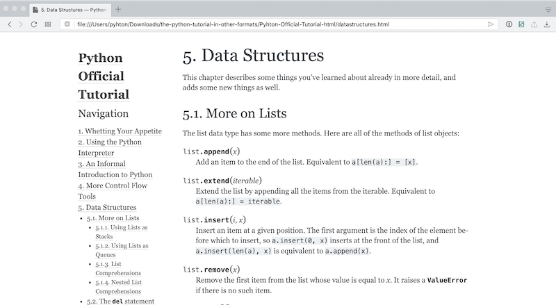

# 官方教程：The Python Tutorial

虽然，第一部分总计七章关于编程内容的编排是非常特别且相当有效的：

> * 它并没有像其它教程那样，从 “Hello world!” 入手；
> * 它也没有使用与市面上所有编程教材一样的内容先后顺序；
> * 它一上来就让你明白了程序的灵魂：布尔运算；
> * 它很快就让你明白有意义的程序其实只有两个核心构成：运算和流程控制；
> * 它让你很快理解函数从另外一个角度看只不过是 “程序员作为用户所使用的产品”；
> * 它让你重点掌握了最初级却最重要的数据类型，字符串；
> * 它让你从容器的角度了解了 Python 中绝大多数 “重要的数据类型”；
> * 最重要的是，它不承诺你 “速成”，但承诺 “领你入门”…… 显然，它做到了。

但是，第一部分的内容核心目标是让你 “**脱盲**” —— 它的作用还做不到让你 “已然学会编程”，它更多是让你从此开始有能力去阅读更多的重要资源，比如，官方的教程和参考。第一部分的内容更像地图上的 “**图例**”，而不是地图本身。

第一部分反复读过之后，最重要的结果就是：

> 现在你有能力自己查询官方文档了……

起码，在此之后，再去阅读 [The Python Tutorial](https://docs.python.org/3/tutorial/index.html)，不那么费力了，最起码，可以靠自己理解绝大多数内容……

在继续阅读本书内容的同时，有空就要反复翻 The Python Tutorial。

## 官方文档中最重要的链接

Python 也许是目前所有编程语言中在文档建设（Documenting）方面做得最好的（好像真的不需要在这句话后面加上 “之一”）。Python 社区为了建设完善的文档，甚至有专门的文档制作工具 —— 得益于 Python 社区从一开始就非常重视[文档规范](https://devguide.python.org/documenting/) —— [Sphinx](http://www.sphinx-doc.org/en/master/)。你在网络上最经常看到的计算机类文档，很可能都在这个网站上：[Read the Docs](https://readthedocs.org)……

Python 的官方文档网址是：

> https://docs.python.org/3/

其中对初学者最重要的两个链接是：

> * **[Tutorial](https://docs.python.org/3/tutorial/index.html)**: https://docs.python.org/3/tutorial/index.html
> * **[Library Reference](https://docs.python.org/3/library/index.html)**: https://docs.python.org/3/library/index.html

理论上来讲，只要有了基础的概念，自己反复阅读官方的 The Python Tutorial 是最好的，没什么入门书籍比它更好 —— 因为它的作者是 Python 的作者，那个被称为 “善意独裁者” 的 [Guido van Rossum](https://en.wikipedia.org/wiki/Guido_van_Rossum)。

此人很帅，但更帅的是他的车牌（摘自 Guido van Rossume 的[个人主页](https://gvanrossum.github.io)）：


## 为什么一定要阅读官方文档

买一两本 Python 教程是不可能完整掌握 Python 的 —— 其实，这句话里的 Python 替换成任何一种语言也是一样的。

教程和官方文档的各种属性是非常不一样的，比如，针对读者群，组织方式，语言表达…… 最不一样的地方在 “全面性”。任何一本单独的教程，都不可能像官方文档那样全面。各种单独教程的优势在于，它们更多地针对初学者、入门者设计，但与此同时，在全面性、深入性上做了妥协。

比如，在当前这本书里，不会涉及 [Bytes Object](https://docs.python.org/3/library/stdtypes.html#bytes-objects) —— 并非只有我一个人这么做，著名的 Python 教程《[Think Python: How to Think Like a Computer Scientist](http://greenteapress.com/thinkpython2/html/index.html)》、《[Dive into Python](https://linux.die.net/diveintopython/html/toc/index.html)》等等都没有涉及 Bytes Object 这个话题。

由于官方文档实际上没办法对入门者、初学者过分友好 —— 毕竟，全面、权威、准确才是它更应该做到的事情 —— 所以，很多人在刚开始的时候求助于各类非官方的教材、教程。原本应该是入门以后就理应 “只读官方文档”，或者 “第一查询对象只能是官方文档”，但在很多人那里竟然变成了 “从一开始到最后都在回避官方文档（或者说 ‘最专业的说明文字’），这就不好了，真的很吃亏，且自己都无法知道自己究竟吃了多少亏 —— 总以为自己已经学完了，但实际上从一开始就一点都不全面。

请牢记且遵守这个原则：

> **第一查询对象只能是官方文档**。

所以，当我用 Google 查询的时候，经常使用这样的格式：

> `<querries> site:python.org`

有时甚至会指定在那个目录里搜索：
    
> `bytes site:python.org/3/library`，你试试这个连接：[bytes site:python.org/3/library](https://www.google.com/search?q=byte+site%3Apython.org%2F3%2Flibrary) 

这个原则对任何语言都适用。将来你在学习任何新软件包（库）、语言更新后的新特性、甚至另外一个新语言的时候，都要这么做。所谓的超强自学能力，基本上就是由一些类似这样的小习惯和另外一些特别基础的方法构成的强大能力。

## 将官方文档拉回本地

把 The Python Tutorial 拉回本地阅读，可能更为方便，尤其是可以用 Sphinx 重新制作之后，页面左侧可以总是显示完整的目录：



也可以把这个教程转换成 epub 格式，以便在移动设备上阅读；甚至可以把这些个页面的 `.rst` 源文件转换成 `.ipynb` 文件，以便用 Jupyter Lab 浏览时可以直接执行其中的代码……

**注意**

> 此页的 Code Cell 中都是可执行的 bash 命令……

在此页执行它们对你来说是没意义的 —— 因为它们的执行结果在服务器上；这其中的命令，应该在你本地计算机上的 Terminal 中执行，你才能在本地计算机上获取结果。

### 安装 git
```bash
%%bash
which git
git --version

# 没有的话就执行以下命令安装 git
# conda install -c anaconda git
```
### 下载源文件

The Python Tutorial 的源文件位置在：

> https://github.com/python/cpython/tree/master/Doc/tutorial

repo 地址是：

> https://github.com/python/cpython.git

使用 git 将 repo 下载到 `~/Download/` 目录：
```bash
%%bash
cd ~/Downloads
# 总计 241 M，所以需要一点时间
git clone https://github.com/python/cpython.git
cd cpython/Doc/tutorial
ls
```
### 安装 rst2ipynb
```bash
%%bash
# rst2ipynb needs pandoc and notedown...
which pandoc
which notedown
# 没有这两样东西的话，需要执行下面两行进行安装……
# conda install -c conda-forge pandoc
# conda install -c conda-forge notedown

# install rst2ipynb
cd ~/Downloads
git clone https://github.com/nthiery/rst-to-ipynb.git
cd rst-to-ipynb
pip install .
which rst2ipynb
```
### 批量转换 rst 至 ipynb

这个 rst2ipynb 的程序有点讨厌，一次只能处理一个文件…… 下面是一个 bash 程序，其实将来学起来也不难，看着跟 Python 差不多…… 下面的代码执行过后会出现很多 “警告” —— 没关系，文件会正常转换的。
```bash
%%bash
cd ~/Downloads/cpython/Doc/tutorial/ 
for f in *.rst
    do
        rst2ipynb $f -o "${f/%.rst/.ipynb}"
    done
mkdir ipynbs
mv *.ipynb ipynbs/
```
如此这般，你就把 rst 文件都转换成 ipynb 文件，保存在 `~/Downloads/cpython/Doc/tutorial/ipynbs/` 之中了。随便把它挪到你喜欢的什么地方。用本地的 Jupyterlab 浏览，或者用 [Nteract](https://nteract.io) App 浏览。

如果以后你经常需要批量转换某个目录内的 `rst` 文件，那就把 bash function 放在 `~/.bash_profile` 文件里，在最后面追加以下代码：
```bash
function rsti {
    for f in *.rst
    do
    rst2ipynb $f -o "${f/%.rst/.ipynb}"
    done
}
```
而后在 Terminal 里执行一遍：
```bash
source ~/.bash_profile
```
而后，在有 `.rst` 文件的目录下输入 `rsti` 执行即可……

### 用 Sphinx 生成 html/epub 版本
```bash
%%bash 
which sphinx-quickstart
# 没有的话就执行下一行：
# conda install -c anaconda sphinx
sphinx-quickstart --version
sphinx-quickstart --help
```
生成 html 版本和 epub 版本：
```bash
%%bash
cd ~/Downloads/cpython/Doc/tutorial/ 
sphinx-quickstart -q output --sep -p 'The Python Tutorial' -a 'Guido van Rossum' -r '1.0' -v '1.0' -l 'en' --suffix '.rst' --master 'index' --ext-autodoc --ext-doctest --ext-intersphinx --ext-todo --ext-coverage --ext-imgmath --ext-mathjax --ext-ifconfig --ext-viewcode --makefile --no-batchfile --no-use-make-mode
cp -f *.rst output/source/
cd output
make html
make epub

# 生成的 html 版本应该在 output/build/html 目录下；
# 生成的 epub 版本应该在 output/build/epub 目录下。

# sphinx-quickstart -q output \
# --sep \
# -p 'The Python Tutorial' \
# -a 'Guido van Rossum' \
# -v '1.0'
# -r '1.0' \
# -l 'en' \
# --suffix '.rst' \
# --master 'index' \
# --ext-autodoc \
# --ext-doctest \
# --ext-intersphinx \
# --ext-todo \
# --ext-coverage \
# --ext-imgmath \
# --ext-mathjax \
# --ext-ifconfig \
# --ext-viewcode \
# --makefile \
# --no-batchfile \
# --no-use-make-mode
```
用 Sphinx 这样生成的版本，支持本地目录内搜索，也确实比在网站上看更方便一点：


### 下载已经转换好的版本

万一有什么情况中间出错又搞不定的话，就直接下载已经转换好的版本：
```bash
%%bash
cd ~/Downloads
git clone https://github.com/xiaolai/the-python-tutorial-in-other-formats.git
```
### 完整的 Python Doc 制作

其实，Python 的整个文档，已经是做好了制作文件的文档库：

> `cpython/Doc/Makefile`

只不过，将所有文件编译到一个 epub 里，在 iPad 之类的移动设备上打开有点费劲 —— 在我的设备上显示有 7701 页，翻页都要顿一顿……

想要使用这个官方的 `Makefile` 的话，首先确认自己已经安装过 Sphinx，其次需要补充安装一个包：
```bash
pip install blurb
```
而后在 Terminal 中转到 Doc 所在目录，执行以下命令：
```bash
make html
make epub
```
