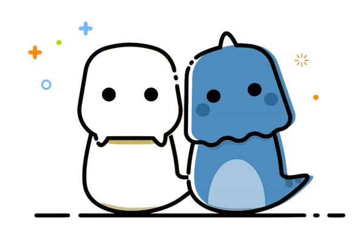

# 类 —— 面向对象编程

## 面向对象编程

注意：当前这一小节所论述的内容，不是专属于哪个编程语言（比如 Python、JavaScript 或者 Golang）。

面向对象编程（[Object Oriented Programming, OOP](https://en.wikipedia.org/wiki/Object-oriented_programming)）是一种编程的范式（Paradigm），或者说，是一种方法论（Methodology）—— 可以说这是个很伟大的方法论，在我看来，现代软件工程能做那么复杂的宏伟项目，基本上都得益于这个方法论的普及。

## 争议

现在，OOP 的支持者与反对者在数量上肯定不是一个等级，绝大多数人支持 OOP 这种编程范式。

但是，从另外一个角度，反对 OOP 的人群中，牛人比例更高 —— 这也是个看起来颇为吊诡的事实。

比如，Erlang 的发明者，[Joe Armstrong](https://en.wikipedia.org/wiki/Joe_Armstrong_(programmer) 就很讨厌 OOP，觉得它效率低下。他用的类比也确实令人忍俊不禁，说得也挺准的：

> 支持 OOP 的语言的问题在于，它们总是随身携带着一堆并不明确的环境 —— 你明明只不过想要个香蕉，可你所获得的是一个大猩猩手里拿着香蕉…… 以及那大猩猩身后的整个丛林！ —— [Coders at Work](http://www.codersatwork.com)

创作 UTF-8 和 Golang 的程序员 [Rob Pike](https://en.wikipedia.org/wiki/Rob_Pike)，更看不上 OOP，在 2004 年的一个讨论帖里直接把 OOP 比作 “[Roman numerals of computing](https://groups.google.com/forum/#!topic/comp.os.plan9/VUUznNK2t4Q%5B151-175%5D)” —— 讽刺它就是很土很低效的东西。八年后又[挖坟把一个 Java 教授写的 OOP 文章嘲弄了一番](https://plus.google.com/+RobPikeTheHuman/posts/hoJdanihKwb)：“也不知道是什么脑子，认为写 6 个新的 Class 比直接用 1 行表格搜索更好？”

[Paul Graham](https://en.wikipedia.org/wiki/Paul_Graham_(programmer) —— 就是那个著名的 Y-Combinator 的创始人 —— 也一样对 OOP 不以为然，在 [Why Arc isn't Especially Object-Oriented](http://www.paulgraham.com/noop.html) 中，说他认为 OOP 之所以流行，就是因为平庸程序员（Mediocre programers）太多，大公司用这种编程范式去阻止那帮家伙，让他们捅不出太大的娄子……

然而，争议归争议，应用归应用 —— 就好像英语的弊端不见得比其他语言少，可就是最流行，那怎么办呢？用呗 —— 虽然该抱怨的时候也得抱怨抱怨。

从另外一个角度望过去，大牛们如此评价 OOP 也是很容易理解的 —— 因为他们太聪明，又因为他们太懒得花时间去理解或容忍笨蛋…… 我们不一样，最不一样的地方在于，我们不仅更多容忍他人，而且更能够容忍自己的愚笨，所以，视角就不同了，仅此而已。

并且，上面两位大牛写的编程语言，现在也挺流行，Joe Armstrong 的 Erlang 和 Rob Pike 的 Golang，弄不好早晚你也得去学学，去用用……

## 基本术语

面向对象编程（OOP），是使用**对象**（Objects）作为核心的编程方式。进而就可以把对象（Objects）的数据和运算过程**封装**（Encapsulate）在内部，而外部仅能根据事先设计好的**界面**（Interface）与之沟通。

比如，你可以把灯泡想象成一个对象，使用_灯泡_的人，只需要与_开关_这个界面（Interface）打交道，而不必关心灯泡内部的设计和原理 —— 说实话，这是个很伟大的设计思想。

生活中，我们会遇到无数有意无意应用了这种设计思想的产品 —— 并不仅限于编程领域。你去买个车回来，它也一样是各种封装之后的对象。当你转动方向盘（操作界面）的时候，你并不需要关心汽车设计者是如何做到把那个方向盘和车轮车轴联系在一起并如你所愿去转向的；你只需要知道的是，逆时针转动方向盘是左转，而顺时针转动方向盘是右转 —— 这就可以了！

在程序设计过程中，我们常常需要对标现实世界创造对象。这时候我们用的最直接手段就是**抽象**（Abstract）。抽象这个手段，在现实中漫画家们最常用。为什么你看到下面的图片觉得它们俩看起来像是人？尤其是在你明明知道那肯定不是人的情况下，却已然接受那是两个漫画小人的形象？

这种描绘方式，就是抽象，很多 “没必要” 的细节都被去掉了（或者反过来说，没有被采用），留下的两个特征，一个是头，一个是双眼 —— 连那双 “眼睛” 都抽象到只剩下一个黑点了……

这种被保留下来的 “必要的特征”，叫做对象的**属性**（Attributes），进而，这些抽象的对象，既然是 “人” 的映射，它们实际上也能做一些抽象过后被保留下来的 “必要的行为”，比如，说话，哭笑，这些叫做对象的**方法**（Methods）。

从用编程语言创造对象的角度去看，所谓的界面，就由这两样东西构成：

> * _属性_ —— 用自然语言描述，通常是名词（Nouns）
> * _方法_ —— 用自然语言描述，通常是动词（Verbs）

从另外一个方面来看，在设计复杂对象的时候，抽象到极致是一种必要。

我们为生物分类，就是一层又一层地抽象的过程。当我们使用 “生物” 这个词的时候，它并不是某一个特定的我们能够指称的东西…… 然后我们开始给它分类……

所以，当我们在程序里创建对象的时候，做法常常是

> * 先创建最抽象的**类**（Class）
> * 然后再创建 **子类**（Subclass）…… 

它们之间是从属关系是：

> Class ⊃ Subclass

在 OOP 中，这叫**继承**（Inheritance）关系。比如，狗这个_对象_，就可以是从哺乳动物这个对象_继承_过来的。如果哺乳动物有 “头” 这个_属性_（Attributes），那么在狗这个对象中就没必要再重新定义这个属性了，因为既然狗是从哺乳动物继承过来的，那么它就拥有哺乳动物的所有属性……

每当我们创建好一个类之后，我们就可以根据它创建它的许多个**实例**（Instances）。比如，创建好了 “狗” 这个类之后，我们就可以根据这个类创建很多条狗…… 这好多条狗，就是狗这个类的_实例_。

现在能把这些术语全部关联起来了吗？

> * 对象，封装，抽象
> * 界面，属性，方法
> * 继承，类，子类，实例

这些就是关于 “面向对象编程” 方法论的最基本的术语 —— 无论在哪种编程语言里，你都会频繁地遇到它们。

**对象**、**类**，这两个词，给人的感觉是经常被通用 —— 习惯了还好，但对有些初学者来说，就感觉那是生命不能承受之重。—— 这次不是英文翻译中文时出现的问题，在英文世界里，这些词的互通使用和滥用也使相当一部分人（我怀疑是大部分人）最终掌握不了 OOP 这个方法论。

细微的差异在于 “视角” 的不同。

之前提到函数的时候，我用的说辞是，

> - 你写了一个函数，而后你要为这个产品的使用者写说明书……
> - —— 当然，产品使用者之中也包括未来的你……

类（Class）这个东西也一样，它也有创作者和使用者。

你可以这样分步理解：

> * 你创造了一个类（Class），这时候你是创作者，从你眼里望过去，那就是个类（Class）；
> * 而后你根据这个类的定义，创建了很多实例（Instances）；
> * 接下来一旦你开始使用这些实例的时候，你就成了使用者，从使用者角度望过去，手里正在操作的，就是各种对象（Objects）……

最后，补充一下，不要误以为所有的 Classes 都是对事物（即，名词）的映射 —— 虽然大多数情况下确实如此。

对基本概念有了一定的了解之后，再去看 Python 语言是如何实现的，就感觉没那么难了。
