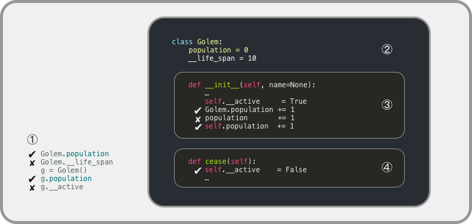

# 类 —— Python 的实现

既然已经在不碰代码的情况下，把 OOP 中的主要概念梳理清楚了，以下的行文中，那些概念就直接用英文罢，省得理解上还得再绕个弯……

## Defining Class

Class 使用 `class` 关键字进行定义。

与函数定义不同的地方在于，Class 接收参数不是在 `class Classname():` 的括号里完成 —— 那个圆括号有另外的用处。

让我们先看看代码，而后再逐一解释：
```python
from IPython.core.interactiveshell import InteractiveShell
InteractiveShell.ast_node_interactivity = "all"
import datetime

class Golem:
    
    def __init__(self, name=None):
        self.name = name
        self.built_year = datetime.date.today().year
    
    def say_hi(self):
        print('Hi!')
        
g = Golem('Clay')
g.name
g.built_year
g.say_hi
g.say_hi()
type(g)
type(g.name)
type(g.built_year)
type(g.__init__)
type(g.say_hi)
```
    'Clay'
    2019
    <bound method Golem.say_hi of <__main__.Golem object at 0x107bac278>>
    Hi!
    __main__.Golem
    str
    int
    method
    method


以上，我们创建了一个 Class:
```python
class Golem:
    
    def __init__(self, name=None):
        self.name = name
        self.built_year = datetime.date.today().year
```
其中定义了当我们根据这个 Class 创建一个实例的时候，那个 Object 的初始化过程，即 `__init__()` 函数 —— 又由于这个函数是在 Class 中定义的，我们称它为 Class 的一个 Method。

这里的 `self` 就是个变量，跟程序中其它变量的区别在于，它是一个系统默认可以识别的变量，用来指代将来用这个 Class 创建的 Instance。

比如，我们创建了 Golem 这个 Class 的一个 Instance，`g = Golem('Clay')` 之后，我们写 `g.name`，那么解析器就去找 `g` 这个实例所在的 Scope 里有没有`self.name`…… 

注意：`self` 这个变量的定义，是在 `def __init__(self, ...)` 这一句里完成的。对于这个变量的名称取名没有强制要求，你实际上可以随便用什么名字，很多 C 程序员会习惯于将这个变量命名为 `this` —— 但根据惯例，你最好还是只用 `self` 这个变量名，省得给别人造成误会。

在 Class 的代码中，如果定义了 `__init__()` 函数，那么系统就会将它当作用来 Instance 在创建后被初始化的函数。这个函数名称是强制指定的，初始化函数必须使用这个名称；注意 `init` 两端各有两个下划线 `_`。

当我们用 `g = Golem('Clay')` 这一句创建了一个 Golam 的 Instance 的时候，以下一连串的事情发生了：

> * `g` 从此之后就是一个根据 Golem 这个 Class 创建的 Instance，对使用者来说，它就是个 Object；
> * 因为 Golem 这个 Class 的代码中有 `__init__()`，所以，当 `g` 被创建的时候，`g` 就需要被初始化……
> * 在 `g` 所在的变量目录中，出现了一个叫做 `self` 的用来指代 `g` 本身的变量；
> * self.name 接收了一个参数，`'Clay'`，并将其保存了下来；
> * 生成了一个叫做 `self.built_year` 的变量，其中保存的是 `g` 这个 Object 被创建时的年份……

对了，Golem 和 Robot 一样，都是机器人的意思；Golem 的本义来自于犹太神话，一个被赋予了生命的泥人……

## Inheritance

我们刚刚创建了一个 Golem Class，如果我们想用它 Inherite 一个新的 Class，比如，`Running_Golem`，一个能跑的机器人，那就像以下的代码那样做 —— 注意 `class Running_Golem` 之后的圆括号：
```python
from IPython.core.interactiveshell import InteractiveShell
InteractiveShell.ast_node_interactivity = "all"
import datetime

class Golem:
    
    def __init__(self, name=None):
        self.name = name
        self.built_year = datetime.date.today().year
    
    def say_hi(self):
        print('Hi!')

class Running_Golem(Golem):      # 刚刚就说，这个圆括号另有用途……
    
    def run(self):
        print("Can't you see? I'm running...")

rg = Running_Golem('Clay')
rg.run
rg.run()
rg.name
rg.built_year
rg.say_hi()
```
    Can't you see? I'm running...
    Hi!


如此这般，我们根据 Golem 这个 Class 创造了一个 Subclass —— `Running_Golem`，既然它是 Golem 的 Inheritance，那么 Golem 有的 Attributes 和 Methods 它都有，并且还多了一个 Method —— `self.run`。

## Overrides

当我们创建一个 Inherited Class 的时候，可以重写（Overriding）Parent Class 中的 Methods。比如这样：
```python
from IPython.core.interactiveshell import InteractiveShell
InteractiveShell.ast_node_interactivity = "all"
import datetime

class Golem:
    
    def __init__(self, name=None):
        self.name = name
        self.built_year = datetime.date.today().year
    
    def say_hi(self):
        print('Hi!')

class runningGolem(Golem):
    
    def run(self):
        print("Can't you see? I'm running...")
    
    def say_hi(self):                            # 不再使用 Parent Class 中的定义，而是新的……
        print('Hey! Nice day, Huh?')

rg = runningGolem('Clay')
rg.run
rg.run()
rg.name
rg.built_year
rg.say_hi()
```
    <bound method runningGolem.run of <__main__.runningGolem object at 0x1056f9358>>
    Can't you see? I'm running...
    'Clay'
    2019
    Hey! Nice day, Huh?


## Inspecting A Class

当我们作为用户想了解一个 Class 的 Interface，即，它的 Attributes 和 Methods 的时候，常用的有三种方式：
```python
1. help(object)
2. dir(object)
3. object.__dict__
```
```python
from IPython.core.interactiveshell import InteractiveShell
InteractiveShell.ast_node_interactivity = "all"
import datetime

class Golem:
    
    def __init__(self, name=None):
        self.name = name
        self.built_year = datetime.date.today().year
    
    def say_hi(self):
        print('Hi!')

class runningGolem(Golem):
    
    def run(self):
        print('Can\'t you see? I\'m running...')
    
    def say_hi(self):                            # 不再使用 Parent Class 中的定义，而是新的……
        print('Hey! Nice day, Huh?')

rg = runningGolem('Clay')
help(rg)
dir(rg)
rg.__dict__
hasattr(rg, 'built_year')
```
    Help on runningGolem in module __main__ object:
    
    class runningGolem(Golem)
     |  runningGolem(name=None)
     |  
     |  Method resolution order:
     |      runningGolem
     |      Golem
     |      builtins.object
     |  
     |  Methods defined here:
     |  
     |  run(self)
     |  
     |  say_hi(self)
     |  
     |  ----------------------------------------------------------------------
     |  Methods inherited from Golem:
     |  
     |  __init__(self, name=None)
     |      Initialize self.  See help(type(self)) for accurate signature.
     |  
     |  ----------------------------------------------------------------------
     |  Data descriptors inherited from Golem:
     |  
     |  __dict__
     |      dictionary for instance variables (if defined)
     |  
     |  __weakref__
     |      list of weak references to the object (if defined)
    
    ['__class__',
     '__delattr__',
     '__dict__',
     '__dir__',
     '__doc__',
     '__eq__',
     '__format__',
     '__ge__',
     '__getattribute__',
     '__gt__',
     '__hash__',
     '__init__',
     '__init_subclass__',
     '__le__',
     '__lt__',
     '__module__',
     '__ne__',
     '__new__',
     '__reduce__',
     '__reduce_ex__',
     '__repr__',
     '__setattr__',
     '__sizeof__',
     '__str__',
     '__subclasshook__',
     '__weakref__',
     'built_year',
     'name',
     'run',
     'say_hi']
    {'name': 'Clay', 'built_year': 2019}
    True


## Scope

每个变量都属于某一个 **Scope**（变量的作用域），在同一个 Scope 中，变量可以被引用被操作…… 这么说非常抽象，难以理解 —— 只能通过例子说明。

我们先给 Golem 这个 Class 增加一点功能 —— 我们需要随时知道究竟有多少个 Golem 处于活跃状态…… 也因此顺带给 Golem 加上一个 Method： `cease()` —— 哈！机器人么，想关掉它，说关掉它，就能关掉它；

另外，我们还要给机器人设置个使用年限，比如 10 年；

…… 而外部会每隔一段时间，用 `Golem.is_active()` 去检查所有的机器人，所以，不需要外部额外操作，到了年头，它能应该关掉自己。—— 当然，又由于以下代码是简化书写的，核心目的是为了讲解 Scope，所以并没有专门写模拟 10 年后某些机器人自动关闭的情形……

在运行以下代码之前，需要先介绍三个 Python 的内建函数：

> * `hasattr(object, attr)` 查询这个 `object` 中有没有这个 `attr`，返回布尔值
> * `getattr(object, attr)` 获取这个 `object` 中这个 `attr` 的值
> * `setattr(object, attr, value)` 将这个 `object` 中的 `attr` 值设置为 `value`

现在的你，应该一眼望过去，就已经能掌握这三个内建函数的用法 —— 还记得之前的你吗？眼睁睁看着，那些字母放在那里对你来说没任何意义…… 这才多久啊！
```python
from IPython.core.interactiveshell import InteractiveShell
InteractiveShell.ast_node_interactivity = "all"
import datetime

class Golem:
    population = 0
    __life_span = 10
    
    def __init__(self, name=None):
        self.name = name
        self.built_year = datetime.date.today().year
        self.__active = True
        Golem.population += 1
    
    def say_hi(self):
        print('Hi!')
    
    def cease(self):
        self.__active = False
        Golem.population -= 1          # 执行一遍之后，试试把这句改成 population += 1
    
    def is_active(self):
        if datetime.date.today().year - self.built_year >= Golem.__life_span:
            self.cease()
        return self.__active

g = Golem()
hasattr(Golem, 'population')      # True
hasattr(g, 'population')          # True
hasattr(Golem, '__life_span')     # False
hasattr(g, '__life_span')         # False
hasattr(g, '__active')            # False
Golem.population                  # 1
setattr(Golem, 'population', 10) 
Golem.population                  # 10
x = Golem()
Golem.population                  # 11
x.cease()
Golem.population                  # 10
getattr(g, 'population')          # 10
g.is_active()
```
    True
    True
    False
    False
    False
    1
    10
    11
    10
    10
    True


如果你试过把第 13 行的 `Golem.population += 1` 改成 `population += 1`，你会被如下信息提醒：
```python
     12         self.__active = True
---> 13         population += 1
UnboundLocalError: local variable 'population' referenced before assignment
```
—— 本地变量 `population` 尚未赋值，就已经提前被引用…… 为什么会这样呢？因为在你所创建 `g` 之后，马上执行的是 `__init()__` 这个初始化函数，而 `population` 是在这个函数之外定义的……

如果你足够细心，你会发现这个版本中，有些变量前面有两个下划线 `__`，比如，`__life_span` 和 `self.__active`。这是 Python 的定义，变量名前面加上一个以上下划线（Underscore） `_` 的话，那么该变量是 “私有变量”（Private Variables），不能被外部引用。而按照 Python 的惯例，我们会使用两个下划线起始，去命名私有变量，如： `__life_span`。你可以回去试试，把所有的 `__life_span` 改成 `_life_span`（即，变量名开头只有一个 `_`，那么，`hasattr(Golem, '_life_span')` 和 `hasattr(g, '_life_span')` 的返回值就都变成了 `True`。

看看下面的图示，理解起来更为直观一些：



整个代码启动之后，总计有 4 个 Scopes 如图所示：

> * ① `class Golem` 之外；
> * ② `class Golem` 之内；
> * ③ `__init__(self, name=None)` 之内；
> * ④ `cease(self)` 之内；

在 Scope ① 中，可以引用 `Golem.population`，在生成一个 Golem 的实例 `g` 之后，也可以引用 `g.population`；但 `Golem.__life_span` 和 `g.__active` 在 Scope ① 是不存在的；

在 Scope ② 中，存在两个变量，`population` 和 `__life_span`；而 `__life_span` 是 Private（私有变量，因为它的变量名中前两个字符是下划线 `__`；于是，在 Scope ① 中，不存在 `Golem.__life_span` —— `hasattr(Golem, '__life_span')` 的值为 `False`；

在 Scope ③ 中和 Scope ④ 中，由于都给它们传递了 `self` 这个参数，于是，在这两个 Scope 里，都可以引用 `self.xxx`，比如 `self.population`，比如 `self.__life_span`；

在 Scope ③ 中，`population` 是不存在的，如果需要引用这个值，可以用 `Golem.population`，也可以用 `self.population`。同样的道理，在 Scope ③ 中 `__life_span` 也不存在，如果想用这个值，可以用 `Golem.__life_span` 或者 `self.__life_span`；

Scope ④ 与 Scope ③ 平行存在。所以在这里，`population` 和 `__life_span` 也同样并不存在。


## Encapsulation

到目前为止，Golem 这个 Class 看起来不错，但有个问题，它里面的数据，外面是可以随便改的 —— 虽然，我们已经通过给变量 life_span 前面加上两个下划线，变成 `__life_span`，使其成为私有变量，外部不能触达（你不能引用 `Golem.__life_span`），可 Golem.population 就不一样，外面随时可以引用，还可以随时修改它，只需要写上一句：
```python
Golem.population = 1000000
```
我们干脆把 `population` 这个变量也改成私有的罢：`__population`，而后需要从外界查看这个变量的话，就在 Class 里面写个函数，返回那个值好了：
```python
from IPython.core.interactiveshell import InteractiveShell
InteractiveShell.ast_node_interactivity = "all"
import datetime

class Golem:
    __population = 0
    __life_span = 10
    
    def __init__(self, name=None):
        self.name = name
        self.built_year = datetime.date.today().year
        self.__active = True
        Golem.__population += 1
    
    def say_hi(self):
        print('Hi!')
    
    def cease(self):
        self.__active = False
        Golem.__population -= 1
    
    def is_active(self):
        if datetime.date.today().year - self.built_year >= Golem.__life_span:
            self.cease
        return self.__active
    
    def population(self):
        return Golem.__population

g = Golem('Clay')
g.population
g.population()
```
    <bound method Golem.population of <__main__.Golem object at 0x1036f5cc0>>
    1


如果，你希望外部能够像获得 Class 的属性那样，直接写 `g.population`，而不是必须加上一个括号 `g.population()` 传递参数（实际上传递了一个隐含的 `self` 参数），那么可以在 `def population(self):` 之前的一行加上一句 `@property`：
```python
class Golem:
    __population = 0
    ...
    
    @property
    def population(self):
        return Golem.__population
```
如此这般之后，你就可以用 `g.population` 了：
```python
from IPython.core.interactiveshell import InteractiveShell
InteractiveShell.ast_node_interactivity = "all"
import datetime

class Golem:
    __population = 0
    __life_span = 10
    
    def __init__(self, name=None):
        self.name = name
        self.built_year = datetime.date.today().year
        self.__active = True
        Golem.__population += 1
    
    def say_hi(self):
        print('Hi!')
    
    def cease(self):
        self.__active = False
        Golem.__population -= 1
    
    def is_active(self):
        if datetime.date.today().year - self.built_year >= Golem.__life_span:
            self.cease
        return self.__active
    
    @property
    def population(self):
        return Golem.__population

g = Golem('Clay')
g.population
# g.population = 100
```
    1


如此这般之后，不仅你可以直接引用 `g.population`，并且，在外部不能再直接给 `g.population` 赋值了，否则会报错：
```python
---------------------------------------------------------------------------
AttributeError                            Traceback (most recent call last)
<ipython-input-16-5d8c475304d3> in <module>
     26 g = Golem('Clay')
     27 g.population
---> 28 g.population = 100

AttributeError: can't set attribute
```
到此为止，Encapsulation 就做得不错了。

如果你非得希望从外部可以设置这个值，那么，你就得再写个函数，并且在函数之前加上一句：
```python
    ...
    
    @property
    def population(self):
        return Golem.__population
    
    @population.setter
    def population(self, value):
        Golem.__population = value
```
这样之后，`.population` 这个 Attribute 就可以从外部被设定其值了（虽然在当前的例子中显得没必要让外部设定 `__population` 这个值…… 以下仅仅是为了举例）：
```python
from IPython.core.interactiveshell import InteractiveShell
InteractiveShell.ast_node_interactivity = "all"
import datetime

class Golem:
    __population = 0
    __life_span = 10
    
    def __init__(self, name=None):
        self.name = name
        self.built_year = datetime.date.today().year
        self.__active = True
        Golem.__population += 1
    
    def say_hi(self):
        print('Hi!')
    
    def cease(self):
        self.__active = False
        Golem.__population -= 1
    
    def is_active(self):
        if datetime.date.today().year - self.built_year >= Golem.__life_span:
            self.cease
        return self.__active
    
    @property
    def population(self):
        return Golem.__population
    
    @population.setter
    def population(self, value):
        Golem.__population = value

g = Golem('Clay')
g.population
g.population = 100
ga = Golem('New')
g.population
ga.population
help(Golem)
Golem.__dict__
g.__dict__
hasattr(Golem, 'population')
getattr(Golem, 'population')
setattr(Golem, 'population', 10000)
g.population    # 所以，在很多的情况下，不把数据封装在 Class 内部的话，后面会很有很多麻烦。
```
    Help on class Golem in module __main__:
    
    class Golem(builtins.object)
     |  Golem(name=None)
     |  
     |  Methods defined here:
     |  
     |  __init__(self, name=None)
     |      Initialize self.  See help(type(self)) for accurate signature.
     |  
     |  cease(self)
     |  
     |  is_active(self)
     |  
     |  say_hi(self)
     |  
     |  ----------------------------------------------------------------------
     |  Data descriptors defined here:
     |  
     |  __dict__
     |      dictionary for instance variables (if defined)
     |  
     |  __weakref__
     |      list of weak references to the object (if defined)
     |  
     |  population
    
    10000


