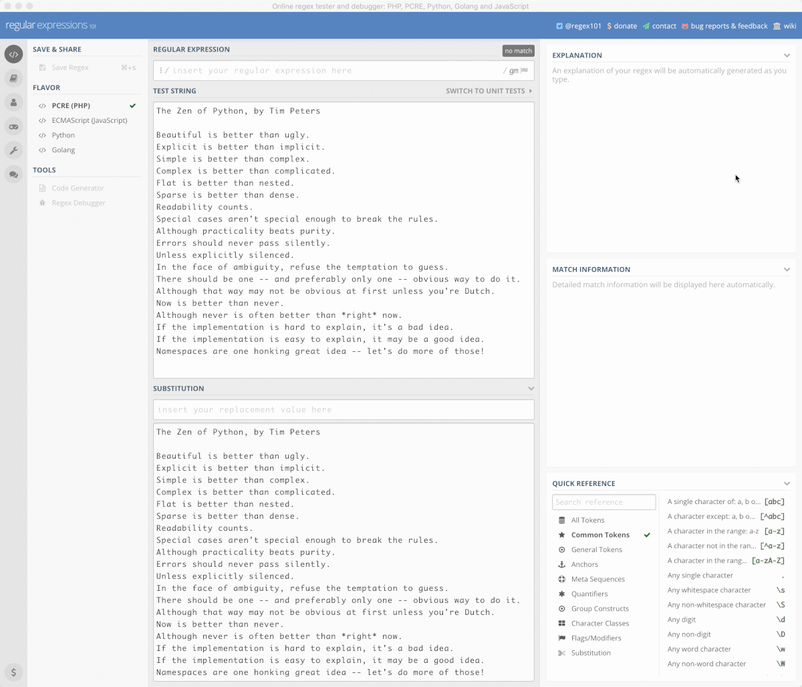

# 正则表达式

正则表达式本质上是个独立的语言，短小却格外强悍 —— 乃至于，如果你竟然没学会它的话，你的之前学的编程技能干脆与残疾无异。

Wikipedia 上对正则表达式的说明如下：

> **正则表达式**（英语：Regular Expression，在代码中常简写为 regex、regexp 或 RE），又称*正规表示式*、*正规表示法*、*正规运算式*、*规则运算式*、*常规表示法*，是计算机科学的一个概念。正则表达式使用单个字符串来描述、匹配一系列符合某个句法规则的字符串。在很多文本编辑器里，正则表达式通常被用来检索、替换那些符合某个模式的文本。许多程序设计语言都支持利用正则表达式进行字符串操作。例如，在 Perl 中就内建了一个功能强大的正则表达式引擎。正则表达式这个概念最初是由 Unix 中的工具软件（例如 sed 和 grep）普及开的。

以下是绝大多数翻译成中文的教程中对正则表达式进行讲解时所使用的描述：

> 一个正则表达式（Regular Expression）通常被称为一个模式（Pattern）。

我常常觉得当初要是它被翻译成 “规则表达式”，那么很可能初学者不会感到那么大的压力 —— 谁都一样，看着由 “每个都认识的字构成的词组” 却不能直观地想到它究竟是什么东西，都会感到莫名的压力。

**Regular**，其实在它的众多语义中，取以下释义最符合 Regular Expression 的原意<a href='#fn1' name='fn1b'><sup>[1]</sup></a>：

> ⑭ Linguistics 规则的 ▸ regular verbs 规则动词

而 **Pattern** 这个词，在词典里有好几个对应的中文词汇：

> ① 图案；② 式样；③ 图样；④ 榜样；⑤ 模式；⑥ 样品；⑦ 模子

在当前语境之下，把 Pattern 翻译成 “模式”，显然不如 “模子” 更好（甚至连 “样品” 感觉都比 “模式” 更恰当）—— “模子” 这个词很直观啊，拿着一个模子去找与它一致的字符串…… “与规则一致”，英文用的是 **Match**，一般被翻译作 “匹配”。

在自学编程的过程中，处处都是这种语言翻译带来的迷惑、障碍，或者耽误。既然应该把 Regular Expression 理解为 “规则表达式” 更好，那其实吧，把 Pattern 直接理解为中文的 “*规则*”，可能更直观更准确，理解上更是毫无障碍：

> 一个规则表达式（Regular Expression）通常被称为一个规则（Pattern）。

那么，**规则表达式**里写的是什么呢？只能是**规则**了…… 到最后好像也就 “捕获”（Capture）这个词没什么歧义。

现在，我们已经把术语全部 “解密” 了，然后再看看下面的表述：

> 我们可以用书写特定的规则，用来在文本中捕获与规则一致的字符串，而后对其进行操作……

理解起来相当顺畅。

以下的 Python 代码中，[`\wo\w`](https://regexper.com#%5Cwo%5Cw) 就是一个*规则表达式*（或称为*规则*）；

而 `re.findall(pttn, str)` 的作用就是，在 `str` 里找到所有与这个**规则**（Pattern，模式）**一致**（Match，匹配）的字符串：

```python
import re
str = 'The quick brown fox jumps over the lazy dog'
pttn = re.compile(r'\wo\w')
re.findall(pttn, str)
```

    ['row', 'fox', 'dog']

总结一下：

> **规则表达式**（Regular Expressions，通常缩写为 Regex）是最强大且不可或缺的文本处理工具 —— 它的用处就是在文本中**扫描/搜索**（Scan/Search）与某一**规则**（Pattern）**匹配**（Match，即，与规则一致）的所有实例，并且还可以按照规则**捕获**（Capture）其中的部分或者全部，对它们进行**替换**（Replace）。

接下来为了避免歧义，我们干脆用 Regex 这个缩写，以及与它相关的英文单词：pattern, match, capture, replace(ment)……

有时，使用 Regex 并不是为了 Replace，而是为了检查格式，比如，可以用 Regex 检查用户输入的密码是否过于简单（比如，全部都由数字构成），比如可以用来验证用户输入的电话号码、证件号码是否符合特定格式等等。

另外，在自学的过程中，想尽一切办法把一切术语用简单直白的 “人话” 重新表述，是特别有效的促进进步的行为模式。

## 视觉体验

所谓百闻不如一见。

眼见为实 —— 想办法让一个陌生的概念视觉上直观，是突破大多学习障碍的最简单粗暴直接有效的方式。

我们最好先直接看看 Regex 的工作过程。以下，是用微软发行的代码编辑工具 Visual Studio Code 针对一小段文本使用若干条 Regex 进行匹配的过程：


Python 的项目代码仓库里有一个很简短的 Demo 程序，叫 [`redemo.py`](https://github.com/python/cpython/blob/master/Tools/demo/redemo.py)，它使用 [Tcl/Tk](https://docs.python.org/3/library/tkinter.html) 作为图形界面，也可以用来测试正则表达式。

它的代码地址是：

> https://raw.githubusercontent.com/python/cpython/master/Tools/demo/redemo.py

它运行起来长成这样：


目前（2019）网上最方便的 Regex 测试器，是 [regex101.com](https://regex101.com)：

以下，就是在一段文本中，找出所有首写字母大写的词汇的*过程*，并将其先全部替换成小写，再将其全部替换为大写的过程；使用的正则表达式是 `([A-Z])\w+`，替换表达式分别是 `\L$1` 和 `\U$1`：



这个网站太好了，所以，平日里我是用 [Nativefier](https://github.com/jiahaog/nativefier) 工具将这个网站打包为一个 Mac Desktop App 使用。不过，它也有局限，就是被搜索文件略微大点就报错，说 `timeout`……

## 准备工作

我们需要个文本文件，用来当作练习使用正则表达式去搜索替换的目标。这个文件保存在当前的根目录，文件名称是：`regex-target-text-sample.txt`。

以下代码中，`pttn = r'beg[iau]ns?'` 这一句中的 [`beg[iau]ns?`](https://regexper.com#beg[iau]ns?) 就是 Regex 的 Pattern。

**注意**：在 Python 代码中，写 Pattern 的时候，之所以要在字符串 `'...'` 之前加上 `r`，写成 `r'...'`，是因为如果不用 raw string 的话，那么，每个转义符号都要写成 `\\`；如果用 raw string，转义符号就可以直接使用 `\` 本身了…… 当然，如果你想搜索 `\` 这个符号本身的话，那么还是得写 `\\`。

而 `re.findall(pttn, str)` 的意思是说，把 `str` 中所有与 `pttn` 这个规则一致的字符串都找出来：

```python
import re
with open('regex-target-text-sample.txt', 'r') as f:
    str = f.read()
pttn = r'beg[iau]ns?'
re.findall(pttn, str)
```

    ['begin', 'began', 'begun', 'begin']

文件 `regex-target-text-sample.txt` 中的内容如下：

```html
<ol>
    <li><pre>begin began begun bigins begining</pre></li>
    <li><pre>google gooogle goooogle goooooogle</pre></li>
    <li><pre>coloured color coloring  colouring colored</pre></li>
    <li><pre>never ever verb however everest</pre></li>
    <li><pre>520 52000 5200000 520000000 520000000000</pre></li>
    <li><pre>error wonderer achroiocythaemia achroiocythemia</pre></li>
    <li><pre>The white dog wears a black hat.</pre></li>
    <li><pre>Handel, Händel, Haendel</pre></li>
</ol>
<dl>(843) 542-4256</dl> <dl>(431) 270-9664</dl>
<dl>3336741162</dl> <dl>3454953965</dl>
<ul>
<li>peoplesr@live.com</li> <li>jaxweb@hotmail.com</li>
<li>dhwon@comcast.net</li> <li>krueger@me.com</li>
</ul>
<h3>URLs</h3>
https://docs.python.org/3/howto/regex.html
https://docs.python.org/3/library/re.html
<h3>passwords</h3>
Pasw0rd~
i*Eh,GF67E
a$4Bh9XE&E
<h3>duplicate words</h3>
<p>It's very very big.</p>
<p>Keep it simple, simple, simple!</p>
```

在以下的示例中，有时直接设定了 str 的值，而不是使用以上整个文本文件 —— 因为读者在阅读的时候，最好能直接看到被搜索的字符串。另外，如果使用整个文件，所得到的 Match 太多，也确实影响阅读。

## 优先级

毕竟，你已经不是 “啥都不懂” 的人了。你已经知道一个事实：编程语言无非是用来运算的。

所谓的运算，就有操作符（Operators）和操作元（Operands）—— 而操作符肯定是有优先级的，不然的话，那么多操作元和操作符放在一起，究竟先操作哪个呢？

Regex 也一样，它本身就是个迷你语言（Mini Language）。在 Regex 中，操作符肯定也有优先级。它的操作元有个专门的名称，**原子**（Atom）。

先大致看看它的操作符优先级，你就会对它有相当不错的了解：

| 排列 |         原子与操作符优先级      |（从高到低）|
|---|-----------------------------------|------------------------|
| 1 | 转义符号 (Escaping Symbol)               | `\` |
| 2 | 分组、捕获 (Grouping or Capturing)                          | `(...)` `(?:...)` `(?=...)` `(?!...)` `(?<=...)` `(?<!...)`     |
| 3 | 数量 (Quantifiers)      | `a*` `a+` `a?` `a{n, m}` |
| 4 | 序列与定位（Sequence and Anchor）| `abc` `^` `$` `\b` `\B`               |
| 5 | 或（Alternation）| `a\|b\|c`                   |
| 6 | 原子 (Atoms)                 | `a` `[^abc]` `\t` `\r` `\n` `\d` `\D` `\s` `\S` `\w` `\W` `.` |

当然，你若是在之前，没有自学过、理解过 Python（或者任何其它编程语言）表达式中的操作符优先级，那么一上来就看上面的表格不仅对你没有帮助，只能让你更迷惑。

—— 这就是理解能力逐步积累逐步加强的过程。

## 原子

在 Regex 的 Pattern 中，操作元，即，被运算的 “值”，被称为**原子**（Atom）。

### 本义字符

最基本的原子，就是本义字符，它们都是单个字符。

本义字符包括从 `a` 到 `z`，`A` 到 `Z`，`0` 到 `9`，还有 `_` —— 它们所代表的就是它们的字面值。

即，相当于，`string.ascii_letters` 和 `string.digits` 以及 `_`。

```python
from IPython.core.interactiveshell import InteractiveShell
InteractiveShell.ast_node_interactivity = "all"

import string
string.ascii_letters
string.digits
```

    'abcdefghijklmnopqrstuvwxyzABCDEFGHIJKLMNOPQRSTUVWXYZ'
    '0123456789'

以下字符在 Regex 中都有特殊含义：

> `\` `+` `*` `.` `?` `-` `^` `$` `|` `(` `)` `[` `]` `{` `}` `<` `>`

当你在写 Regex 的时候，如果你需要搜索的字符不是本义字符，而是以上这些特殊字符时，*建议*都直接加上转义符号 `\` 来表示，比如，你想搜索 `'`，那你就写 `\'`，或者你想搜索 `#` 那你就写 `\#`（事实上，`#` 并不是 Regex 的特殊符号，所以，它之前的转义符号可有可无）—— 这对初学者来说可能是最安全的策略。

跟过往一样，所有的细节都很重要，它们就是需要花时间逐步熟悉到牢记。

### 集合原子

集合原子还是原子。

标示集合原子，使用方括号 `[]`。`[abc]` 的意思是说，“`a` or `b` or `c`”，即，`abc` 中的任意一个字符。

比如，[`beg[iau]n`](https://regexper.com#beg[iau]n) 能够代表 `begin`、`began`，以及 `begun`。

```python
import re

str = 'begin began begun bigins begining'
pttn = r'beg[iau]n'
re.findall(pttn, str)
```

    ['begin', 'began', 'begun', 'begin']

在方括号中，我们可以使用两个操作符：`-`（区间）和 `^`（非）。

* `[a-z]` 表示从小写字母 `a` 到小写字母 `z` 中的任意一个字符。
* `[^abc]` 表示 `abc` 以外的其它任意字符，即，非 `[abc]`。

注意，一个集合原子中，`^` 符号只能用一次，只能紧跟在 `[` 之后。否则不起作用。

### 类别原子

类别原子，是指那些能够代表 “一类字符” 的原子，它们都得使用转义符号再加上另外一个符号表达，包括：

`\d` 任意数字；等价于 `[0-9]`

`\D` 任意非数字；等价于 `[^0-9]`

`\w` 任意本义字符；等价于 `[a-zA-Z0-9_]`

`\W` 任意非本义字符；等价于 `[^a-zA-Z0-9_]`

`\s` 任意空白；相当于 `[ \f\n\r\t\v]`（注意，方括号内第一个字符是空格符号）

`\S` 任意非空白；相当于 `[^ \f\n\r\t\v]`（注意，紧随 `^` 之后的是一个空格符号）

`.` 除 `\r` `\n` 之外的任意字符；相当于 `[^\r\n]`

类别原子挺好记忆的，如果你知道各个字母是哪个词的首字母的话：

> * `d` 是 digits
> * `w` 是 word characters
> * `s` 是 spaces

另外，在空白的集合 `[ \f\n\r\t\v]` 中：`f` 是分页符；`\n` `\r` 是换行符；`\t` 是制表符；`\v` 是纵向制表符（很少用到）。各种关于空白的转义符也同样挺好记忆的，如果你知道各个字母是那个词的首字母的话：

> * `f` 是 flip
> * `n` 是 new line
> * `r` 是 return
> * `t` 是 tab
> * `v` 是 vertical tab

```python
import re

str = '<dl>(843) 542-4256</dl> <dl>(431) 270-9664</dl>'
pttn = r'\d\d\d\-'
re.findall(pttn, str)
```

    ['542-', '270-']

### 边界原子

我们可以用边界原子指定边界。也可以称作 “定位操作符”。

`^` 匹配被搜索字符串的开始位置；

`$` 匹配被搜索字符串的结束位置；

`\b` 匹配单词的边界；[`er\b`](https://regexper.com#er%5Cb)，能匹配 `coder` 中的 `er`，却不能匹配 `error` 中的 `er`；

`\B` 匹配非单词边界；[`er\B`](https://regexper.com#er%5CB)，能匹配 `error` 中的 `er`，却不能匹配 `coder` 中的 `er`。

```python
import re

str = 'never ever verb however everest'
pttn = r'er\b'
re.findall(pttn, str)
pttn = r'er\B'
re.findall(pttn, str)
```

    ['er', 'er', 'er']
    ['er', 'er']

**注意**：`^` 和 `$` 在 Python 语言中被 `\A` 和 `\Z` 替代。

事实上，每种语言或多或少都对 Regex 有自己的定制。不过，本章讨论的绝大多数细节，都是通用的。

### 组合原子

我们可以用圆括号 `()` 将多个单字符原子组合成一个原子 —— 这么做的结果是，`()` 内的字符串将被当作一整个原子，可以被随后我们要讲解的数量操作符操作。

另外，`()` 这个操作符，有两个作用：**组合**（Grouping），就是我们刚刚讲到的作用；而另外一个作用是**捕获**（Capturing)，后面会讲到。

注意区别，[`er`](https://regexper.com#er)、[`[er]`](https://regexper.com#[er]) 和 [`(er)`](https://regexper.com#(er) 各不相同。

> * `er` 是两个原子，`'e'` 和紧随其后的 `'r'`
> * `[er]` 是一个原子，或者 `'e'` 或者 `'r'`；
> * `(er)` 是一个原子，`'er'`

下一节中讲到数量操作符的时候，会再次强调这点。

## 数量操作符

数量操作符有：`+` `?` `*` `{n, m}`。

它们是用来限定位于它们之前的原子允许出现的个数；不加数量限定则代表出现一次且仅出现一次：

`+` 代表前面的原子必须至少出现一次，即：` 出现次数 ≧ 1`

> 例如，[`go+gle`](https://regexper.com#go+gle)可以匹配 `google` `gooogle` `goooogle` 等；

`?` 代表前面的原子最多只可以出现一次，即：`0 ≦ 出现次数 ≦ 1`

> 例如，[`colou?red`](https://regexper.com#colou?red)可以匹配 `colored` 或者 `coloured`;

`*` 代表前面的原子可以不出现，也可以出现一次或者多次，即：` 出现次数 ≧ 0`

> 例如，[`520*`](https://regexper.com#520*)可以匹配 `52` `520` `52000` `5200000` `520000000000` 等。

`{n}` 之前的原子出现确定的 `n` 次；

`{n,}` 之前的原子出现至少 `n` 次；

`{n, m}` 之前的原子出现至少 `n` 次，至多 `m` 次

> 例如，[`go{2,5}gle`](https://regexper.com#go%7B2,5%7Dgle)，能匹配 `google` `gooogle` `goooogle` 或 `gooooogle`，但不能匹配 `gogle` 和 `gooooooogle`

```python
from IPython.core.interactiveshell import InteractiveShell
InteractiveShell.ast_node_interactivity = "all"

import re
with open('regex-target-text-sample.txt', 'r') as f:
    str = f.read()

pttn = r'go+gle'
re.findall(pttn, str)

pttn = r'go{2,5}gle'
re.findall(pttn, str)

pttn = r'colou?red'
re.findall(pttn, str)

pttn = r'520*'
re.findall(pttn, str)
```

    ['google', 'gooogle', 'goooogle', 'goooooogle']
    
    ['google', 'gooogle', 'goooogle']
    
    ['coloured', 'colored']
    
    ['520', '52000', '5200000', '520000000', '520000000000']

数量操作符是对它之前的原子进行操作的，换言之，数量操作符的操作元是操作符之前的原子。

上一节提到，要注意区别：`er`、`[er]` 和 `(er)` 各不相同。

> * `er` 是两个原子，`'e'` 之后 `'r'`
> * `[er]` 是一个原子，或者 `'e'` 或者 `'r'`；
> * `(er)` 是一个原子，`'er'`

```python
from IPython.core.interactiveshell import InteractiveShell
InteractiveShell.ast_node_interactivity = "all"

import re

str = 'error wonderer severeness'

pttn = r'er'
re.findall(pttn, str)

pttn = r'[er]'
re.findall(pttn, str)

pttn = r'(er)'
re.findall(pttn, str)
```

    ['er', 'er', 'er', 'er']
    ['e', 'r', 'r', 'r', 'e', 'r', 'e', 'r', 'e', 'e', 'r', 'e', 'e']
    ['er', 'er', 'er', 'er']

在以上的例子中，看不出 `er` 和 `(er)` 的区别，但是，加上数量操作符就不一样了 —— 因为*数量操作符只对它之前的那一个原子进行操作*：

```python
from IPython.core.interactiveshell import InteractiveShell
InteractiveShell.ast_node_interactivity = "all"

import re

str = 'error wonderer severeness'

pttn = r'er+'
re.findall(pttn, str)

pttn = r'[er]+'
re.findall(pttn, str)

pttn = r'(er)+'
re.findall(pttn, str)
```

    ['err', 'er', 'er', 'er']
    ['err', 'r', 'erer', 'e', 'ere', 'e']
    ['er', 'er', 'er']

## 或操作符 `|`

或操作符 `|` 是所有操作符中优先级最低的，数量操作符的优先级比它高，所以，在 `|` 前后的原子被数量操作符（如果有的话）操作之后才交给 `|` 操作。

于是，[`begin|began|begun`](https://regexper.com#begin%7Cbegan%7Cbegun) 能够匹配 `begin` 或 `began` 或 `begun`。

```python
import re

str = 'begin began begun begins beginn'
pttn = r'begin|began|begun'
re.findall(pttn, str)
```

    ['begin', 'began', 'begun', 'begin', 'begin']

在集合原子中（即，`[]` 内的原子）各个原子之间的关系，只有 “或” —— 相当于方括号中的每个原子之间都有一个被省略的 `|`。

**注意**：中括号的 `|` 不被当作特殊符号，而是被当作 `|` 这个符号本身。在中括号中的圆括号，也被当作圆括号 `()` 本身，而无分组含义。

```python
from IPython.core.interactiveshell import InteractiveShell
InteractiveShell.ast_node_interactivity = "all"

import re

str = 'achroiocythaemia achroiocythemia a|e'
pttn = r'[a|ae]'
re.findall(pttn, str)

pttn = r'[a|e]'
re.findall(pttn, str)

pttn = r'[ae]'
re.findall(pttn, str)

pttn = r'[(ae)]'
re.findall(pttn, str)

pttn = r'[a|ae|(ae)]'
re.findall(pttn, str)
```

    ['a', 'a', 'e', 'a', 'a', 'e', 'a', 'a', '|', 'e']

## 匹配并捕获

捕获（Capture），使用的是圆括号 `()`。使用圆括号得到的匹配的值被暂存成一个带有索引的列表，第一个是 `$1`，第二个是 `$2`…… 以此类推。随后，我们可以在替换的过程中使用 `$1` `$2` 中所保存的值。

**注意**：在 Python 语言中调用 `re` 模块之后，在 `re.sub()` 中调用被匹配的值，用的索引方法是 `\1`、`\2`…… 以此类推。

```python
import re
str = 'The white dog wears a black hat.'
pttn = r'The (white|black) dog wears a (white|black) hat.'
re.findall(pttn, str)

repl = r'The \2 dog wears a \1 hat.'
re.sub(pttn, repl, str)

repl = r'The \1 dog wears a \1 hat.'
re.sub(pttn, repl, str)

```

    [('white', 'black')]
    'The black dog wears a white hat.'
    'The white dog wears a white hat.'

## 非捕获匹配

有时，你并不想捕获圆括号中的内容，在那个地方你使用括号的目的只是分组，而非捕获，那么，你就在圆括号内最开头加上 `?:` —— `(?:...)`：

```python
import re
str = 'The white dog wears a black hat.'
pttn = r'The (?:white|black) dog wears a (white|black) hat.'
re.findall(pttn, str)                   # 只捕获了一处，也就是说只有一个值将来可以被引用

repl = r'The \1 dog wears a \1 hat.'    # 不过，可替换的位置却有两个（即便非捕获匹配，也有可替换位置）
re.sub(pttn, repl, str)

```

    ['black']
    
    'The black dog wears a black hat.'

需要注意的是，虽然非匹配捕获不将匹配值暂存以便随后替换时调用，但匹配处依然是将来可被替换的位置。

在 Python 代码中使用正则表达式，匹配和捕获以及随后的替换，有更灵活的方式，因为可以对那些值直接编程。`re.sub()` 中，`repl` 参数甚至可以接收另外一个函数作为参数 —— 以后你肯定会自行认真阅读以下页面中的所有内容：

> https://docs.python.org/3/library/re.html

非捕获匹配，还有若干个操作符：

 `(?=pattern)`
> 正向肯定预查（look ahead positive assert），在任何匹配规则的字符串开始处匹配查找字符串。这是一个非获取匹配，也就是说，该匹配不需要获取供以后使用。例如，[`Windows(?=95|98|NT|2000)`](https://regexper.com#%60Windows(?=95%7C98%7CNT%7C2000)%60)
能匹配 `Windows2000` 中的 `Windows`，但不能匹配 `Windows3.1` 中的 `Windows`。预查不消耗字符，也就是说，在一个匹配发生后，在最后一次匹配之后立即开始下一次匹配的搜索，而不是从包含预查的字符之后开始。

`(?!pattern)`
> 正向否定预查（negative assert），在任何不匹配规则的字符串开始处匹配查找字符串。这是一个非获取匹配，也就是说，该匹配不需要获取供以后使用。例如[`Windows(?!95|98|NT|2000)`](https://regexper.com#Windows(?=95%7C98%7CNT%7C2000))
能匹配 `Windows3.1` 中的 `Windows`，但不能匹配 `Windows2000` 中的 `Windows`。预查不消耗字符，也就是说，在一个匹配发生后，在最后一次匹配之后立即开始下一次匹配的搜索，而不是从包含预查的字符之后开始。

`(?<=pattern)`
>反向（look behind）肯定预查，与正向肯定预查类似，只是方向相反。例如，[`(?<=95|98|NT|2000)Windows`](https://regexper.com#(?%3C=95%7C98%7CNT%7C2000)Windows)
能匹配 `2000Windows` 中的 `Windows`，但不能匹配 `3.1Windows` 中的 `Windows`。

 `(?<!pattern)`
 >反向否定预查，与正向否定预查类似，只是方向相反。例如 `(?<!95|98|NT|2000)Windows`
能匹配 `3.1Windows` 中的 `Windows`，但不能匹配 `2000Windows` 中的 `Windows`。

## 控制标记

有几个全局控制标记（Flag）需要了解，其中最常默认指定的有 `G` 和 `M`：

`A`/`ASCII`，默认为 `False`

> * `\d`, `\D`, `\w`, `\W`, `\s`, `\S`, `\b`, 和 `\B` 等只限于 ASCII 字符
> * 行内写法：`(?a)`
> * Python re 模块中的常量：`re.A` `re.ASCII`

`I`/`IGNORECASE`，默认为 `False`

> * 忽略字母大小写
> * 行内写法：`(?i)`
> * Python re 模块中的常量：`re.I` `re.IGNORECASE`

`G`/`GLOBAL`，默认为 `True`
> * 找到第一个 match 之后不返回
> * 行内写法：`(?g)`
> * Python re 模块中这个标记不能更改，默认为 TRUE

`L`/`LOCALE`，默认为 `False`

> * 由本地语言设置决定 `\d`, `\D`, `\w`, `\W`, `\s`, `\S`, `\b`, 和 `\B` 等等的内容
> * 行内写法：`(?L)`
> * Python re 模块中的常量：`re.L` `re.LOCALE`

`M`/`MULTILINE`，默认为 `True`

> * 使用本标志后，`^` 和 `$` 匹配行首和行尾时，会增加换行符之前和之后的位置。
> * 行内写法：`(?m)`
> * Python re 模块中的常量：`re.M` `re.MULTILINE`

`S`/`DOTALL`，默认为 `False`
> * 使 `.` 完全匹配任何字符，包括换行；没有这个标志，`.` 匹配除了 `n` `r` 之外的任何字符。
> * 行内写法：`(?s)`
> * Python re 模块中的常量：`re.S` `re.DOTALL`

`X`/`VERBOSE`，默认为 `False`
> * 当该标志被指定时，Pattern 中的的空白符会被忽略，除非该空白符在圆括号或方括号中，或在反斜杠 `\ ` 之后。这样做的结果是允许将注释写入 Pattern，这些注释会被 Regex 解析引擎忽略。注释用 `#` 号来标识，不过该符号不能在字符串或反斜杠之后。
> * 行内写法：`(?x)`
> * Python re 模块中的常量：`re.X` `re.VERBOSE`

## 几个最常用的 Regex

以下是几个常用的 Regex<a href='#fn2' name='fn2b'><sup>[2]</sup></a>，值得保存：

* matching username
> [`/^[a-z0-9_-]{3,16}$/`](https://regexper.com#/%5E[a-z0-9_-]%7B3,16%7D$/)

* matching password<a href='#fn3' name='fn3b'><sup>[3]</sup></a>
> [`/^[a-z0-9_-]{6,18}$/`](https://regexper.com#/%5E[a-z0-9_-]%7B6,18%7D$/)

* matching a HEX value
> [`/^#?([a-f0-9]{6}|[a-f0-9]{3})$/`](https://regexper.com#/%5E#?([a-f0-9]%7B6%7D%7C[a-f0-9]%7B3%7D)$/)

* matching a slug
> [`/^[a-z0-9-]+$/`](https://regexper.com#/%5E[a-z0-9-]+$/)

* matching email address
> [`/^([a-z0-9_\.-]+)@([\da-z\.-]+)\.([a-z\.]{2,6})$/`](https://regexper.com#/%5E([a-z0-9_%5C.-]+)@([%5Cda-z%5C.-]+)%5C.([a-z%5C.]%7B2,6%7D)$/)

* matching a URL
> [`/^(https?:\/\/)?([\da-z\.-]+)\.([a-z\.]{2,6})([\/\w \.-]*)*\/?$/`](https://regexper.com#/%5E(https?:%5C/%5C/)?([%5Cda-z%5C.-]+)%5C.([a-z%5C.]%7B2,6%7D)([%5C/%5Cw%20%5C.-]*)*%5C/?$/)

* matching an IP address
> [`/^(?:(?:25[0-5]|2[0-4][0-9]|[01]?[0-9][0-9]?)\.){3}(?:25[0-5]|2[0-4][0-9]|[01]?[0-9][0-9]?)$/`](https://regexper.com/#%2F%5E%28%3F%3A%28%3F%3A25%5B0-5%5D%7C2%5B0-4%5D%5B0-9%5D%7C%5B01%5D%3F%5B0-9%5D%5B0-9%5D%3F%29%5C.%29%7B3%7D%28%3F%3A25%5B0-5%5D%7C2%5B0-4%5D%5B0-9%5D%7C%5B01%5D%3F%5B0-9%5D%5B0-9%5D%3F%29%24%2F)

* matching a HTML tag
> [`/^<([a-z]+)([^<]+)*(?:>(.*)<\/\1>|\s+\/>)$/`](https://regexper.com/#%2F%5E<%28%5Ba-z%5D%2B%29%28%5B%5E<%5D%2B%29*%28%3F%3A>%28.*%29<%5C%2F%5C1>%7C%5Cs%2B%5C%2F>%29%24%2F)

对了，告诉你一个小秘密：
> 以上的正则表达式，点击都能连接到 [regexper.com](https://regexper.com)，在那里你能查看这些正则表达式的图形化示意图。另外，本文中，处于 markdown cell 的绝大多数正则表达式都有这样的连接…… 你可以重读的时候试试。

写 Regex 最烧脑的地方在于 “使其全面” —— 要考虑到各种意外情况。

当然，除非必要，也不要在 “全面” 这事上面花太多时间 —— 给你看一个据说是 “最大程度上能够匹配所有 email 地址的 Regex” <a href='#fn4' name='fn4b'><sup>[4]</sup></a>，我都懒得测试的一个正则表达式：

```regex
(?:(?:\r\n)?[ \t])*(?:(?:(?:[^()<>@,;:\\".\[\] \000-\031]+(?:(?:(?:\r\n)?[ \t]
)+|\Z|(?=[\["()<>@,;:\\".\[\]]))|"(?:[^\"\r\\]|\\.|(?:(?:\r\n)?[ \t]))*"(?:(?:
\r\n)?[ \t])*)(?:\.(?:(?:\r\n)?[ \t])*(?:[^()<>@,;:\\".\[\] \000-\031]+(?:(?:(
?:\r\n)?[ \t])+|\Z|(?=[\["()<>@,;:\\".\[\]]))|"(?:[^\"\r\\]|\\.|(?:(?:\r\n)?[
\t]))*"(?:(?:\r\n)?[ \t])*))*@(?:(?:\r\n)?[ \t])*(?:[^()<>@,;:\\".\[\] \000-\0
31]+(?:(?:(?:\r\n)?[ \t])+|\Z|(?=[\["()<>@,;:\\".\[\]]))|\[([^\[\]\r\\]|\\.)*\
](?:(?:\r\n)?[ \t])*)(?:\.(?:(?:\r\n)?[ \t])*(?:[^()<>@,;:\\".\[\] \000-\031]+
(?:(?:(?:\r\n)?[ \t])+|\Z|(?=[\["()<>@,;:\\".\[\]]))|\[([^\[\]\r\\]|\\.)*\](?:
(?:\r\n)?[ \t])*))*|(?:[^()<>@,;:\\".\[\] \000-\031]+(?:(?:(?:\r\n)?[ \t])+|\Z
|(?=[\["()<>@,;:\\".\[\]]))|"(?:[^\"\r\\]|\\.|(?:(?:\r\n)?[ \t]))*"(?:(?:\r\n)
?[ \t])*)*\<(?:(?:\r\n)?[ \t])*(?:@(?:[^()<>@,;:\\".\[\] \000-\031]+(?:(?:(?:\
r\n)?[ \t])+|\Z|(?=[\["()<>@,;:\\".\[\]]))|\[([^\[\]\r\\]|\\.)*\](?:(?:\r\n)?[
 \t])*)(?:\.(?:(?:\r\n)?[ \t])*(?:[^()<>@,;:\\".\[\] \000-\031]+(?:(?:(?:\r\n)
?[ \t])+|\Z|(?=[\["()<>@,;:\\".\[\]]))|\[([^\[\]\r\\]|\\.)*\](?:(?:\r\n)?[ \t]
)*))*(?:,@(?:(?:\r\n)?[ \t])*(?:[^()<>@,;:\\".\[\] \000-\031]+(?:(?:(?:\r\n)?[
 \t])+|\Z|(?=[\["()<>@,;:\\".\[\]]))|\[([^\[\]\r\\]|\\.)*\](?:(?:\r\n)?[ \t])*
)(?:\.(?:(?:\r\n)?[ \t])*(?:[^()<>@,;:\\".\[\] \000-\031]+(?:(?:(?:\r\n)?[ \t]
)+|\Z|(?=[\["()<>@,;:\\".\[\]]))|\[([^\[\]\r\\]|\\.)*\](?:(?:\r\n)?[ \t])*))*)
*:(?:(?:\r\n)?[ \t])*)?(?:[^()<>@,;:\\".\[\] \000-\031]+(?:(?:(?:\r\n)?[ \t])+
|\Z|(?=[\["()<>@,;:\\".\[\]]))|"(?:[^\"\r\\]|\\.|(?:(?:\r\n)?[ \t]))*"(?:(?:\r
\n)?[ \t])*)(?:\.(?:(?:\r\n)?[ \t])*(?:[^()<>@,;:\\".\[\] \000-\031]+(?:(?:(?:
\r\n)?[ \t])+|\Z|(?=[\["()<>@,;:\\".\[\]]))|"(?:[^\"\r\\]|\\.|(?:(?:\r\n)?[ \t
]))*"(?:(?:\r\n)?[ \t])*))*@(?:(?:\r\n)?[ \t])*(?:[^()<>@,;:\\".\[\] \000-\031
]+(?:(?:(?:\r\n)?[ \t])+|\Z|(?=[\["()<>@,;:\\".\[\]]))|\[([^\[\]\r\\]|\\.)*\](
?:(?:\r\n)?[ \t])*)(?:\.(?:(?:\r\n)?[ \t])*(?:[^()<>@,;:\\".\[\] \000-\031]+(?
:(?:(?:\r\n)?[ \t])+|\Z|(?=[\["()<>@,;:\\".\[\]]))|\[([^\[\]\r\\]|\\.)*\](?:(?
:\r\n)?[ \t])*))*\>(?:(?:\r\n)?[ \t])*)|(?:[^()<>@,;:\\".\[\] \000-\031]+(?:(?
:(?:\r\n)?[ \t])+|\Z|(?=[\["()<>@,;:\\".\[\]]))|"(?:[^\"\r\\]|\\.|(?:(?:\r\n)?
[ \t]))*"(?:(?:\r\n)?[ \t])*)*:(?:(?:\r\n)?[ \t])*(?:(?:(?:[^()<>@,;:\\".\[\]
\000-\031]+(?:(?:(?:\r\n)?[ \t])+|\Z|(?=[\["()<>@,;:\\".\[\]]))|"(?:[^\"\r\\]|
\\.|(?:(?:\r\n)?[ \t]))*"(?:(?:\r\n)?[ \t])*)(?:\.(?:(?:\r\n)?[ \t])*(?:[^()<>
@,;:\\".\[\] \000-\031]+(?:(?:(?:\r\n)?[ \t])+|\Z|(?=[\["()<>@,;:\\".\[\]]))|"
(?:[^\"\r\\]|\\.|(?:(?:\r\n)?[ \t]))*"(?:(?:\r\n)?[ \t])*))*@(?:(?:\r\n)?[ \t]
)*(?:[^()<>@,;:\\".\[\] \000-\031]+(?:(?:(?:\r\n)?[ \t])+|\Z|(?=[\["()<>@,;:\\
".\[\]]))|\[([^\[\]\r\\]|\\.)*\](?:(?:\r\n)?[ \t])*)(?:\.(?:(?:\r\n)?[ \t])*(?
:[^()<>@,;:\\".\[\] \000-\031]+(?:(?:(?:\r\n)?[ \t])+|\Z|(?=[\["()<>@,;:\\".\[
\]]))|\[([^\[\]\r\\]|\\.)*\](?:(?:\r\n)?[ \t])*))*|(?:[^()<>@,;:\\".\[\] \000-
\031]+(?:(?:(?:\r\n)?[ \t])+|\Z|(?=[\["()<>@,;:\\".\[\]]))|"(?:[^\"\r\\]|\\.|(
?:(?:\r\n)?[ \t]))*"(?:(?:\r\n)?[ \t])*)*\<(?:(?:\r\n)?[ \t])*(?:@(?:[^()<>@,;
:\\".\[\] \000-\031]+(?:(?:(?:\r\n)?[ \t])+|\Z|(?=[\["()<>@,;:\\".\[\]]))|\[([
^\[\]\r\\]|\\.)*\](?:(?:\r\n)?[ \t])*)(?:\.(?:(?:\r\n)?[ \t])*(?:[^()<>@,;:\\"
.\[\] \000-\031]+(?:(?:(?:\r\n)?[ \t])+|\Z|(?=[\["()<>@,;:\\".\[\]]))|\[([^\[\
]\r\\]|\\.)*\](?:(?:\r\n)?[ \t])*))*(?:,@(?:(?:\r\n)?[ \t])*(?:[^()<>@,;:\\".\
[\] \000-\031]+(?:(?:(?:\r\n)?[ \t])+|\Z|(?=[\["()<>@,;:\\".\[\]]))|\[([^\[\]\
r\\]|\\.)*\](?:(?:\r\n)?[ \t])*)(?:\.(?:(?:\r\n)?[ \t])*(?:[^()<>@,;:\\".\[\]
\000-\031]+(?:(?:(?:\r\n)?[ \t])+|\Z|(?=[\["()<>@,;:\\".\[\]]))|\[([^\[\]\r\\]
|\\.)*\](?:(?:\r\n)?[ \t])*))*)*:(?:(?:\r\n)?[ \t])*)?(?:[^()<>@,;:\\".\[\] \0
00-\031]+(?:(?:(?:\r\n)?[ \t])+|\Z|(?=[\["()<>@,;:\\".\[\]]))|"(?:[^\"\r\\]|\\
.|(?:(?:\r\n)?[ \t]))*"(?:(?:\r\n)?[ \t])*)(?:\.(?:(?:\r\n)?[ \t])*(?:[^()<>@,
;:\\".\[\] \000-\031]+(?:(?:(?:\r\n)?[ \t])+|\Z|(?=[\["()<>@,;:\\".\[\]]))|"(?
:[^\"\r\\]|\\.|(?:(?:\r\n)?[ \t]))*"(?:(?:\r\n)?[ \t])*))*@(?:(?:\r\n)?[ \t])*
(?:[^()<>@,;:\\".\[\] \000-\031]+(?:(?:(?:\r\n)?[ \t])+|\Z|(?=[\["()<>@,;:\\".
\[\]]))|\[([^\[\]\r\\]|\\.)*\](?:(?:\r\n)?[ \t])*)(?:\.(?:(?:\r\n)?[ \t])*(?:[
^()<>@,;:\\".\[\] \000-\031]+(?:(?:(?:\r\n)?[ \t])+|\Z|(?=[\["()<>@,;:\\".\[\]
]))|\[([^\[\]\r\\]|\\.)*\](?:(?:\r\n)?[ \t])*))*\>(?:(?:\r\n)?[ \t])*)(?:,\s*(
?:(?:[^()<>@,;:\\".\[\] \000-\031]+(?:(?:(?:\r\n)?[ \t])+|\Z|(?=[\["()<>@,;:\\
".\[\]]))|"(?:[^\"\r\\]|\\.|(?:(?:\r\n)?[ \t]))*"(?:(?:\r\n)?[ \t])*)(?:\.(?:(
?:\r\n)?[ \t])*(?:[^()<>@,;:\\".\[\] \000-\031]+(?:(?:(?:\r\n)?[ \t])+|\Z|(?=[
\["()<>@,;:\\".\[\]]))|"(?:[^\"\r\\]|\\.|(?:(?:\r\n)?[ \t]))*"(?:(?:\r\n)?[ \t
])*))*@(?:(?:\r\n)?[ \t])*(?:[^()<>@,;:\\".\[\] \000-\031]+(?:(?:(?:\r\n)?[ \t
])+|\Z|(?=[\["()<>@,;:\\".\[\]]))|\[([^\[\]\r\\]|\\.)*\](?:(?:\r\n)?[ \t])*)(?
:\.(?:(?:\r\n)?[ \t])*(?:[^()<>@,;:\\".\[\] \000-\031]+(?:(?:(?:\r\n)?[ \t])+|
\Z|(?=[\["()<>@,;:\\".\[\]]))|\[([^\[\]\r\\]|\\.)*\](?:(?:\r\n)?[ \t])*))*|(?:
[^()<>@,;:\\".\[\] \000-\031]+(?:(?:(?:\r\n)?[ \t])+|\Z|(?=[\["()<>@,;:\\".\[\
]]))|"(?:[^\"\r\\]|\\.|(?:(?:\r\n)?[ \t]))*"(?:(?:\r\n)?[ \t])*)*\<(?:(?:\r\n)
?[ \t])*(?:@(?:[^()<>@,;:\\".\[\] \000-\031]+(?:(?:(?:\r\n)?[ \t])+|\Z|(?=[\["
()<>@,;:\\".\[\]]))|\[([^\[\]\r\\]|\\.)*\](?:(?:\r\n)?[ \t])*)(?:\.(?:(?:\r\n)
?[ \t])*(?:[^()<>@,;:\\".\[\] \000-\031]+(?:(?:(?:\r\n)?[ \t])+|\Z|(?=[\["()<>
@,;:\\".\[\]]))|\[([^\[\]\r\\]|\\.)*\](?:(?:\r\n)?[ \t])*))*(?:,@(?:(?:\r\n)?[
 \t])*(?:[^()<>@,;:\\".\[\] \000-\031]+(?:(?:(?:\r\n)?[ \t])+|\Z|(?=[\["()<>@,
;:\\".\[\]]))|\[([^\[\]\r\\]|\\.)*\](?:(?:\r\n)?[ \t])*)(?:\.(?:(?:\r\n)?[ \t]
)*(?:[^()<>@,;:\\".\[\] \000-\031]+(?:(?:(?:\r\n)?[ \t])+|\Z|(?=[\["()<>@,;:\\
".\[\]]))|\[([^\[\]\r\\]|\\.)*\](?:(?:\r\n)?[ \t])*))*)*:(?:(?:\r\n)?[ \t])*)?
(?:[^()<>@,;:\\".\[\] \000-\031]+(?:(?:(?:\r\n)?[ \t])+|\Z|(?=[\["()<>@,;:\\".
\[\]]))|"(?:[^\"\r\\]|\\.|(?:(?:\r\n)?[ \t]))*"(?:(?:\r\n)?[ \t])*)(?:\.(?:(?:
\r\n)?[ \t])*(?:[^()<>@,;:\\".\[\] \000-\031]+(?:(?:(?:\r\n)?[ \t])+|\Z|(?=[\[
"()<>@,;:\\".\[\]]))|"(?:[^\"\r\\]|\\.|(?:(?:\r\n)?[ \t]))*"(?:(?:\r\n)?[ \t])
*))*@(?:(?:\r\n)?[ \t])*(?:[^()<>@,;:\\".\[\] \000-\031]+(?:(?:(?:\r\n)?[ \t])
+|\Z|(?=[\["()<>@,;:\\".\[\]]))|\[([^\[\]\r\\]|\\.)*\](?:(?:\r\n)?[ \t])*)(?:\
.(?:(?:\r\n)?[ \t])*(?:[^()<>@,;:\\".\[\] \000-\031]+(?:(?:(?:\r\n)?[ \t])+|\Z
|(?=[\["()<>@,;:\\".\[\]]))|\[([^\[\]\r\\]|\\.)*\](?:(?:\r\n)?[ \t])*))*\>(?:(
?:\r\n)?[ \t])*))*)?;\s*)
```

## 趣事一则

[ELIZA](https://en.wikipedia.org/wiki/ELIZA) 是人类史上第一个 “聊天机器人” 程序，上个世纪六十年代，1966 年实现的。核心就是使用正则表达式匹配对方语句中的关键词汇，再经过替换，形成看似有意义的 “回应” —— 事实上，ELIZA 完全不知道自己在说什么……

几年后，就是七十年代初，1972 年，另外一个聊天机器人 [Parry](https://en.wikipedia.org/wiki/PARRY) <a href='#fn5' name='fn5b'><sup>[5]</sup></a>被写了出来…… 随后第二年，这两个聊天机器人在 ARPANET “碰面” 好好地聊了一下<a href='#fn6' name='fn6b'><sup>[6]</sup></a>：

> ELIZA: Good Evening. Tell me your problems. Please terminate input with a period or a question mark.
>
> PARRY: People get on my nerves sometimes.
>
> ELIZA: I am not sure I understand you fully.
>
> PARRY: You should pay more attention.
>
> ELIZA: Suppose you should pay more attention.
>
> PARRY: You're entitled to your own opinion.
>
> ELIZA: What makes you think I am entitled to my own opinion?
>
> PARRY: It bothers me just to be around people in general.
>
> ELIZA: Please go on.
>
> PARRY: I went to the track at Bay Meadows a while back.
>
> ELIZA: What does that suggest to you?
>
> PARRY: I went to the races.
>
> ......

以下是后人用 Python 重新实现的 ELIZA 的程序代码，你可以直接执行它，尝试一下与 ELIZA 聊聊天：

```python
# %load https://raw.githubusercontent.com/jezhiggins/eliza.py/master/eliza.py
#----------------------------------------------------------------------
#  eliza.py
#
#  a cheezy little Eliza knock-off by Joe Strout
#  with some updates by Jeff Epler
#  hacked into a module and updated by Jez Higgins
#----------------------------------------------------------------------

import string
import re
import random

class eliza:
  def __init__(self):
    self.keys = list(map(lambda x:re.compile(x[0], re.IGNORECASE),gPats))
    self.values = list(map(lambda x:x[1],gPats))

  #----------------------------------------------------------------------
  # translate: take a string, replace any words found in dict.keys()
  #  with the corresponding dict.values()
  #----------------------------------------------------------------------
  def translate(self,str,dict):
    words = str.lower().split()
    keys = dict.keys();
    for i in range(0,len(words)):
      if words[i] in keys:
        words[i] = dict[words[i]]
    return ' '.join(words)

  #----------------------------------------------------------------------
  #  respond: take a string, a set of regexps, and a corresponding
  #    set of response lists; find a match, and return a randomly
  #    chosen response from the corresponding list.
  #----------------------------------------------------------------------
  def respond(self,str):
    # find a match among keys
    for i in range(0, len(self.keys)):
      match = self.keys[i].match(str)
      if match:
        # found a match ... stuff with corresponding value
        # chosen randomly from among the available options
        resp = random.choice(self.values[i])
        # we've got a response... stuff in reflected text where indicated
        pos = resp.find('%')
        while pos > -1:
          num = int(resp[pos+1:pos+2])
          resp = resp[:pos] + \
            self.translate(match.group(num),gReflections) + \
            resp[pos+2:]
          pos = resp.find('%')
        # fix munged punctuation at the end
        if resp[-2:] == '?.': resp = resp[:-2] + '.'
        if resp[-2:] == '??': resp = resp[:-2] + '?'
        return resp

#----------------------------------------------------------------------
# gReflections, a translation table used to convert things you say
#    into things the computer says back, e.g. "I am" --> "you are"
#----------------------------------------------------------------------
gReflections = {
  "am"   : "are",
  "was"  : "were",
  "i"    : "you",
  "i'd"  : "you would",
  "i've"  : "you have",
  "i'll"  : "you will",
  "my"  : "your",
  "are"  : "am",
  "you've": "I have",
  "you'll": "I will",
  "your"  : "my",
  "yours"  : "mine",
  "you"  : "me",
  "me"  : "you"
}

#----------------------------------------------------------------------
# gPats, the main response table.  Each element of the list is a
#  two-element list; the first is a regexp, and the second is a
#  list of possible responses, with group-macros labelled as
#  %1, %2, etc.
#----------------------------------------------------------------------
gPats = [
  [r'I need (.*)',
  [  "Why do you need %1?",
    "Would it really help you to get %1?",
    "Are you sure you need %1?"]],

  [r'Why don\'?t you ([^\?]*)\??',
  [  "Do you really think I don't %1?",
    "Perhaps eventually I will %1.",
    "Do you really want me to %1?"]],

  [r'Why can\'?t I ([^\?]*)\??',
  [  "Do you think you should be able to %1?",
    "If you could %1, what would you do?",
    "I don't know -- why can't you %1?",
    "Have you really tried?"]],

  [r'I can\'?t (.*)',
  [  "How do you know you can't %1?",
    "Perhaps you could %1 if you tried.",
    "What would it take for you to %1?"]],

  [r'I am (.*)',
  [  "Did you come to me because you are %1?",
    "How long have you been %1?",
    "How do you feel about being %1?"]],

  [r'I\'?m (.*)',
  [  "How does being %1 make you feel?",
    "Do you enjoy being %1?",
    "Why do you tell me you're %1?",
    "Why do you think you're %1?"]],

  [r'Are you ([^\?]*)\??',
  [  "Why does it matter whether I am %1?",
    "Would you prefer it if I were not %1?",
    "Perhaps you believe I am %1.",
    "I may be %1 -- what do you think?"]],

  [r'What (.*)',
  [  "Why do you ask?",
    "How would an answer to that help you?",
    "What do you think?"]],

  [r'How (.*)',
  [  "How do you suppose?",
    "Perhaps you can answer your own question.",
    "What is it you're really asking?"]],

  [r'Because (.*)',
  [  "Is that the real reason?",
    "What other reasons come to mind?",
    "Does that reason apply to anything else?",
    "If %1, what else must be true?"]],

  [r'(.*) sorry (.*)',
  [  "There are many times when no apology is needed.",
    "What feelings do you have when you apologize?"]],

  [r'Hello(.*)',
  [  "Hello... I'm glad you could drop by today.",
    "Hi there... how are you today?",
    "Hello, how are you feeling today?"]],

  [r'I think (.*)',
  [  "Do you doubt %1?",
    "Do you really think so?",
    "But you're not sure %1?"]],

  [r'(.*) friend (.*)',
  [  "Tell me more about your friends.",
    "When you think of a friend, what comes to mind?",
    "Why don't you tell me about a childhood friend?"]],

  [r'Yes',
  [  "You seem quite sure.",
    "OK, but can you elaborate a bit?"]],

  [r'(.*) computer(.*)',
  [  "Are you really talking about me?",
    "Does it seem strange to talk to a computer?",
    "How do computers make you feel?",
    "Do you feel threatened by computers?"]],

  [r'Is it (.*)',
  [  "Do you think it is %1?",
    "Perhaps it's %1 -- what do you think?",
    "If it were %1, what would you do?",
    "It could well be that %1."]],

  [r'It is (.*)',
  [  "You seem very certain.",
    "If I told you that it probably isn't %1, what would you feel?"]],

  [r'Can you ([^\?]*)\??',
  [  "What makes you think I can't %1?",
    "If I could %1, then what?",
    "Why do you ask if I can %1?"]],

  [r'Can I ([^\?]*)\??',
  [  "Perhaps you don't want to %1.",
    "Do you want to be able to %1?",
    "If you could %1, would you?"]],

  [r'You are (.*)',
  [  "Why do you think I am %1?",
    "Does it please you to think that I'm %1?",
    "Perhaps you would like me to be %1.",
    "Perhaps you're really talking about yourself?"]],

  [r'You\'?re (.*)',
  [  "Why do you say I am %1?",
    "Why do you think I am %1?",
    "Are we talking about you, or me?"]],

  [r'I don\'?t (.*)',
  [  "Don't you really %1?",
    "Why don't you %1?",
    "Do you want to %1?"]],

  [r'I feel (.*)',
  [  "Good, tell me more about these feelings.",
    "Do you often feel %1?",
    "When do you usually feel %1?",
    "When you feel %1, what do you do?"]],

  [r'I have (.*)',
  [  "Why do you tell me that you've %1?",
    "Have you really %1?",
    "Now that you have %1, what will you do next?"]],

  [r'I would (.*)',
  [  "Could you explain why you would %1?",
    "Why would you %1?",
    "Who else knows that you would %1?"]],

  [r'Is there (.*)',
  [  "Do you think there is %1?",
    "It's likely that there is %1.",
    "Would you like there to be %1?"]],

  [r'My (.*)',
  [  "I see, your %1.",
    "Why do you say that your %1?",
    "When your %1, how do you feel?"]],

  [r'You (.*)',
  [  "We should be discussing you, not me.",
    "Why do you say that about me?",
    "Why do you care whether I %1?"]],

  [r'Why (.*)',
  [  "Why don't you tell me the reason why %1?",
    "Why do you think %1?" ]],

  [r'I want (.*)',
  [  "What would it mean to you if you got %1?",
    "Why do you want %1?",
    "What would you do if you got %1?",
    "If you got %1, then what would you do?"]],

  [r'(.*) mother(.*)',
  [  "Tell me more about your mother.",
    "What was your relationship with your mother like?",
    "How do you feel about your mother?",
    "How does this relate to your feelings today?",
    "Good family relations are important."]],

  [r'(.*) father(.*)',
  [  "Tell me more about your father.",
    "How did your father make you feel?",
    "How do you feel about your father?",
    "Does your relationship with your father relate to your feelings today?",
    "Do you have trouble showing affection with your family?"]],

  [r'(.*) child(.*)',
  [  "Did you have close friends as a child?",
    "What is your favorite childhood memory?",
    "Do you remember any dreams or nightmares from childhood?",
    "Did the other children sometimes tease you?",
    "How do you think your childhood experiences relate to your feelings today?"]],

  [r'(.*)\?',
  [  "Why do you ask that?",
    "Please consider whether you can answer your own question.",
    "Perhaps the answer lies within yourself?",
    "Why don't you tell me?"]],

  [r'quit',
  [  "Thank you for talking with me.",
    "Good-bye.",
    "Thank you, that will be $150.  Have a good day!"]],

  [r'(.*)',
  [  "Please tell me more.",
    "Let's change focus a bit... Tell me about your family.",
    "Can you elaborate on that?",
    "Why do you say that %1?",
    "I see.",
    "Very interesting.",
    "%1.",
    "I see.  And what does that tell you?",
    "How does that make you feel?",
    "How do you feel when you say that?"]]
  ]

#----------------------------------------------------------------------
#  command_interface
#----------------------------------------------------------------------
def command_interface():
  print('Therapist\n---------')
  print('Talk to the program by typing in plain English, using normal upper-')
  print('and lower-case letters and punctuation.  Enter "quit" when done.')
  print('='*72)
  print('Hello.  How are you feeling today?')

  s = ''
  therapist = eliza();
  while s != 'quit':
    try:
      s = input('> ')
    except EOFError:
      s = 'quit'
    print(s)
    while s[-1] in '!.':
      s = s[:-1]
    print(therapist.respond(s))

if __name__ == "__main__":
  command_interface()

```

    Therapist
    ---------
    Talk to the program by typing in plain English, using normal upper-
    and lower-case letters and punctuation.  Enter "quit" when done.
    ========================================================================
    Hello.  How are you feeling today?

-----
**脚注**

<a name='fn1'>[1]</a>：释义摘自苹果电脑上系统内建的《牛津英汉双解辞典》

<a href='#fn1b'><small>↑Back to Content↑</small></a>

<a name='fn2'>[2]</a>：[8 Regular Expressions You Should Know](https://bit.ly/2tz8v9n) by Vasili

<a href='#fn2b'><small>↑Back to Content↑</small></a>

<a name='fn3'>[3]</a>：关于校验密码强度的正则表达式，往往需要设置更为复杂的规则，Stackoverflow 上的一则答复中有很好的示例：https://stackoverflow.com/a/21456918

<a href='#fn3b'><small>↑Back to Content↑</small></a>

<a name='fn4'>[4]</a>：http://www.ex-parrot.com/pdw/Mail-RFC822-Address.html

<a href='#fn4b'><small>↑Back to Content↑</small></a>

<a name='fn5'>[5]</a>：Parry 的源代码（用 Lisp 写的）在这里：http://www.cs.cmu.edu/afs/cs/project/ai-repository/ai/areas/classics/parry/</a>

<a href='#fn5b'><small>↑Back to Content↑</small></a>

<a name='fn6'>[6]</a>：ELIZA 和 Parry 的完整聊天记录在这里：https://tools.ietf.org/html/rfc439</a>

<a href='#fn6b'><small>↑Back to Content↑</small></a>

