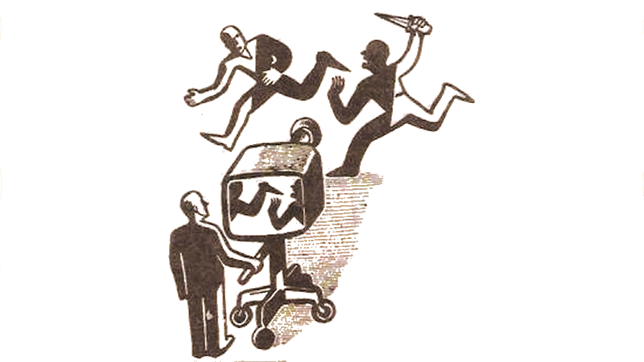
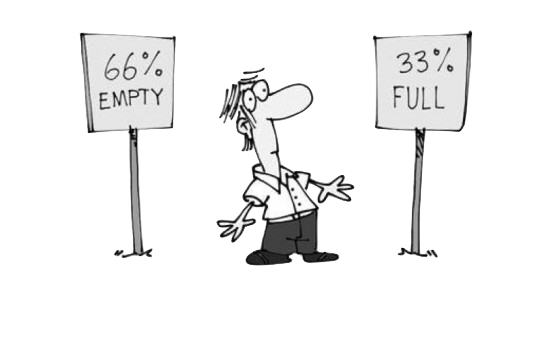

# 刚需幻觉

在前言之中，就举过一个例子，人们一不小心就把自己搭了进去…… 只不过因为没搞明白，道理就是道理，跟讲道理的老生其实全然没什么关系。

在自学中，耽误人的幻觉很多。比如，时间幻觉。人们总觉得自己时间不够了，所以学东西的时候总是很急…… 可实际上，练成一门手艺，到够用的地步，一两年足够；到很好的地步，三五年足够 —— 至于极好么，那是一辈子的事儿。结果呢，很多人瞎着急，乱 “省时间”，学啥都不全面，练啥都不足数足量，一晃三五年就过去，然后又开始焦虑，换个手艺再学学再试试…… 然后循环焦虑。

最坑人的幻觉，在我看来，就是刚需幻觉 —— 这又是我杜撰的一个词…… 听我慢慢讲。

## 感觉总是最大的坑

我的结论是：

> 绝大多数人的自学能力，基本上都是被 “自己的感觉” 耽误掉的。

即，原本每个人都有一定的自学能力，但最终，都被自己的感觉给干掉了，直至全然失去自学能力 —— 虽然其后也经常学习，但其后一生从事的全都是学习这个行为里最初级的模式：“模仿”。

为什么 “模仿” 是学习行为最初级的模式呢？

首先，模仿必须依赖模仿对象，受自己的视野所限。

其次，模仿只能处理表里如一的简单知识和技能；一旦遇到那些深层次的、表面上看不大出来的，模仿就无效了，即便是非要模仿、愣模仿，结果就只能是 “东施效颦”。

在《[把时间当作朋友](https://github.com/xiaolai/time-as-a-friend)》中，我就反复强调一件事：

> 不要问学它有什么用，学就是了……

这原本是自学的最佳策略之一，也是自学的最根本策略。然而，听进去这句话的人不多，即便是我举了无数的例子，即便是他可能当时也有一点认同…… 然而，转瞬间又变成了原来的状态，无论遇到什么自学机会都不由自主地问：

> 我学它有什么用啊？

如果，得到的答案中，那 “用处” 对自己不是 “刚需”，瞬间就失去了动力，瞬间就放弃了追求…… 直至某一天，突然 “发现” 那竟然是个刚需…… 于是，临时抱佛脚。人么，总是对追求的事情形影相随；又有谁会对曾经放弃的事情念念不忘呢？于是，下一次还是会再做 “预算不足” 的决定。

最终失去自学能力的人，都是因为对 “刚需” 的判断失误 —— 这就是我说的 “刚需幻觉”。

## 刚需幻觉

“刚需幻觉” 的根源在于：

> 你不会的东西，对你来说感觉上就不是刚需。

要不是这本 “书” 里有个自学编程那么大且立体的一个例子存在，供我反复地、多角度地阐述道理，上面这句话还真的不好解释 —— 即便解释清楚了，也因为缺乏生动的例证而失去效力。

正则表达式（Regex）就是很好的例子。

当你没有学会它的时候，甚至不知道它的时候，感觉上，你不可能觉得那是个刚需 —— 因为你一直都活得好好的，甚至在你全然不知道那个东西竟然存在的情况下。

你略微学了一下，没学会、没学好、或者干脆放弃了之后，在感觉上，你也同样不会觉得那是刚需。因为你不会用它，所以你当然 “用不上它”…… 你根本没办法直到你不懂正则表达式这个事实让你 “未得到” 什么（不是 “失去”，因为你不曾拥有）。

然而，只要你花了一点力气，真的掌握了它，你会有两个 “发现”：

> * 你根本离不开它<a href='#fn1' name='fn1b'><sup>[1]</sup></a>；
> * 它其实真没多难……

第二个 “发现” 总是让你无比庆幸 —— 幸亏学了，幸亏 “发现” 了，否则，自己耽误自己一辈子且完全不自知。庆幸！庆幸！！但第一个 “发现” 更为重要，因为但凡哪怕只有过一次这样的经历，你就可以永久摆脱 “刚需幻觉” 的诅咒。

编程也是一样的，当你开始学编程的时候，被身边的人发现，他们中的大多数一定会问你：

> 你学它要干嘛啊？

无论你怎么回答，他们的反应应该都是差不多的：反正就是不理解你的投入是否合理。

然后，等你学会了编程，掌握了这个技能，你的 “发现” 肯定包括那两点：

> * 你根本离不开它；
> * 它其实真没多难……

哪怕很简单的技能都是如此。许多年前，我专门花一两周的时间练习键盘盲打，以及把输入法方案选择改为微软双拼方案…… 也有人揶揄过我：“我靠，你练这玩意干嘛？难道将来要当一辈子打字员？”

当然，我很早就练就了一定的自学能力，所以很早就有一些自学经验，所以我用不着事后 “发现”，而是 “直接就知道”，将来：

> * 我根本离不开它；
> * 它其实真没多难……

事实上呢？事实上就是如此。打字速度极快，直接导致了后来我成为多产作家。无法想象如果我是个打字速度极慢的人，我如何写书，如何写那么多书和那么多文章；以及，后来我又是如何于 2018 年 9 月的某一天开始在 72 小时之内完成《韭菜的自我修养》初稿…… 可问题在于，这个技能难吗？在我长大的年代里，它算个技能；在今天，全都是从小就用键盘的人的世界里，谁不会呢？

所以，当面对一项新技能的时候，“觉得并非刚需” 肯定是幻觉。因为一个技能到底是不是刚需，在掌握它之前是不知道的……

> 只有真正掌握了那个技能之后，那个技能才会 “变” 成刚需。

并且，

> 一旦掌握了某项技能，它只能是刚需。

这种幻觉非常坑人。

我们的大脑，有一种神奇的功能 —— “无论如何都会用已有信息拼成一个完整图像的功能”。

“无论如何” 的意思是说，不管那已有信息有多么凌乱、有多么残缺、有多么无意义、人脑竟然还是可以拼出一个完整的 “有意义” 的图像。

这一点也经常被人利用。在新闻学里，就有著名的 “Framing Effect”：



这个原理也经常被各路营销使用：



很容易想象，经常被这些东西误导的人，“脑力” 欠缺到什么程度 —— 这当然也是他们全无自学能力的结果之一。

而当我们被刚需幻觉所左右的时候，我们明显是使用 “片面的信息” 拼出了 “完整的意义”，而后被其误导，严重误导，且全然不自知 —— 最气人的是，误导我们的竟然不是别人，竟然是我们自己的大脑！刚需幻觉如此，时间幻觉、困难幻觉亦如是。后面会讲到的注意力漂移，也依然是这种情况，自己才是真正的元凶……

所以，在决定学任何东西的时候，最好不要去咨询身边的人 —— 除非你确定对方是高手，最好是自学高手。否则，你遇到的永远是怀疑、打击、甚至嘲笑。最令人遗憾、最令人无奈的是，那些人其实也不是坏人，他们其实也不是故意，他们只是被自己的 “刚需幻觉” 误导了而已，他们（竟然）以为所有人都和他们一样…… 然后，若是你（居然）听信了他们的话，那就实在是太惨了！

**要学，想学，那就自顾自去学吧，用不着征求别人的意见！**

## 优势策略

如何不被 “刚需幻觉” 所迷惑、所限制呢？

首先，基础策略是，要深刻理解这个现象及其解释：

> 对任何一项技能来说，**刚需是自学的结果**；而不是自学的原因；

用 “是否为刚需” 作为自己是否开始学习的理由，注定会吃亏的，因为如此做的下场就是肯定被 “刚需幻觉” 所迷惑、所限制。

而后，也是更为重要的一个策略：

> **做个自驱动的人**，而非被外部驱动的被动的人。

这基本上是个越早建立越好的习惯。绝大多数人一生都是被动者，终生只是被外界驱动而已。所以，他们会在某一时刻，“发现” 某个技能是刚需，然后再去学，但可惜却肯定的是，到那时候预算总是并不充裕，总是捉襟见肘。

最后一个很简单却很有效的策略是三个字，[之前提到过的](Part.2.E.deliberate-thinking.md)：

> **找活干**

有活干，真的很幸福。

## 影响下一代

想象一下有些父母是这样跟孩子对话的：

> * 爸爸（妈妈），你在干什么呀？
> * 我在学 \_\_\_\_\_\_\_\_\_\_\_\_\_\_\_\_\_（请自行填空）
> * 那你学它干什么用啊？
> * 等我学会就知道了…… 

而后又过了段时间……

> * 孩子，过来看看！这是爸爸（妈妈）做的东西！

我猜，这样的孩子，会从小就自然而然地破解掉 “刚需幻觉”。

所谓的 “潜移默化”，所谓的 “耳闻目染”，其实是很简单的东西。

然而，效果呢？效果不会因为策略的简单或者容易而消减。通常的情况是，越是简单容易的策略，效用越是惊人。

所以，正确结论是这样的：

> **一切的技能都是刚需。**

虽然，这并不意味着你不需要选择。

然而，至于学还是不学，其实从来都不是从 “有没有用” 来判断的，真正有意义的判断依据只有一条：

> 有没有时间？

有时间就学呗！没时间就挤时间呗！学得不足够好怎么办？花更多时间呗……

-----
**脚注**

<a name='fn1'>[1]</a>：写这本书的时候，前后弄出来那么多 `.ipynb` 文件 —— 于是，到最后哪怕 “生成个目录” 这样看起来简单的活，若是会用正则表达式，就能几分钟完成；但若是不会，那就得逐一手工提取、排序、编辑…… 对我来说怎么可能不是**刚需**！
```python
import re
import os

files = [f for f in os.listdir('.') if os.path.isfile(f)]
files.sort()
for f in files:
    if '.ipynb' in f:
        with open(f, 'r') as file:
            str = file.read()
            pttn = r'"# (.*)"\n'
            r = re.findall(pttn, str)
            if len(r) > 0:
                print(f'> - [{f.replace(".ipynb", "")}（**{r[0]}**）]({f})') # 生成 markdown
```
    > - [01.preface（**前言**）](01.preface.md)
    > - [02.proof-of-work（**如何证明你真的读过这本书？**）](02.proof-of-work.md)
    > - [Part.1.A.better.teachyourself（**为什么一定要掌握自学能力？**）](Part.1.A.better.teachyourself.md)
    > - [Part.1.B.why.start.from.learning.coding（**为什么把编程当作自学的入口？**）](Part.1.B.why.start.from.learning.coding.md)
    > - [Part.1.C.must.learn.sth.only.by.reading（**只靠阅读习得新技能**）](Part.1.C.must.learn.sth.only.by.reading.md)
    > - [Part.1.D.preparation.for.reading（**开始阅读前的一些准备**）](Part.1.D.preparation.for.reading.md)
    > - [Part.1.E.1.entrance（**入口**）](Part.1.E.1.entrance.md)
    > - [Part.1.E.2.values-and-their-operators（**值及其相应的运算**）](Part.1.E.2.values-and-their-operators.md)
    > - [Part.1.E.3.controlflow（**流程控制**）](Part.1.E.3.controlflow.md)
    > - [Part.1.E.4.functions（**函数**）](Part.1.E.4.functions.md)
    > - [Part.1.E.5.strings（**字符串**）](Part.1.E.5.strings.md)
    > - [Part.1.E.6.containers（**数据容器**）](Part.1.E.6.containers.md)
    > - [Part.1.E.7.files（**文件**）](Part.1.E.7.files.md)
    > - [Part.1.F.deal-with-forward-references（**如何从容应对含有过多 “过早引用” 的知识？**）](Part.1.F.deal-with-forward-references.md)
    > - [Part.1.G.The-Python-Tutorial-local（**官方教程：The Python Tutorial**）](Part.1.G.The-Python-Tutorial-local.md)
    > - [Part.2.A.clumsy-and-patience（**笨拙与耐心**）](Part.2.A.clumsy-and-patience.md)
    > - [Part.2.B.deliberate-practicing（**刻意练习**）](Part.2.B.deliberate-practicing.md)
    > - [Part.2.C.why-start-from-writing-functions（**为什么从函数开始？**）](Part.2.C.why-start-from-writing-functions.md)
    > - [Part.2.D.1-args（**关于参数（上）**）](Part.2.D.1-args.md)
    > - [Part.2.D.2-aargs（**关于参数（下）**）](Part.2.D.2-aargs.md)
    > - [Part.2.D.3-lambda（**化名与匿名**）](Part.2.D.3-lambda.md)
    > - [Part.2.D.4-recursion（**递归函数**）](Part.2.D.4-recursion.md)
    > - [Part.2.D.5-docstrings（**函数的文档**）](Part.2.D.5-docstrings.md)
    > - [Part.2.D.6-modules（**保存到文件的函数**）](Part.2.D.6-modules.md)
    > - [Part.2.D.7-tdd（**测试驱动的开发**）](Part.2.D.7-tdd.md)
    > - [Part.2.D.8-main（**可执行的 Python 文件**）](Part.2.D.8-main.md)
    > - [Part.2.E.deliberate-thinking（**刻意思考**）](Part.2.E.deliberate-thinking.md)
    > - [Part.3.A.conquering-difficulties（**战胜难点**）](Part.3.A.conquering-difficulties.md)
    > - [Part.3.B.1.classes-1（**类 —— 面向对象编程**）](Part.3.B.1.classes-1.md)
    > - [Part.3.B.2.classes-2（**类 —— Python 的实现**）](Part.3.B.2.classes-2.md)
    > - [Part.3.B.3.decorator-iterator-generator（**函数工具**）](Part.3.B.3.decorator-iterator-generator.md)
    > - [Part.3.B.4.regex（**正则表达式**）](Part.3.B.4.regex.md)
    > - [Part.3.B.5.bnf-ebnf-pebnf（**BNF 以及 EBNF**）](Part.3.B.5.bnf-ebnf-pebnf.md)
    > - [Part.3.C.breaking-good-and-bad（**拆解**）](Part.3.C.breaking-good-and-bad.md)
    > - [Part.3.D.indispensable-illusion（**刚需幻觉**）](Part.3.D.indispensable-illusion.md)
    > - [Part.3.E.to-be-thorough（**全面 —— 自学的境界**）](Part.3.E.to-be-thorough.md)
    > - [Part.3.F.social-selfteaching（**自学者的社交**）](Part.3.F.social-selfteaching.md)
    > - [Part.3.G.the-golden-age-and-google（**这是自学者的黄金时代**）](Part.3.G.the-golden-age-and-google.md)
    > - [Part.3.H.prevent-focus-drifting（**避免注意力漂移**）](Part.3.H.prevent-focus-drifting.md)
    > - [Q.good-communiation（**如何成为优秀沟通者**）](Q.good-communiation.md)
    > - [R.finale（**自学者的终点**）](R.finale.md)
    > - [S.whats-next（**下一步干什么？**）](S.whats-next.md)
    > - [T-appendix.editor.vscode（**Visual Studio Code 的安装与配置**）](T-appendix.editor.vscode.md)
    > - [T-appendix.git-introduction（**Git 简介**）](T-appendix.git-introduction.md)
    > - [T-appendix.jupyter-installation-and-setup（**Jupyterlab 的安装与配置**）](T-appendix.jupyter-installation-and-setup.md)
    > - [T-appendix.symbols（**这些符号都代表什么？**）](T-appendix.symbols.md)


<a href='#fn1b'><small>↑Back to Content↑</small></a>
