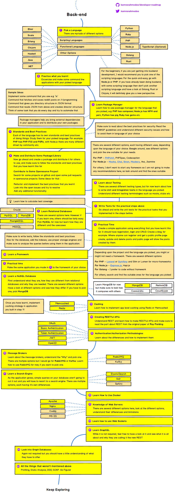

# 下一步干什么？

理论上，下一步你的选择很多。自学是门手艺，你可以用它去学任何你想要掌握的其它手艺。如果，你有意在编程这个领域继续深入，那么，以下就是一些不错的线索。

当然，最先应当做的是，去检查一下自己的 “突击” 的结果，去 Pythonbasics.org 做做练习：

> https://pythonbasics.org/Exercises/

除了我在这里介绍的之外，请移步 The Hitchhiker's Guide to Python，它更为全面：

> https://docs.python-guide.org/

## Python 必读书籍

无论学什么，一本书肯定不够，以下是学习 Python 的基本必读书籍：

> * [The Python Tutorial](https://docs.python.org/3/tutorial/)
> * [The Hitchhiker’s Guide to Python!](https://docs.python-guide.org/)
> * [Think Python: How to think like a computer scientist](http://greenteapress.com/wp/think-python-2e/)
> * [Automate the Boring Stuff with Python](https://automatetheboringstuff.com)
> * [Effective Python](https://effectivepython.com)
> * [Python Cookbook](https://www.amazon.com/Python-Cookbook-Recipes-Mastering-ebook/dp/B00DQV4GGY)
> * [Fluent Python](https://www.amazon.com/Fluent-Python-Concise-Effective-Programming-ebook/dp/B0131L3PW4)
> * [Problem Solving with Algorithms and Data Structures using Python](http://interactivepython.org/runestone/static/pythonds/index.html)
> * [Mastering Object-oriented Python - Transform Your Approach to Python Programming](https://www.amazon.com/dp/B00JVQ14UO/ref=dp-kindle-redirect?_encoding=UTF8&btkr=1)

更多 Python 书籍：

> https://pythonbooks.revolunet.com

千万别觉得多，只要真的全面掌握，后面再学别的，速度上都会因此快出很多很多……

## Python Cheatsheet

你已经知道了，这种东西，肯定是自己整理的才对自己真的很有用…… 不过，你也可以把别人整理的东西当作 “用来检查自己是否有所遗漏” 的工具。

网上有无数 Python Cheatsheets，以下是 3 个我个人认为相当不错的：

> * [Comprehensive Python Cheatsheet](https://gto76.github.io/python-cheatsheet/)
> * [Python Crash Course - Cheat Sheets](https://github.com/ehmatthes/pcc/tree/master/cheat_sheets)
> * [Pysheeet](https://www.pythonsheets.com/)

## Awesome Python

Github 上的 “居民” 现在已经养成了一个惯例，无论什么好东西，他们都会为其只做一个 “Awesome ...” 的页面，在里面齐心协力搜集相关资源。比如，你想学 Golang，那你去 Google 搜索 [`Awesome Go`](https://www.google.com/search?q=awesome+go)，一定会给你指向到一个 Github 上的 “Awesome Go” 的页面…… 

以下是 Awesome Python 的链接：

> https://github.com/vinta/awesome-python

## CS 专业的人都在学什么？

如果你真有兴趣把这门手艺学精，不妨看看 Computer Science 专业的人都在学什么…… 

下面这个链接值得认真阅读：

> http://matt.might.net/articles/what-cs-majors-should-know/

## 全栈工程师路径图

既然学了，就肯定不止 Python —— 在扎实的基础之上，学得越多学得越快。以下是一个 “全栈工程师路径图”，作者是位迪拜的帅哥 [Kamran Ahmed](https://github.com/kamranahmedse)：

> https://github.com/kamranahmedse/developer-roadmap
>
> Below you find a set of charts demonstrating the paths that you can take and the technologies that you would want to adopt in order to become a frontend, backend or a devops. I made these charts for an old professor of mine who wanted something to share with his college students to give them a perspective; sharing them here to help the community.
> 
> Check out my blog and say "hi" on Twitter.
> 
> **Disclaimer**
>
> The purpose of these roadmaps is to give you an idea about the landscape and to guide you if you are confused about what to learn next and not to encourage you to pick what is hip and trendy. You should grow some understanding of why one tool would better suited for some cases than the other and remember hip and trendy never means best suited for the job

## Introduction

## Frontend Roadmap

## Back-end Roadmap

## DevOps Roadmap

路漫漫其修远兮…… 

但，多有意思啊？这完全就是一场闯关游戏。
