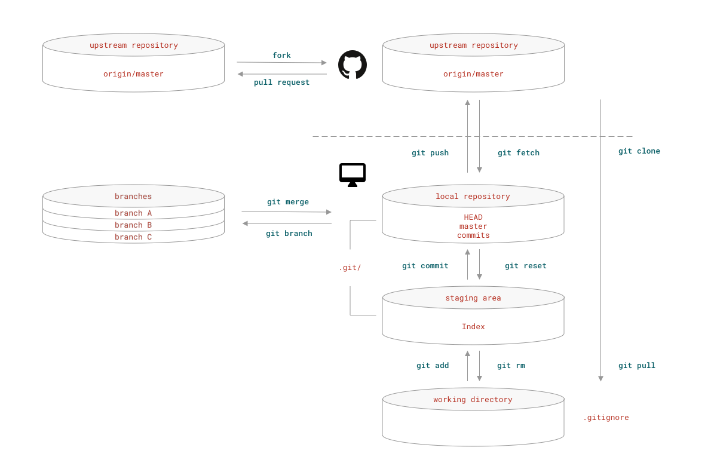

# Git 简介

--- You should've learned Git yesterday.


## 内容目标

再一次，这一篇内容的目标，依然不是 “教程”，而是 “教程” 的 “图例” —— 如果我们把真正的教程比喻成 “地图” 的话。最全面的 Git 教程在网上， **Pro Git**，是免费的 —— 把它反复阅读若干遍，理解完整：

> https://git-scm.com/book/en/v2

并且还有各种语言的翻译版本 —— 也包括中文。

## 为什么你必须学会使用 Git？

Git 是一个分布式版本控制软件 —— 听起来也许跟你没关系，但**无论是谁**，都会因为能够使用 Git 而节约时间、提高效率。进而，如果你居然没有一个活跃的 [Github](https://github.com) 账户，那么你正在错过人类史上前所未有的共同协作时代 —— 半点都没有夸张。同样提供 Git 工具云服务的还有 [Gitlab](https://gitlab.com), [Bitbucket](https://bitbucket.org) 等等。

并且，[Github](https://github.com) 很可能是地球上第一个给人们提供 “[用作品社交](Part.3.F.social-selfteaching.md)” 方式的平台，你若是不能参与其中，实在是太可惜了！

## 从逻辑上理顺 Git 基本命令

Git 的作用，基本上可以被划分为三部分：
> - 备份文件
> - 跟踪文件变化
> - 与他人协作共同操作文件

在一个 git 仓库中，总计有四个 “抽象层”，它们分别是：

> * upstream repository 保存在云端的仓库
> * local repository 本地仓库
> * staging area 缓存区
> * working directory 工作区

其中，`local repository` 和 `staging area` 这两个抽象层的数据，保存在 `working directory` 根目录下的一个隐藏目录 `.git/` 下；需要使用 `ls -a` 才能看到。

当你使用 `git init` 命令将一个本地文件夹 `working directory` 初始化为 `local repository` 的之后，该文件夹内部的结构如下：
```
.
└── .git
    ├── HEAD
    ├── config
    ├── description
    ├── hooks
    │   ├── applypatch-msg.sample
    │   ├── commit-msg.sample
    │   ├── fsmonitor-watchman.sample
    │   ├── post-update.sample
    │   ├── pre-applypatch.sample
    │   ├── pre-commit.sample
    │   ├── pre-push.sample
    │   ├── pre-rebase.sample
    │   ├── pre-receive.sample
    │   ├── prepare-commit-msg.sample
    │   └── update.sample
    ├── info
    │   └── exclude
    ├── objects
    │   ├── info
    │   └── pack
    └── refs
        ├── heads
        └── tags
```
以下示意图中仅包含最基本的 Git 命令 —— 并且基本上都是独自使用 Git 时的常用命令。



在工作区 `working directory` 这个抽象层中，你完成各种日常工作，创建、编辑、删除…… 你可能需要用某个编辑器去修改文件，你也可能频繁使用各种 Bash 命令，如，`rm` `mkdir` `cp` `mv` 等等。

时不时，你可能会把一些处理完的文件 “加入缓存区”；等一个阶段的工作完成之后，你可能会把那些已经放入缓存区的文件**提交**到（commit）本地仓库；而后继续工作…… 根据情况，你也会将本地仓库的文件**推到**（push）云端，即，远端仓库。如果，你正在与他人协作，你也可能经常需要从云端**下拉**（pull）最新版本到本地。

## Git 的安装

### Mac

Mac 的操作系统 Mavericks (10.9) 以上版本中都内建有 Git，你可以在 Terminal 中通过以下命令查看是否有 Git：
``` bash
git --version
which git
```
也可以通过 Homebrew 安装最新版本的 Git：
``` bash
ruby -e "$(curl -fsSL https://raw.githubusercontent.com/Homebrew/install/master/install)"
brew doctor
brew install git
```
还可以通过 Conda 安装：
``` bash
conda install -c anaconda git
```
### Windows

前往 https://gitforwindows.org 下载并安装 Git for Windows。

此外，它还会提供 Git Bash —— 在 Windows 操作系统中使用与 \*Nix 操作系统一样的 Bash 命令行工具。

另外，在 Windows 操作系统中推荐使用 Git Bash 或者 PowerShell，而非 CMD 作为命令行工具。

### Linux

大多数 Linux 操作系统要么基于 Debain，要么基于 Red-Hat —— 请自行查看 [List of Linux distributions](https://en.wikipedia.org/wiki/List_of_Linux_distributions)，确定自己的 Linux 发行版究竟基于哪一个。

基于 Debian 的 Linux 发行版：
```bash
sudo apt-get update
sudo apt-get upgrade
sudo apt-get install git
```
基于 Red-Hat 的 Linux 发行版：
```bash
sudo yum upgrade
sudo yum install git
```
### Git 本地配置

在命令行工具中执行以下命令：
```bash
git config --global user.name "<your_name>"
git config --global user.email <your_email_address>
```
### Git GUI

Git 的图形化版本客户端，有很多种选择，以下几个跨平台的客户端最受欢迎：

> * [Github Desktop](https://desktop.github.com) 
> * [GitAhead](https://gitahead.github.io/gitahead.com/)
> * [Fork](https://git-fork.com)
> * [GitKraken](https://www.gitkraken.com)

更多选择，请移步查看 [git-scm.com 上的 Git GUI Clients 列表](https://git-scm.com/downloads/guis/)。

### 需要了解的 Bash 基本命令

虽然 Git 也有图形化版本，但无论如何你都会接触到命令行工具。并且，谁都一样，早晚会遇到非使用命令行不可的情况。

以下是常用 Bash 命令的简要说明：

| 命令  | 简要说明                                            |
| ----- | --------------------------------------------------- |
| `cd`    | Change Directory 的缩写；转到指定目录               |
| `ls`    | List 的缩写；列出当前目录中的内容                   |
| `mkdir` | Make Directory 的缩写；在当前目录中创建一个新的目录 |
| `pwd`   | Present Working Directory 的缩写；显示当前工作目录  |
| `touch` | 创建一个指定名称的空新文件                          |
| `rm`    | Remove 的缩写；删除指定文件                         |
| `rmdir` | Remove Directory 的缩写；删除指定目录               |
| `cp`    | Copy 的缩写；拷贝指定文件                           |
| `mv`    | Move 的缩写；移动指定文件                           |
| `cat`   | Concatenate 的缩写；在屏幕中显示文件内容            |
| `chmod`   | Change Mode 的缩写；改变文件的权限           |
| `man`   | Manual 的缩写；显示指定命令的使用说明          |

其中，`chmod` 最常用的 4 个权限分别是：

| 文件权限模式  | 简要说明                                            |
| ----- | --------------------------------------------------- |
| `777`    | 任何人都可以读、写、执行该文件               |
| `755`    | 任何人都可以读、执行该文件，但只有所有者可以修改        |
| `700` | 只有所有者才能进行读、写、执行操作 |
| `+x`   | 将文件设置为可执行  |

在使用 `man` 命令时，系统会使用 vim 文本编辑工具以只读模式打开帮助文件，常用键盘命令如下：


| 键盘命令  | 简要说明                                            |
| ----- | --------------------------------------------------- |
| `f`    | 向后翻屏               |
| `b`    | 向前翻屏        |
| `d` | 向后翻半屏 |
| `u`   | 向前翻半屏  |
| `j`   | 向后翻一行  |
| `k`   | 向前翻一行  |
| `h`   | 查看 vim 帮助  |
| `q`   | 退出  |

## 一些不错的 Git 教程

除了 Pro Git 这本书之外，还有很多值得去看：

> * [GIT CHEATSHEET -- an interaction from nop software](http://ndpsoftware.com/git-cheatsheet.html)
> * [Learn Git Branching](https://learngitbranching.js.org/)
> * [Learn Git in a Month of Lunches](https://livebook.manning.com/#!/book/learn-git-in-a-month-of-lunches/about-this-book/)
> * [Git How To](https://githowto.com/)
> * [Git pretty - Solve Git Mess](http://justinhileman.info/article/git-pretty/)
> * [Visualizing Git Concepts with D3](http://onlywei.github.io/explain-git-with-d3/)

当然，你肯定早晚会去 Github 上找 “Awesome Git”：

> https://github.com/dictcp/awesome-git
