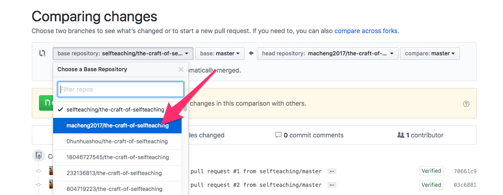
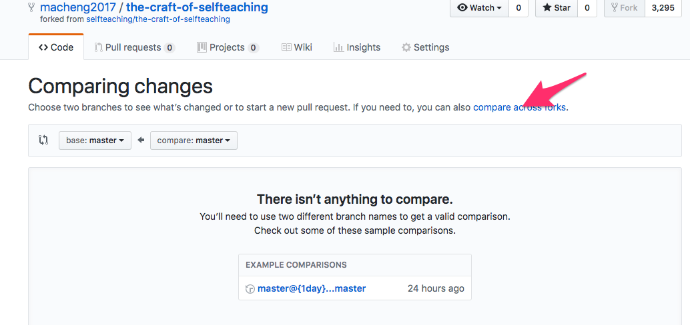
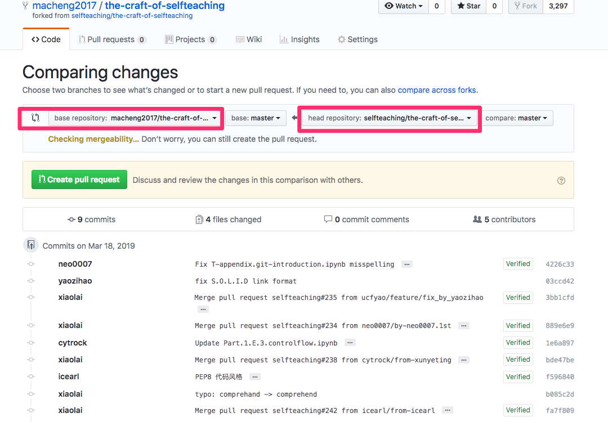

### 方法一 
#### fork过来的仓库更简单方法

1. 打开你fork的项目
2. 点击 New pull request 按钮
3. 对调连个仓库
4. 点击 create pull request 
5. 随便填写个标题即可 继续 create pull request
6. merge pull request 即可

#### 图示一 对调两个仓库

#### 图示二

#### 图示三

#### 一些需要理解的概念
1. 工作区 working directory
2. 本地仓库 local repository 
3. 暂存区 staging area
4. 你的github仓库 origin repository
5. 你fork别人的仓库 upstream repository
5. upstream
6. origin 
7. 主要分支(默认分支) master 
8. 分支 branch

#### 借张图帮助理解

### 方法二使用命令行

#### 下面需要用到的命令简单解释
1. git remote -v 检查仓库地址
2. git status  检查本地仓库的状态
3. git add .   将所有更改提交到暂存区
4. git commit -m '一些描述你的提交内容' 从工作区提交到本地仓库
5. git merge  合并分支
6. git fetch 拉取更新
7. git checkout 切换分支
8. git push 推送本地修改到仓库

---
#### 操作步骤
1. 检查是否设置上游地址,否并设置
2. 检查本地是否有修改,如果有则提交
3. 获取他人仓库更新
4. 获取更新后会自动切换分支upstream/master,切换回到master分支
5. 合并upstream/master分支到当前分支(master)

 #### 实际操作
 
1. 检查是否设置上游地址,否并设置
  > git remote -v 
  > 
  > git remote add upstream https://github.com/selfteaching/the-craft-of-selfteaching.git
2. 检查本地是否有修改,如果有则提交
    
  > git status 
  > git add . 
  > git commit -m 'short message'
3. 获取他人仓库更新
  > git fetch upsteam
4. 获取更新后会自动切换分支upstream/master,切换回到master分支
  > git checkout master
5. 合并upstream/master分支到当前分支(master)
  > git merge upsteam/master
6. 推送到自己的仓库
  > git push

[参考 Github进行fork后如何与原仓库同步](https://github.com/selfteaching/the-craft-of-selfteaching/blob/master/my-notes/how-to-merge.md)
[What is the difference between origin and upstream in github](https://outofmymemory.wordpress.com/2013/09/18/what-is-the-difference-between-origin-and-upstream-in-github/)
[How do I update a GitHub forked repository?](https://stackoverflow.com/questions/7244321/how-do-i-update-a-github-forked-repository)
